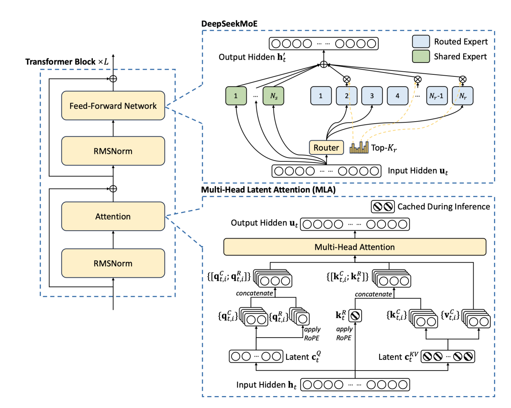
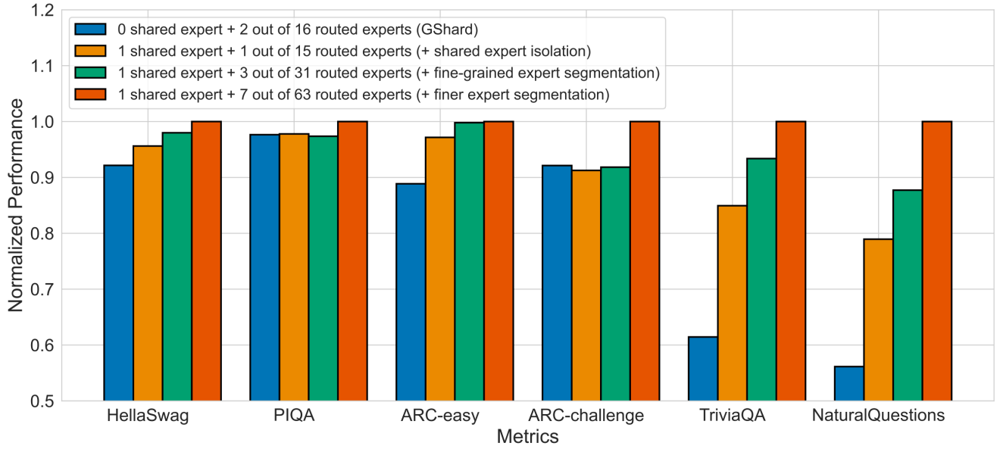
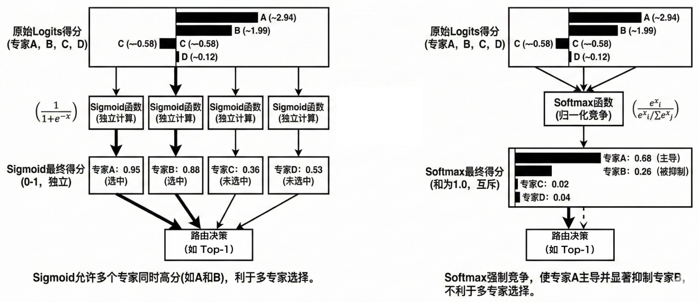

# 第2章 技术原理解析

本章系统剖析 DeepSeek 模型的核心技术原理，以 2026 年发布的 DeepSeek V4 为主线展开：先给出 V4 的架构全景、训练体系与设计哲学，为全章建立坐标；随后深入其继承并持续演进的基础组件——MoE 前馈网络、MLA 与 DSA 注意力机制，以及以纯强化学习为基础的深度推理能力构建与融合机制；最后剖析 V4 面向百万级上下文引入的三大架构创新，即 CSA/HCA 混合稀疏注意力、mHC 流形约束超连接与 Muon 优化器。

## 2.1 DeepSeek V4 架构全景、训练与设计哲学

DeepSeek V4[^dsv4] 于 2026 年第二季度发布，是继 V3/R1 体系之后的新一代旗舰模型：上下文窗口扩展至 1M Token，并在注意力机制、残差连接与优化器三个维度引入代际性架构创新。本节勾勒 V4 的整体轮廓——规格与定位、架构组成、训练方式与设计哲学——为 2.2～2.7 节的深入剖析建立全局坐标。

### 2.1.1 模型定位与参数规格

DeepSeek V4 是 DeepSeek 系列大语言模型的第四代架构，延续了 V3 的条件计算（Conditional Computation）路线，在推理能力和长上下文处理能力上实现了代际跨越。V4 提供两个规格，其参数规格如表2-1 所示。

表2-1 DeepSeek-V4 模型参数规格

| 规格 | 总参数量 | 激活参数量 | 层数 | 隐藏维度 $d$ | 查询头数 | 单头维度 | 路由专家数 | 上下文长度 |
|------|---------|-----------|------|-------------|-------------|----------|-----------|-----------|
| V4-Pro | 1.6T | 49B | 61 | 7168 | 128 | 512 | 384 | 1M |
| V4-Flash | 284B | 13B | 43 | 4096 | 64 | 512 | 256 | 1M |

两个规格共享同一组架构创新，但不只是参数规模和层数不同，注意力配置也按模型大小分别设定：V4-Pro 的 CSA top-$k$ 为 1024、查询头数为 128、查询压缩维度为 1536；V4-Flash 的 CSA top-$k$ 为 512、查询头数为 64、查询压缩维度为 1024。V4-Pro 面向旗舰推理场景，V4-Flash 面向高性价比部署场景。两者均支持 1M Token 上下文窗口。

从 V3 到 V4 的参数增长幅度适中（V3 为 671B 总参/37B 激活），V4-Pro 的总参数增长约 2.4 倍，但激活参数仅增长约 1.3 倍——这体现了 MoE 架构"用总量换质量、用稀疏换效率"的设计哲学。

### 2.1.2 整体架构组成

V4 的架构组成可以概括为"基础组件、MoE、新增的三大创新"三个层面。

#### 1. 基础组件

V4 并非从零设计，而是在 V3 的成熟组件基础上进行增量创新。以下三个组件从 V3 直接继承。

1）DeepSeekMoE：混合专家架构，每个 FFN 层包含多个路由专家（Routed Expert）和共享专家（Shared Expert）。每个 Token 仅激活少量专家，实现"大参数、小计算"的条件计算。

2）MLA（多头潜在注意力，Multi-head Latent Attention）：通过低秩压缩将 KV 缓存压缩至潜空间，显著降低推理时的 KV 缓存显存占用。V4-Pro 的查询压缩维度为 1536，输出投影分为 16 组。V4-Flash 对应为 1024 和 8 组。

3）MTP（多词元预测，Multi-Token Prediction）：在训练阶段，模型不仅预测下一个 Token，还同时预测后续多个 Token（V4 的 MTP 深度为 1，即额外预测 1 个 Token）。这提供了更丰富的训练信号，加速收敛。

#### 2. MoE 层的参数调整

V4 对 MoE 层进行了多项重要调整，核心方向是"更多专家、更稀疏激活、更稳定路由"，具体参数配置及其与 V3 的对照如表2-2 所示。

表2-2 MoE 参数配置对照（V3、V4-Pro、V4-Flash）

| 参数 | V3 | V4-Pro | V4-Flash |
|------|-----|--------|----------|
| 路由专家数 | 256 | 384 | 256 |
| 共享专家数 | 1 | 1 | 1 |
| 激活专家数 | 8 | 6 | 6 |
| 专家中间维度 | 2048 | 3072 | 2048 |
| 路由打分函数 | Sigmoid | $\sqrt{\text{softplus}(\cdot)}$ | $\sqrt{\text{softplus}(\cdot)}$ |
| 浅层路由策略 | 标准路由 | 哈希路由（前 3 层） | 哈希路由（前 3 层） |

表2-2 所列参数的关键变化解读如下。

1）路由专家数增加（256 $\to$ 384），激活数减少（8 $\to$ 6）。

这一"增多减活"的调整使每个 Token 的专家选择面更广、激活更精准。稀疏度从 8/256=3.1% 降至 6/384=1.6%，意味着每个专家承担更专一的功能分工。

2）打分函数从 Sigmoid 改为 $\sqrt{\text{softplus}(\cdot)}$。

Sigmoid 的输出范围为 $(0, 1)$，在输入绝对值较大时梯度趋近于零（饱和区），导致路由器训练后期学习速率下降。softplus 函数定义为：

$$
\text{softplus}(x) = \ln(1 + e^x)
$$

其输出范围为 $(0, +\infty)$，无饱和区。取平方根后 $\sqrt{\text{softplus}(x)}$ 既保持了正值输出特性，又压缩了大值区间的动态范围，兼顾了梯度通畅和数值稳定。

3）前 3 层使用哈希路由（Hash Routing）。

网络浅层（前 3 层）的表征尚未充分分化，学习型路由器难以做出有意义的专家分配。V4 对这些层改用确定性的哈希路由——根据 Token 的哈希值直接确定分配的专家，省去路由器的学习开销，同时保证负载均衡。

#### 3. 新增的三大架构创新

DeepSeek-V4 相较 V3 的架构创新集中在三个正交的维度：注意力机制、残差连接与优化器。三者遵循同一方法论——先从数学原理出发设计约束，再以最小的工程开销落地。表2-3 给出三项创新的全景对照，详细的数学推导与实验分析分别见 2.5～2.7 节。

表2-3 DeepSeek-V4 三大架构创新一览

| 创新 | 作用维度 | 替代对象 | 解决的核心问题 | 关键结果 | 详见 |
|------|---------|---------|--------------|---------|------|
| CSA/HCA 混合稀疏注意力 | 注意力机制 | 全注意力 | 1M 上下文下 $O(n^2)$ 计算与 KV 缓存存储不可行 | 相比 V3.2，V4-Pro 单 Token 推理 FLOPs 约 27%、KV 缓存约 10% | 2.5 节 |
| mHC（流形约束超连接） | 残差连接 | Pre-Norm 残差 | 深层表征坍缩；多路径超连接的信号增益发散 | 以 6.7% 额外训练开销换取全程训练稳定与下游任务 7+ 分提升 | 2.6 节 |
| Muon 优化器 | 优化器 | AdamW | 逐元素更新忽略权重矩阵的整体几何结构 | 动量矩阵经 Newton-Schulz 正交化后更新，绝大多数参数改用 Muon | 2.7 节 |

简要而言：CSA（Compressed Sparse Attention，稀疏压缩注意力）将 KV 缓存沿序列维度以压缩比 $m=4$ 加权池化，再由闪电索引器（Lightning Indexer）精选 top-$k$ 条参与注意力计算，负责"从全局历史中精选细节"；HCA（Heavily Compressed Attention，重度压缩注意力）以 $m'=128$ 重度压缩后全部参与计算，负责"以极低成本扫读全局大意"；两类注意力层交替堆叠，且均配有 128 条滑动窗口分支保留最近上下文的原始精度。mHC 将残差流扩展为 4 条并行路径，并把路径间的混合矩阵经 Sinkhorn-Knopp 迭代投影到双随机矩阵流形（Birkhoff 多面体），以谱范数有界性从数学上保证任意深度下信号增益不发散。Muon 则对动量矩阵做极分解意义上的正交化——保留更新方向、拉平各方向强度；嵌入层、输出头、RMSNorm 及 mHC 静态偏置等少数参数仍保留 AdamW。

三者还存在深层协同：Muon 的正交化更新在其他系统（如 Kimi K2）中曾诱发注意力分数失控，而 V4 凭借 mHC 对信号增益的架构级约束（配合对 Q/KV 的 RMSNorm），无需在优化器端引入 QK-Clip 之类的裁剪补丁（见 2.7 节）。

### 2.1.3 训练数据、策略与数值精度

本小节按"数据—策略—精度"三个维度介绍 V4 的训练体系：先给出预训练数据量与渐进式训练策略，再介绍面向训练稳定性的两项机制，最后讲解数值精度方面的 FP4 量化感知训练。

#### 1. 训练数据与渐进式训练策略

V4 的预训练数据量为：V4-Flash 32T Token，V4-Pro 33T Token。相较 V3 的 14.8T Token，数据量增长约 2.2 倍。在这一数据规模上，V4 的训练策略以"渐进引入"为主线，体现在注意力模式和序列长度两个方面。

1）注意力模式的渐进引入。V4 在训练早期使用全密集注意力（Dense Attention），在模型已建立基本语言能力后再引入稀疏注意力机制：

$$
\text{训练流程} = \underbrace{\text{密集注意力}}_{\text{前 1T+ Token}} \to \underbrace{\text{CSA + HCA 稀疏注意力}}_{\text{后续训练}}
$$

该策略的动机是：稀疏注意力的路由模块（闪电索引器）需要基于有意义的表征进行块选择；若从随机初始化开始就启用稀疏注意力，路由器和表征会陷入"鸡生蛋"困境——差的表征导致差的路由，差的路由阻碍表征学习。V4-Flash 先用密集注意力训练 1T Token，在 64K 序列长度阶段引入稀疏注意力；V4-Pro 的密集注意力阶段更长，随后采用同样的两阶段稀疏注意力引入策略。

2）序列长度的渐进扩展。训练过程中序列长度按以下阶段递增：

$$
4\text{K} \to 16\text{K} \to 64\text{K} \to 1\text{M}
$$

每个阶段的位置编码（RoPE）基频相应调整，模型逐步适应更长的上下文依赖。

#### 2. 训练稳定性机制

V4 在训练策略层面引入了两项稳定性机制：预防性路由针对 MoE 路由引起的损失突刺，SwiGLU 数值截断针对极端激活值的累积放大。

1）预防性路由（Anticipatory Routing）。MoE 模型的损失突刺（loss spike）是一个已知的训练稳定性问题，通常由少数 Token 被错误路由至不擅长的专家引起，导致局部梯度爆发并扩散到全局。

V4 引入预防性路由机制：将路由决策与专家计算解耦——路由网络使用几步之前的旧参数 $\theta_{t-\Delta t}$ 做出专家分配决策，而被选中的专家使用当前最新参数 $\theta_t$ 执行计算。路由决策"慢半拍"，不会被当前步的剧烈梯度更新带偏，从而稳定了专家分配。在工程实现上，路由索引在步骤 $t - \Delta t$ 时预计算并缓存，步骤 $t$ 直接使用，避免加载两次模型参数。该机制的计算开销约 20%，且配有自动开关：正常训练时关闭，检测到损失突刺时自动启用，损失恢复后关闭。

2）SwiGLU 数值截断。SwiGLU 激活函数[^swiglu]是 V3/V4 FFN 层的基础组件，定义为：

$$
\text{SwiGLU}(\mathbf{x}) = (\mathbf{x} \mathbf{W}_1) \odot \text{SiLU}(\mathbf{x} \mathbf{W}_g)
$$

其中 $\mathbf{W}_1$ 为线性分支，$\mathbf{W}_g$ 为门控分支，$\odot$ 为逐元素乘法。

V4 对 SwiGLU 的两个分支施加数值截断：

- 线性分支 $\mathbf{x} \mathbf{W}_1$：截断至 $[-10, 10]$
- 门控分支 $\text{SiLU}(\mathbf{x} \mathbf{W}_g)$：上界截断至 $10$

该截断防止极端激活值在 MoE 专家间累积放大，是一项低成本但高回报的训练稳定性措施。

#### 3. FP4 量化感知训练

在数值精度方面，V4 在后训练阶段（Post-Training）引入 FP4 量化感知训练（Quantization-Aware Training, QAT），将部分参数从标准精度压缩至 4 位浮点表示，以降低推理阶段的显存占用和计算成本。

量化范围包括以下两类参数：

- MoE 专家权重：所有路由专家和共享专家的 FFN 权重
- 闪电索引器的 QK 路径：用于 CSA 块路由的查询-键投影权重

FP4 格式为 4 位浮点数，1 位符号 + 2 位指数 + 1 位尾数，可表示 16 个离散值。

QAT 的原理是在训练过程中模拟量化误差——前向传播时将权重量化至 FP4 再参与计算，反向传播时使用直通估计器（Straight-Through Estimator, STE）将梯度直接传递到全精度权重：

$$
\text{前向}: \quad \hat{\mathbf{W}} = Q_{\text{FP4}}(\mathbf{W})
$$
$$
\text{反向}: \quad \frac{\partial \mathcal{L}}{\partial \mathbf{W}} \approx \frac{\partial \mathcal{L}}{\partial \hat{\mathbf{W}}}
$$

其中 $Q_{\text{FP4}}(\cdot)$ 为 FP4 量化算子。训练过程中模型逐步适应量化噪声，使量化后的性能损失最小化。

该方案的关键工程特性在于：FP4 $\to$ FP8 的反量化过程是无损的。这意味着 FP4 的 16 个离散值可以精确映射到 FP8 的表示空间中，无需近似。推理时，FP4 存储的权重可以精确还原为 FP8 后参与矩阵乘法，利用硬件原生的 FP8 张量核心执行计算，兼顾存储效率（4 位）和计算精度（8 位）。

### 2.1.4 设计哲学

综合以上各组件，V4 的设计哲学可归纳为三个核心原则，如表2-4 所示。

表2-4 DeepSeek-V4 设计原则

| 原则 | 体现 | 效果 |
|------|------|------|
| 极致稀疏 | MoE 稀疏度 1.6%、CSA 块稀疏注意力 | 总参数大但激活参数小，计算效率高 |
| 渐进引入 | 密集注意力 $\to$ 稀疏注意力、4K $\to$ 1M 序列、QAT 后训练 | 避免冷启动困境，训练更稳定 |
| 数学约束 | mHC 双随机矩阵、Muon 正交化、SwiGLU 数值截断 | 用数学保证替代工程调参，从根本上消除不稳定性 |

V4 的每项创新都遵循相同的方法论：先识别训练或推理中的瓶颈（注意力的 $O(n^2)$ 复杂度、残差连接的信号发散、优化器的低效更新方向），再从数学原理出发设计约束或投影算子，最后以最小的工程开销实现目标。这种"数学先行、约束驱动"的风格贯穿了 V4 架构的每个角落。

本章后续将循着"沿用的基础组件→新增的三大创新"这条主线，对 V4 的核心组件分别进行深入剖析：先讲解 V4 沿用并持续演进的 DeepSeekMoE、MLA、DSA 与深度推理训练体系，再深入 V4 新增的 CSA/HCA 混合稀疏注意力、mHC 流形约束超连接与 Muon 优化器。

## 2.2 前馈网络架构

V4 的前馈网络沿用自 V3 引入的 DeepSeekMoE 基本架构，图2-1 给出了该基本架构的示意图。这一架构贯穿 V3、R1、V3.1、V3.2 直至 V4，奠定了该系列模型"高性能与低成本"的核心优势；V4 只在其上调整了参数配置与路由细节（见 2.1.2 节），架构本身未变。因此，理解本节所讲的架构原理，就理解了 V4 前馈网络的根基。

图2-1 DeepSeek 模型的基本架构示意图

翻译对照：

Transformer Block ×L：Transformer 块 ×L

Feed-Forward Network：前馈网络

RMSNorm：RMS 归一化

Attention：注意力机制

Output Hidden ${\mathbf{h}^{'}}_{t}$：输出隐藏状态${\mathbf{h}^{'}}_{t}$

Routed Expert：路由专家

Shared Expert：共享专家

Router：路由模块，门控网络

Input Hidden $\mathbf{u}_{t}$：输入隐藏状态 $\mathbf{u}_{t}$

Multi-Head Latent Attention (MLA)：多头潜注意力（MLA）

Cached During Inference：推理时缓存

Output Hidden $\mathbf{u}_{t}$：输出隐藏状态 $\mathbf{u}_{t}$

Multi-Head Attention：多头注意力

concatenate：拼接

apply RoPE：应用 RoPE

Latent $\mathbf{c}_{t}^{Q}$：潜向量 $\mathbf{c}_{t}^{Q}$

Latent $\mathbf{c}_{t}^{KV}$：潜向量 $\mathbf{c}_{t}^{KV}$

Input Hidden $\mathbf{h}_{t}$：输入隐藏状态 $\mathbf{h}_{t}$

具体而言，该架构是一个典型的 Transformer 架构大语言模型：在每一层中，信号先经过归一化，然后进入注意力机制层；再次经过归一化，再进入 FFN（前馈网络，Feed-Forward Network）[^dsv3]。图2-1 的上半部分展示了以 DeepSeekMoE 为核心的 FFN 结构，下半部分展示了注意力机制 MLA。本节将重点剖析前一部分，2.3 节再对注意力机制进行详细展开。

### 2.2.1 MoE 架构原理

在该架构中，前 3 个 Transformer 层采用稠密 FFN，其余各层均采用 MoE 结构（V3 共 61 层，其中 58 层为 MoE 层；V4 的层数配置见表2-1）。不同于传统 MoE，DeepSeekMoE[^dsmoe] 提出了细粒度专家分割与共享专家机制相结合的方案。本节将首先分析传统 MoE 架构的局限性，随后分别详细阐述 DeepSeekMoE 的细粒度分割原理、共享与路由专家的协同机制，以及具体的路由激活算法实现。

#### 1. 传统 MoE 架构中的知识混合与冗余问题

MoE的核心思想是将Transformer 中的前馈网络（Feed-Forward Network，FFN）拆分为多个“专家”，每个专家负责处理特定类型的数据或任务。在处理每个Token时，模型通过一个路由机制动态选择少数专家，而非让所有参数同时工作。这种稀疏激活的方式降低了计算量，允许模型在参数规模扩大的同时保持高效。

在传统MoE架构（如GShard）中，模型通常采用较粗粒度的专家划分方式。这种设计在处理复杂任务时存在以下两个局限。

- **“知识混合”问题：**传统架构倾向于使用数量较少但单体参数量较大的专家，导致单个专家往往需要试图涵盖多个不同领域的知识，模型难以将细分知识（如高阶数学推理或一类编程问题）精确解耦到特定专家中，限制了专家实现高度专业化的能力，进而影响了模型在复杂任务上的表现上限 。

- **“知识冗余”问题：**传统 MoE 架构缺乏专门处理通用知识的机制。由于不同 Token 之间往往存在一些通用的、跨领域的底层逻辑，在没有“共享专家”的设计下，这些公共知识会被迫分散并重复存储在多个专家中。这种冗余不仅降低了整体模型的参数利用效率，也挤占了专家本应用于学习独特、专业化知识的时间和空间。

#### 2. 细粒度专家分割原理

为了解决传统架构中专家粒度过粗导致的“知识混合”问题，DeepSeekMoE 引入了细粒度专家分割（Fine-Grained Expert Segmentation）策略：在保持总参数规模和单次前向传播计算量（即激活参数量）不变的前提下，通过增加专家总数量并相应减小单个专家的参数规模，来提升专家组合的灵活性与知识表达的精确度。

从数学结构上看，假设一个标准的 MoE 架构（如 GShard）包含 $N$ 个专家，每个专家的前馈网络（FFN）中间隐藏层维度为 $d$，每次推理时针对每个 Token 激活前 $K$ 个专家。细粒度分割策略引入了一个超参数 $m$（分割因子），将每个原始专家在隐藏层维度上分割为 $m$ 个更小的子专家。

经过分割，模型的架构发生如下演变：

- **专家总数**：从 $N$ 增加至 $mN$。

- **单个专家维度**：中间隐藏层维度从 $d$ 缩减为 $d/m$。

- **激活专家数**：为了维持计算开销不变，每次激活的专家数量从 $K$ 调整为 $mK$。

这种“化整为零”的方案带来了两方面的显著优势：

1）**促进专家的高度专业化**：能够有效避免单一专家被迫学习多种混杂知识的情况，实现专家的深度解耦。

2）**指数级增加专家组合的可能性**：在激活参数总量不变的情况下，激活更多数量的小专家意味着模型在处理不同 Token 时，能够从更大的专家池中挑选出更多样化的激活组合。这种高度灵活的组合方式显著增强了模型对复杂语义的拟合能力，像“搭积木”一样，通过精选不同功能的微型专家来精确构建所需的知识结构。

#### 3. 共享专家与路由专家的设计

针对“知识冗余”问题，即通用知识在多个专家中重复存储的现象，DeepSeekMoE 在细粒度分割的基础上，进一步改进专家的激活机制，将专家划分为两类：**共享专家**（shared expert）和**路由专家**（routed expert）。

这一设计的核心理念是“知识解耦”。在处理任意 Token 时，模型不仅需要特定的领域知识（如编程语法或医学术语），还需要依赖基础的通用知识（如语言的句法结构、逻辑连接词的含义等）。DeepSeekMoE 通过架构层面的约束，强制模型将这两类知识分别存储于不同的专家模块中。

- **共享专家**：对所有Token生效，不参与路由筛选，在每次前向传播中都会被激活。其职责是捕获和存储跨领域知识，提供基础的通用能力，避免了在大量专家中重复学习相同的基础模式。

- **路由专家**：这类专家和传统MoE的专家相同，通过门控网络（即router）根据输入内容的特征按需激活，提供特定领域的专业能力。

这种设计就像一个公司团队：共享专家是“全能行政人员”，为每个任务提供基本支持；而路由专家则是“专业人员”，只在需要时出场。

在数学形式上，设 $\mathbf{u}_{t}$ 为第 $t$ 个 Token 的输入向量，DeepSeekMoE 层的输出 $\mathbf{h}'_{t}$ 计算如下：

$$
\mathbf{h}'_{t} = \mathbf{u}_{t} + \sum_{i=1}^{N_{s}}\text{FFN}_{i}^{(s)}(\mathbf{u}_{t}) + \sum_{j=1}^{N_{r}} g_{j,t}\,\text{FFN}_{j}^{(r)}(\mathbf{u}_{t})
$$

其中：

- $N_{s}$表示共享专家的数量，$\text{FFN}_{i}^{(s)}$ 为第 $i$ 个共享专家，在DeepSeek-V3中，对于每个MoE层，$N_{s}=1$。

- $N_{r}$表示路由专家的总数，$\text{FFN}_{j}^{(r)}$ 为第 $j$ 个路由专家，在DeepSeek-V3中，对于每个MoE层，$N_{r}=256$。

- $g_{j,t}$ 为路由专家 $j$ 对 Token $t$ 的门控权重，仅对被选中的 Top-$K$ 个专家非零，在DeepSeek-V3中，对于每个MoE层，$K=8$，关于$g_{j,t}$的计算将在下文介绍。

根据DeepSeek的实验结果，在传统MoE架构模型的基础上仅仅增加一个共享专家，就能在大多数基准上提升性能；相反，如果禁用共享专家，即便额外激活一个路由专家来弥补计算量，模型的性能也会受到显著影响。图2-2给出了消融实验结果。

图2-2 消融实验结果

翻译对照：

Normalized Performance：归一化性能

Metrics：评测指标

Shared Expert：共享专家

Routed Experts：路由专家

0 shared expert + 2 out of 16 routed experts (GShard)：0 个共享专家 + 16 个路由专家中激活 2 个（GShard 架构）

shared expert isolation：共享专家隔离

fine-grained expert segmentation：细粒度专家分割

finer expert segmentation：更细粒度的专家分割

图2-2的消融实验结果表明：相较于传统架构，共享专家与路由专家的分工显著降低了参数冗余，使得模型在相同的激活参数量下，取得更好的性能。而在此基础上，更细粒度的专家划分，亦能够持续提升模型性能。

#### 4. 基于 Sigmoid 的亲和度计算与 Top-K 路由算法实现

在确定了共享专家与路由专家的静态架构后，模型需要通过高效的路由算法动态决定针对每个Token激活哪些特定的路由专家。与 DeepSeek-V2 及传统 MoE 架构通常采用 Softmax 函数计算路由权重不同，DeepSeek-V3 采用了基于 Sigmoid 函数的亲和度计算与归一化策略。

Softmax将多个专家的得分处理为互斥的概率分布，其总和恒为1，强制模型在类别间做出“单选”；而Sigmoid为每个专家独立地输出一个介于0到1之间的得分，允许多个专家有较高的得分，天然支持“多选”场景。如图2-3所示，一组专家*A*、*B*、*C*、*D*，在Sigmoid下得分为：0.95、0.88、0.36和0.53，专家*A*和*B*都有较高的得分，都可能被选中；而在Softmax下得分为：0.68、0.26、0.02和0.04，专家*A*得分突出，而专家*B*被抑制，不利于在细粒度MoE模型中进行Top-*K*多专家选择。

图2-3 Sigmoid与Softmax在MoE路由中的比较

采用Sigmoid还能够在模型训练阶段引入偏置项来调整每个专家被选择的概率，以实现负载均衡和更精准的专家选择。关于偏置项的引入和负载均衡算法将在2.2.2节进行讨论。

DeepSeek-V3中专家路由过程具体包含3个核心步骤。

（1）亲和度分数计算

首先，模型计算输入 Token 的隐藏状态 $\mathbf{u}_{t}$ 与第 $i$ 个路由专家的质心向量 $\mathbf{e}_{i}$ 之间的相似度。DeepSeek-V3 使用 Sigmoid 函数作为激活函数来得出亲和度分数 $s_{i,t}$：

$$
s_{i,t} = \text{Sigmoid}(\mathbf{u}_{t}^{T}\mathbf{e}_{i})
$$

这一设计使得每个专家对 Token 的亲和度评估在 $(0,1)$ 区间内独立进行，而非像 Softmax 那样在所有专家间进行强制的概率竞争分布。

（2）Top-$K$ 专家选择

不同于传统MoE路由选择为数不多的1或2个专家，由于采用细粒度专家分割策略，DeepSeekMoE会选择亲和度最高的$K$个专家，即采用Top-$K$ 路由策略。通常，在DeepSeek-V3中，$K=8$。

对于选中的专家，其亲和度分数将被作为门控值参与后续计算；对于未被选中的专家其对应的门控值将被置为 0，不参与后续计算。

（3）门控值归一化

为了确保后续加权求和的数值稳定性，模型仅对被选中的 $K$ 个专家的亲和度分数进行归一化处理，得到最终的门控值 $g_{i,t}$：

$$
g_{i,t} = \frac{s_{i,t}}{\sum_{j \in \text{Top-}K} s_{j,t}}
$$

最终，这些归一化的门控值将作为权重，与被激活路由专家的输出进行加权求和，并与共享专家的输出相加，共同构成 DeepSeekMoE 层的最终输出。

需要说明的是，V4 在沿用上述路由流程的同时，将亲和度打分函数由 Sigmoid 调整为 $\sqrt{\text{softplus}(\cdot)}$，并对浅层改用哈希路由（见 2.1.2 节），但"亲和度计算—Top-$K$ 选择—门控值归一化"的整体框架保持不变。

### 2.2.2 MoE 负载均衡方案

在混合专家架构中，如何确保海量Token在各个专家之间实现合理的负载分配，均匀地分散到各个专家进行处理，是影响模型训练效率与参数利用率的关键因素。DeepSeek-V3摒弃了传统MoE基于辅助损失函数的强制约束方法，转而采用一种无辅助损失的动态偏置调整机制。该方案旨在解决负载均衡目标与模型预测性能之间的优化冲突，并在分布式训练环境下有效控制通信开销。

#### 1. 传统辅助损失函数对模型性能的影响

在 MoE 模型的并行训练与推理中，若专家间负载分配严重失衡，会出现“路由崩溃”（Routing Collapse）现象，即少数专家承担了大部分计算任务，而其余专家处于闲置或欠拟合状态。这不仅导致硬件资源（如 GPU 显存和算力）的浪费，也限制了模型整体参数容量的有效表达。

为了解决这一问题，传统 MoE 架构通常在总损失函数中引入一个额外的辅助损失项（Auxiliary Loss），用于对门控网络（Router）进行训练，惩罚分布不均的路由决策，迫使其将 Token 尽可能均匀地分配给各个专家。

然而，这种机制在实际应用中存在局限性。辅助损失本质上引入了一个与模型主任务（即最大化预测准确率）不一致的优化目标。在训练过程中，为了降低辅助损失以满足平衡性约束，门控网络可能学习到将 Token 分配给并非最优但负载较轻的专家，这会干扰模型的主任务优化，导致模型在基准测试中的性能下降。这种以牺牲路由准确性换取负载均匀性的策略，制约了 MoE 模型的性能。

#### 2. 无辅助损失的动态偏置调整机制

为了解决负载均衡与模型性能之间的冲突，DeepSeek-V3 采用了一种不采用辅助损失的负载均衡方案。其核心在于将“专家选择”与“权重计算”在逻辑上解耦，并通过动态反馈机制调节专家的被选概率。

在训练过程中，为每个专家 $i$ 引入了一个偏置项 $b_{i}$,用于人为调整专家的排序。进行 Top-$K$ 路由选择时，将 Token 与专家之间的亲和度分数 $s_{i,t}$ 结合偏置项，依据 $s_{i,t}+b_{i}$ 的值进行排序，并筛选前$K$个。但对被选中的专家计算门控值（Gating Value，即路由权重）时，仍使用原始的归一化亲和度$s_{i,t}$。也就是说，偏置项 $b_{i}$ 仅参与专家筛选，但不参与权重计算。其路由决策的数学表达如下：

$$
{g^{'}}_{i,t}=\left\{ \begin{matrix}
s_{i,t}, & \text{若 }s_{i,t}+b_{i}\text{ 在 Top-}K\text{ 中} \\
0, & \text{其他}
\end{matrix} \right.\ 
$$

这种解耦确保了专家权重的计算主要反映输入内容的语义特征，减少了平衡操作对模型表示能力的干扰。

为了实现自适应均衡，在模型训练时监控每个批次内各专家的实际负载，在该批次训练结束时，系统根据负载统计更新偏置项 $b_{i}$：对于负载过重的专家，减小其偏置值；对于负载过轻的专家，则增加其偏置值。通过这种动态反馈调节，系统能够使专家负载收敛至平衡状态，同时避免了辅助损失对模型性能的负面影响。

图2-4显示的实验结果表明了细粒度专家划分和无辅助损失的负载均衡方案给专家的专业化分工带来的提升。该热力图显示了在处理英语维基百科、Github 代码和数学3个不同领域的数据时，专家的激活情况。可以看出，相比于传统采用辅助损失的模型，无辅助损失模型的专家激活模式差异更为明显，图中出现了明显的“条纹状”分布。这表明专家不再被迫“平摊”所有任务，而是能够根据内容特征实现高度的专业化分工（图2-4仅展示了第9层和第18层的情况，其他层次也有相似的实验结果）。

图2-4 有辅助损失和无辅助损失模型在Pile测试集中三个不同领域的  
专家负荷对比，颜色越深代表相对负荷越高

翻译对照：

Aux-Loss-Based Layer：基于辅助损失的层

Aux-Loss-Free Layer：无辅助损失的层

Wikipedia (en)：维基百科（英文）

DM Mathematics：DM 数学

Relative Expert Load：相对专家负载

#### 3. 序列级互补平衡损失

动态偏置策略在批次层面实现了负载均衡，但在处理长序列或特定模式输入时，仍可能出现单条序列内部专家负载不均的情况。为此，DeepSeek-V3 引入了一项序列级互补平衡损失作为补充机制。

该机制主要用于防止单条序列处理过程中的路由崩溃风险。其数学形式通过计算单条序列内各个专家的实际利用率与其平均概率的乘积和来构建惩罚项 $\mathcal{L}_{Bal}$：

$$
\mathcal{L}_{Bal} = \alpha\sum_{i = 1}^{N_{r}}f_{i}P_{i}
$$

其中，$f_{i}$ 代表专家 $i$ 在当前序列中的被选频率，$P_{i}$ 代表该专家的平均路由概率。在训练配置中，该平衡损失的权重系数 $α$ 被设置为极小值（如 $10^{−4}$ 量级）。这种配置确保了该损失项仅在专家负载出现巨大异常时产生梯度修正信号，而在常规情况下不会对模型的主梯度更新造成实质性干扰。

本节阐述了 DeepSeek-V3 在FFN层面的架构改进。DeepSeekMoE 架构利用细粒度专家分割与共享专家机制，解决了传统 MoE 的知识混合与冗余问题，在扩展参数规模的同时降低了激活开销。无辅助损失负载均衡策略通过解耦路由决策与权重计算，消除了强制平衡对模型性能的负面影响；配合序列级互补平衡损失，实现了专家负载的自适应调节。这些算法改进共同构建了 DeepSeek 模型高效稀疏计算的基础。

FFN只是Transformer架构的两大核心子层之一，DeepSeek的卓越性能还得益于其在注意力机制的创新，下一节将对此进行详细介绍。

## 2.3 注意力机制原理

DeepSeek 模型的卓越性能不仅源于其高效的前馈网络，更得益于其对注意力机制的深度重构。作为 Transformer 架构中负责捕捉长距离依赖和上下文关联的核心组件，注意力机制的设计直接决定了模型的推理效率与上下文窗口的扩展能力。在 V4 新增的 CSA/HCA 之前，DeepSeek 在此领域已有两项被 V4 直接继承或发展的创新：在通用架构上采用 MLA 以解决显存瓶颈问题，在长文本场景下引入 DSA（DeepSeek Sparse Attention，DeepSeek 稀疏注意力）以优化计算复杂度。本节将对这两项技术进行深入剖析，它们也是理解 2.5 节 CSA/HCA 的前提。

### 2.3.1 MLA 原理分析

MLA 是 DeepSeek-V2[^dsv2] 中首次提出并被 DeepSeek-V3 沿用的核心架构组件。其设计初衷是为了在保证模型具备标准MHA（Multi-Head Attention，多头注意力）强大学习能力的同时，将推理阶段的KV 缓存显存占用降低至极低水平。

#### 1. KV 缓存的显存瓶颈分析

在基于 Transformer 的大语言模型推理过程中，模型采用“按词元逐个生成”的模式。为了避免重复计算，系统需要将所有历史词元在各层生成的键和值张量存储在显存中，这被称为 KV 缓存（Key-Value Cache）。

对于一个标准的MHA模型，KV 缓存的显存占用量$M_{KV}$可以通过以下公式估算：

$$
M_{KV} = 2 \times b \times L \times n_{h} \times d_{h} \times n_{layers} \times P_{bytes}
$$

其中，$b$为批处理大小（Batch Size），$L$为上下文长度，$n_{h}$为注意力头数，$d_{h}$为每个头的维度，$n_{layers}$为模型层数，$P_{bytes}$为每个参数的字节数（如FP16/BF16为2字节，KV 缓存量化后可能更低）。

随着模型参数规模的扩大（$n_{h}$和$d_{h}$增加）以及长上下文应用的需求增长（$L$激增），KV 缓存迅速成为推理系统的主要瓶颈：

1）**显存容量限制**：巨大的KV 缓存挤占了用于存储模型权重和激活值的显存，限制了系统能够支持的最大批处理大小和上下文长度，直接导致推理吞吐量下降。

2）**显存带宽瓶颈**：在生成每个词元时，GPU需要从显存中读取完整的KV 缓存数据。当$L$较长时，受限于显存带宽，数据搬运时间远超计算时间，导致计算单元（Tensor Core）闲置，严重拖慢生成速度。

为了缓解这一问题，业界此前普遍采用 MQA（Multi-Query Attention，多查询注意力）或 GQA（Grouped-Query Attention，分组查询注意力）。

MQA让所有的查询头共享同一对键-值头。这意味着无论模型有多少个查询头，KV 缓存只需要存储一份数据。这种做法将KV 缓存的显存占用降至MHA的约$1/n_{h}$，极大提升了推理吞吐量。然而，这种“多对一”的强制映射通常会造成较为明显的性能损失。GQA则是一种折中方案：它将查询头分成$g$组，组内的查询头共享同一对键-值头。GQA的显存占用介于MHA和MQA之间，大约是MHA的$g/n_{h}$。

然而，这两种方法本质上都是通过减少键-值头数来实现压缩的。这种物理层面上的“参数削减”，强制多个不同语义空间的Query关注相同的键-值信息，这种物理结构上的削减必然导致模型注意力机制的表达容量下降，导致模型性能相比标准MHA出现降级。

为了从根本上规避这种因物理结构削减带来的性能损失，DeepSeek提出的MLA，实现MQA级别的显存节省的同时，完整保留标准MHA的模型性能。

#### 2.低秩联合压缩：从显式键-值到潜空间表示

MHA的显存瓶颈本质上源于其将每个注意力头的键和值作为独立且高维的显式向量进行存储，但研究表明，不同头捕捉的语义信息往往存在高度重叠或线性相关性，即低秩（Low-Rank）特性。利用这一特点，DeepSeek提出了“低秩键值联合压缩”技术，不再存储高维度的展开后键-值矩阵，而是将键和值投影到一个低维的潜在向量中，通过压缩数据的内在维度来减少冗余，而非像MQA那样直接削减注意力头的数量。

（1）下投影：潜在向量的生成

在MLA架构中，对于第$t$个输入词元的隐藏层状态$\mathbf{h}_{t} \in \mathbb{R}^{d}$，模型首先通过一个向下投影矩阵将其映射为一个低维的压缩潜在向量$\mathbf{c}_{t}^{KV}$。这一过程可以表示为：

$$
\mathbf{c}_{t}^{KV} = \mathbf{W}^{DKV}\mathbf{h}_{t}
$$

其中，$\mathbf{c}_{t}^{KV} \in \mathbb{R}^{d_{c}}$是用于生成键和值的共享潜在向量，$d_{c}$为键-值 压缩维度，$\mathbf{W}^{DKV} \in \mathbb{R}^{d_{c} \times d}$ 为下投影权重矩阵。

在这一步中，$d_{c}$的取值通常远小于标准MHA中所有注意力头维度的总和（即$d_{c} \ll d_{h}n_{h}$）。例如，在DeepSeek-V2/V3的配置中，$d_{c}$被设置为$4d_{h}$（即相当于4个头的维度），而总头数$n_{h}$为128。这意味着在缓存阶段，系统只需存储极小的$\mathbf{c}_{t}^{KV}$，而非庞大的展开向量。

（2）上投影：键-值的还原

虽然存储的是低维向量，但在计算注意力分数时，模型仍需要恢复出多头形式的键和值，以保持“多头”带来的子空间捕捉能力。MLA通过两个独立向上投影矩阵，从共享的潜在向量中重构出键和值：

$$
\mathbf{k}_{t}^{C} = \mathbf{W}^{UK}\mathbf{c}_{t}^{KV}
$$

$$
\mathbf{v}_{t}^{C} = \mathbf{W}^{UV}\mathbf{c}_{t}^{KV}
$$

其中，$\mathbf{k}_{t}^{C} \in \mathbb{R}^{d_{h}n_{h}}$和$\mathbf{v}_{t}^{C} \in \mathbb{R}^{d_{h}n_{h}}$分别表示解压缩后的键和值向量（上标$C$表示其源自压缩潜变量），$\mathbf{W}^{UK} \in \mathbb{R}^{d_{h}n_{h} \times d_{c}}$和$\mathbf{W}^{UV} \in \mathbb{R}^{d_{h}n_{h} \times d_{c}}$分别为键和值的上投影权重矩阵。

（3）显存占用的变化

通过上述机制，MLA彻底改变了KV 缓存的存储逻辑：

- 标准MHA：需要缓存$2n_{h}d_{h}$个元素完整的键值张量。

- MLA：仅需缓存$d_{c}$个元素的潜在向量$\mathbf{c}_{t}^{KV}$，和少量位置编码相关参数。相关内容将在后续介绍。

这一设计使得MLA的推理显存占用不再与注意力头数$n_{h}$线性相关，从而解除了增加头数对推理成本的约束。例如，DeepSeek-V3的KV 缓存仅用相当于不到3个标准注意力头的存储空间，支撑了全部128个头的计算，相比标准MHA，理论上可节省约98.2%的键-值显存。

（4）查询向量的低秩压缩

除了对键-值进行压缩，DeepSeek在训练阶段也对查询向量应用了类似的低秩压缩策略。尽管这不会减少推理时的KV 缓存（因为查询向量不需要缓存），但它可以显著降低训练过程中的激活值显存占用。其计算公式如下：

$$
\mathbf{c}_{t}^{Q} = \mathbf{W}^{DQ}\mathbf{h}_{t}
$$

$$
\mathbf{q}_{t}^{C} = \mathbf{W}^{UQ}\mathbf{c}_{t}^{Q}
$$

其中，$\mathbf{c}_{t}^{Q} \in \mathbb{R}^{d_{\mathbf{c}^{'}}}$为查询潜在向量，$\mathbf{W}^{DQ}$和$\mathbf{W}^{UQ}$分别为对应的下投影和上投影矩阵。

#### 3.解耦RoPE：解决位置编码与低秩投影的冲突

通过引入低秩联合压缩，MLA成功地将KV 缓存的信息密度大幅提升。然而，这种压缩机制却会与Transformer架构中至关重要的旋转位置编码（RoPE）产生数学上的冲突。DeepSeek提出了被称为“解耦RoPE”的数学技巧，解决了这一难题。

（1）问题来源

要充分发挥MLA的优势，需要避免在推理时从潜在向量恢复高维的键向量$\mathbf{k}_{t}^{C}$，否则仍会带来较高的计算与显存开销。DeepSeek利用矩阵乘法的结合律，将键的上投影矩阵$\mathbf{W}^{UK}$吸收到查询的投影参数中，从而避免在显存中恢复高维的键向量$\mathbf{k}_{t}^{C}$，这个方法被称为“矩阵吸收”（Matrix Absorption），将在后面进行详细介绍。

然而，RoPE的位置敏感性和矩阵吸收之间存在矛盾。按照标准MHA的做法，需要将RoPE直接应用于解压缩后的键向量$\mathbf{k}_{t}^{C}$，对其施加一个随位置$t$变化的旋转变换$\mathcal{R}_{t}$。此时，在计算注意力分数$\mathbf{q}^{T}\mathbf{k}$时，动态地$\mathcal{R}_{t}$将位于查询向量和压缩潜在向量之间。由于矩阵乘法不满足交换律，且$\mathcal{R}_{t}$随词元位置变化，导致$\mathbf{W}^{UK}$无法被预先合并或吸收。这迫使模型必须显式计算并存储带有位置信息的高维键向量，从而导致MLA无法发挥出优势。

（2）解耦策略

为了解决这一问题，DeepSeek提出了一种“解耦”的策略：将注意力机制中的键向量和查询向量在逻辑上拆分为两个独立的部分：内容部分和位置部分。

- 内容部分：承载语义信息，不应用RoPE。这部分继续沿用前述的低秩压缩和矩阵吸收策略，保证推理效率。

- 位置部分：承载位置信息，应用RoPE。由于这部分维度$d_{h}^{R}$通常很小，即使不进行压缩也不会占用过多显存。

（3）具体实现

在“解耦RoPE”策略下，最终用于注意力计算的查询向量$\mathbf{q}_{t,i}$和键向量$\mathbf{k}_{t,i}$是由“压缩内容向量”和“解耦位置向量”拼接而成的。

对于第$i$个注意力头， 模型引入额外的权重矩阵生成用于携带位置信息的“解耦查询”$\mathbf{q}_{t,i}^{R}$和“解耦键”$\mathbf{k}_{t}^{R}$。特别值得注意的是，DeepSeek采用了跨头共享的RoPE键策略，即所有$n_{h}$个注意力头共享同一个位置键向量$\mathbf{k}_{t}^{R}$（$\mathbf{k}_{t}^{R} \in \mathbb{R}^{d_{h}^{R}}$），而解耦查询$\mathbf{q}_{t,i}^{R}$则保持头特异性。

$$
\mathbf{q}_{t,i}^{R} = \text{RoPE}(\mathbf{W}_{i}^{QR}\mathbf{c}_{t}^{Q})
$$

$$
\mathbf{k}_{t}^{R} = \text{RoPE}(\mathbf{W}^{KR}\mathbf{h}_{t})
$$

其中，$\mathbf{c}_{t}^{Q}$是压缩后的查询潜在向量，在推理时它通过上投影生成内容查询和位置查询。

最终的查询和键向量由压缩的内容部分（上标$C$）和位置部分（上标$R$）拼接而成：

$$
\mathbf{q}_{t,i} = \lbrack\mathbf{q}_{t,i}^{C};\mathbf{q}_{t,i}^{R}\rbrack
$$

$$
\mathbf{k}_{t,i} = \lbrack\mathbf{k}_{t,i}^{C};\mathbf{k}_{t}^{R}\rbrack
$$

在计算注意力分数时，点积操作执行后按照拼接的总维度进行缩放，因此注意力计算公式为：

$$
\mathbf{o}_{t,i} = \sum_{j = 1}^{t}\text{Softmax}_{j}\left( \frac{\mathbf{q}_{t,i}^{T}\mathbf{k}_{j,i}}{\sqrt{d_{h} + d_{h}^{R}}} \right)\mathbf{v}_{j,i}^{C}
$$

因为拼接向量的点积等于各部分点积之和，所以上式中的$\mathbf{q}_{t,i}^{T}\mathbf{k}_{j,i} = \lbrack\mathbf{q}_{t,i}^{C};\mathbf{q}_{t,i}^{R}\rbrack \cdot \lbrack\mathbf{k}_{j,i}^{C};\mathbf{k}_{j}^{R}\rbrack = \underset{\text{内容部分}}{\underbrace{(\mathbf{q}_{t,i}^{C})^{T}\mathbf{k}_{j,i}^{C}}} + \underset{\text{位置部分}}{\underbrace{(\mathbf{q}_{t,i}^{R})^{T}\mathbf{k}_{j}^{R}}}$

这里产生了一个关键结果：第一项 $(\mathbf{q}_{t,i}^{C})^{T}\mathbf{k}_{j,i}^{C}$ 不涉及位置编码。因此，对于这一部分，系统在推理时可以按照“矩阵吸收”方法简化计算，不必恢复高维向量。位置信息完全由第二项 $(\mathbf{q}_{t,i}^{R})^{T}\mathbf{k}_{j}^{R}$ 独立承担，这部分维度 $d_{h}^{R}$ 很低，如 DeepSeek-V3 中 $d_{h}^{R} = 64$，若用传统 MHA 算法， $d_{h}n_{h} = 16,384$，因此，相比传统 MHA 方法，这一部分的计算和显存开销几乎可以忽略不计。

通过这种解耦设计，MLA 既保留了 RoPE 带来的长上下文位置感知能力，又维持了低秩压缩带来的显存优势。在推理缓存中，除了存储压缩后的潜在向量 $\mathbf{c}_{t}^{KV}$ 外，只需额外存储一个维度很小的共享位置向量 $\mathbf{k}_{t}^{R}$ 。

#### 4. 推理时矩阵吸收与显存优化

通过低秩联合压缩与解耦RoPE的协同设计，MLA将键-值Cache的存储从显式高维向量转变为紧凑的潜在向量，然而，若仅在存储层面进行压缩，而在计算时仍需将键值从潜在向量还原为高维张量，则每次注意力计算仍需额外的计算开销与中间显存。为解决这一问题，DeepSeek通过矩阵吸收（Matrix Absorption）技术，利用矩阵乘法的结合律，在推理阶段避免了高维键值向量的显式还原。

（1）矩阵吸收的数学原理

矩阵吸收的核心在于矩阵乘法的结合律。以键向量的注意力分数的内容部分计算为例，标准流程需先通过上投影矩阵$\mathbf{W}^{UK}$将潜在向量$\mathbf{c}^{KV}$恢复为键向量$\mathbf{k}^{C}$，再与查询向量$\mathbf{q}^{C}$计算点积：

$$
\mathbf{q}_{t,i}^{C} = \mathbf{W}_{i}^{UQ}\mathbf{c}_{t}^{Q},\quad\mathbf{k}_{j,i}^{C} = \mathbf{W}_{i}^{UK}\mathbf{c}_{j}^{KV}\quad\quad(1)
$$

$$
(\mathbf{q}_{t,i}^{C})^{T}\mathbf{k}_{j,i}^{C} = (\mathbf{W}_{i}^{UQ}\mathbf{c}_{t}^{Q})^{T}(\mathbf{W}_{i}^{UK}\mathbf{c}_{j}^{KV})\quad\quad(2)
$$

根据矩阵乘法的结合律，上式可重构为：

$$
(\mathbf{q}_{t,i}^{C})^{T}\mathbf{k}_{j,i}^{C} = \mathbf{c}_{t}^{Q,T}\underset{可预先计算的静态矩阵}{\underbrace{(\mathbf{W}_{i}^{UQ,T}\mathbf{W}_{i}^{UK})}}\mathbf{c}_{j}^{KV}\quad\quad(3)
$$

由于 $\mathbf{W}_{i}^{UQ,T}\mathbf{W}_{i}^{UK}$ 是与输入无关的静态权重，可在模型加载阶段预先计算得到吸收后的静态矩阵 ${\widetilde{\mathbf{W}}}_{i} \in \mathbb{R}^{d_{\mathbf{c}^{'}} \times d_{c}}$，这被称为“预融合（Pre-fuse）”。这意味着在推理时，系统无需从潜在向量 $\mathbf{c}_{j}^{KV}$ 中恢复高维的键向量 $\mathbf{k}_{j,i}^{C}$，也无需显式计算高维的查询内容向量 $\mathbf{q}_{t,i}^{C}$。模型可以直接使用低维的潜在向量 $\mathbf{c}_{t}^{Q}$ 和 $\mathbf{c}_{j}^{KV}$ 进行注意力分数的计算，将计算复杂度从 $O(d_{h}n_{h})$ 降低至 $O(d_{c})$。

同理，对于值（Value）向量，注意力输出是值向量的加权求和 $\mathbf{o}_{i} = \sum_{j}^{}\alpha_{ij}\mathbf{W}_{i}^{UV}\mathbf{c}_{j}^{KV}$。利用结合律，可将 $\mathbf{W}_{i}^{UV}$ 吸收进输出投影矩阵 $\mathbf{W}^{O}$ 对应于第 $i$ 头的分区。这样，系统可直接基于加权后的潜在向量 $\sum_{j}^{}\alpha_{ij}\mathbf{c}_{j}^{KV}$ 生成最终输出，避免显式构造高维的值矩阵。

（2）推理计算流程

综合上述矩阵吸收机制和上一小节的解耦RoPE：

$$
\mathbf{q}_{t,i}^{T}\mathbf{k}_{j,i} = \underset{\text{矩阵吸收优化，低维计算}}{\underbrace{\mathbf{c}_{t}^{Q,T}{\widetilde{\mathbf{W}}}_{i}\mathbf{c}_{j}^{KV}}} + \underset{\text{需显式计算，但维度仅为 }d_{h}^{R}}{\underbrace{(\mathbf{q}_{t,i}^{R})^{T}\mathbf{k}_{j}^{R}}}\quad\quad(4)
$$

MLA 在推理生成阶段的完整计算过程如下：

- 对于内容部分，利用预融合的矩阵 ${\widetilde{\mathbf{W}}}_{i}$ 直接在低维潜在空间计算注意力分数；

- 对于位置部分，独立计算解耦的 RoPE 查询与共享位置键的交互，正如在上一小节《解耦 RoPE：解决位置编码与低秩投影的冲突》中分析的，这部分显存和计算开销相比标准 MHA 非常低。

- 值向量的重构被完全跳过，注意力加权后的输出通过吸收后的投影矩阵直接生成。

（3）推理显存与计算效率总结

综合三项技术，MLA在推理阶段实现了极致的显存效率与计算优化：

- **显存占用**：  
  推理时仅需缓存（每词元每层）：

  1)**键-值潜在向量**：$\mathbf{c}_{t}^{KV} \in \mathbb{R}^{d_{c}}$（如512维）

  2)**共享位置键**：$\mathbf{k}_{t}^{R} \in \mathbb{R}^{d_{h}^{R}}$（如64维）

总缓存量为 $(d_{c} + d_{h}^{R}) \times n_{layers} \times L \times b \times P_{bytes}$。以DeepSeek-V3为例（$d_{c} = 512,d_{h}^{R} = 64$），总维度仅为576，相当于标准MHA（$2 \times n_{h} \times d_{h} = 32,768$维）的**约1.76%**。

- **计算效率**：

**零解压开销**：无需执行从 $\mathbf{c}^{KV}$ 到 $\mathbf{k}^{C},\mathbf{v}^{C}$ 的上投影矩阵乘法。

**潜空间注意力**：内容部分的核心计算在低维空间完成，张量核心（Tensor Core）利用率更高。

**权重预融合**：矩阵吸收在模型加载时静态完成，推理时无额外开销，且可直接兼容KV 缓存量化（如FP8/INT8）进一步压缩显存。

表2-5 更清晰地对比了标准 MHA、MQA、GQA 和 MLA 的开销。

表2-5 标准 MHA、MQA、GQA 与 MLA 的 KV 缓存开销对比

| 架构类型 | KV 缓存构成（单 Token） | 元素总数 | 相比标准 MHA 显存占用 |
|----|----|----|----|
| 标准 MHA | $2 \times n_{h} \times d_{h}$（键 + 值） | $2 \times 128 \times 128 = 32,768$ | 100%（基准） |
| MQA | $2 \times d_{h}$ | $2 \times 128 = 256$ | 约 0.78% |
| GQA（8组） | $2 \times g \times d_{h}$ | $2 \times 8 \times 128 = 2,048$ | 约 6.25% |
| MLA（DeepSeek-V2/V3） | $1 \times d_{c} + 1 \times d_{h}^{R}$ | $512 + 64 = 576$ | 约 1.76% |

### 2.3.2 DSA 原理分析

通过引入 MLA 机制，DeepSeek 将推理过程中的 键-值缓存显存占用降到了极低水平，彻底打破了长上下文场景下的显存瓶颈（Memory Bottleneck）。然而，解决了“存得下”的问题后，DeepSeek 又面临着另一个严峻挑战：随着序列长度的不断攀升（如扩展至 128K 甚至更长），全注意力机制固有的平方级计算复杂度使得推理延迟急剧增加。为了在保持低显存优势的同时，进一步攻克长文本推理的计算瓶颈，DeepSeek-V3.2[^dsv32] 在 MLA 的架构基础上，引入了 DSA（DeepSeek 稀疏注意力）。

#### 1. 从全注意力到动态稀疏注意力的范式转变

在 MLA 成功将键值缓存（KV 缓存）的显存占用压缩至极低水平之后，DeepSeek 面临的新挑战来自计算复杂度本身。随着大语言模型上下文窗口从 4K、32K 扩展至 128K 甚至更长，标准注意力机制 $O(L^{2})$ 的计算复杂度已成为制约模型效率的核心瓶颈。

**（1）全注意力的计算瓶颈**

标准 Transformer 中的注意力机制要求每个查询词元与序列中所有先前的键计算相似度分数。对于长度为 $L$ 的序列，注意力矩阵的计算量与 $L^{2}$ 成正比。当 $L = 128K$ 时，序列长度是 4K 的 32 倍，但计算量却激增至 1024 倍。这种平方级增长使得长上下文推理的成本迅速变得不可承受——不仅预填充（Prefilling）阶段耗时剧增，解码（Decoding）阶段的显存带宽压力也随之暴涨。

业界此前尝试多种方案缓解这一瓶颈。滑动窗口注意力（Sliding Window Attention）仅关注固定长度的局部上下文，虽将复杂度降至 $O(L \times w)$（$w$ 为窗口大小），但牺牲了对长距离依赖的捕捉能力。静态稀疏模式（如稀疏 Transformer、Longformer）通过预定义的稀疏矩阵结构减少计算，但这些固定模式难以适应不同数据分布和任务需求，往往导致性能显著下降。

**（2）动态稀疏注意力的提出**

DeepSeek 提出的**DeepSeek 稀疏注意力（DSA）**基于一个关键观察：并非所有历史词元都对当前查询同等重要。对于任意给定的查询，真正需要精细关注的信息通常集中在少数关键位置——这些位置可能分散在文本的不同区域，而非连续聚集。因此，理想的注意力机制应当具备动态筛选能力：先快速识别出与当前查询最相关的候选词元，再对这些精选的少量词元执行完整的注意力计算。

这一思路实现了从"全量"到"精准"的范式转变：

- **全注意力**：计算所有 $L$ 个键，复杂度 $O(L^{2})$

- **动态稀疏注意力（DSA）**：仅计算精选的 $\mathbf{k}$ 个键（$\mathbf{k} \ll L$），复杂度降至 $O(L \times \mathbf{k})$

这种转变的关键在于如何快速且准确地识别这 $\mathbf{k}$ 个关键词元。如果筛选机制本身计算开销过大或精度不足，稀疏化的收益将被抵消甚至产生负效果。

**（3）DSA 的两阶段流水线架构**

为实现高效的动态稀疏注意力，DeepSeek 设计了一套**两阶段流水线**架构，将"筛选"与"计算"解耦：

**第一阶段：粗粒度筛选——闪电索引器**  
这一阶段的核心目标是**极低成本地缩小候选范围**。DSA 引入了一个轻量化的"闪电索引器"，它使用极少的注意力头（远少于主注意力头数），以 FP8 精度快速计算查询与所有历史词元的相关性分数。尽管这一阶段的计算仍是 $O(L^{2})$，但由于其极度轻量（少量头、低精度、无值向量计算），实际开销远低于主注意力。索引器输出一个分数分布，用于确定哪些词元值得进入下一阶段。

**第二阶段：细粒度计算——Top-$K$ 动态选择**  
基于索引器的分数，DSA 选取 Top-$\mathbf{k}$ 个最高分的词元，仅对这些精选词元执行完整的 MLA 注意力计算。这一阶段保留了 MLA 的所有优势（低秩压缩、矩阵吸收、解耦 RoPE），但计算量从 $O(L^{2})$ 降至 $O(L \times \mathbf{k})$。由于 $\mathbf{k}$ 通常远小于 $L$（如 2048 对比 128K），计算效率提升极为显著。

这种两阶段设计体现的计算资源分配逻辑与人类阅读长文本时的策略高度相似：先快速扫视定位关键段落，再仔细阅读相关内容。以此将大部分算力集中在"值得计算"的位置，而对"不太可能重要"的位置仅投入极少资源进行快速排除。

**（4）与 MLA 的协同：显存优化叠加计算优化**

值得注意的是，DSA 并非对 MLA 的替代，而是在其基础上的延伸。MLA 解决了"存储什么"效率最高的问题（低维潜在向量而非高维键值），DSA 则解决了"计算什么"效率最高的问题（精选子集而非全量序列）。两者结合，使得 DeepSeek-V3.2 在 128K 超长上下文场景下，既能保持极低的显存占用，又能实现接近线性增长的计算成本。

在 DeepSeek-V3.2 的架构中，DSA 被实例化于 MLA 的 MQA（Multi-Query Attention）模式之上。这意味着每个潜在向量（Latent Vector）作为键值入口，可被多个查询共享，进一步提升了稀疏注意力的计算效率。论文显示，这种设计使得 DSA 在保持与密集注意力相当性能的同时，在 128K 上下文场景下实现了数倍的端到端加速。

**（5）范式转变的意义**

从全注意力到动态稀疏注意力的转变，不仅是算法层面的优化，更代表了对注意力机制本质认知的深化。它打破了"注意力必须关注所有位置"的传统假设，证明了大模型可以通过学习到的选择性机制高效处理超长序列。这一范式为未来的大模型架构设计提供了重要启示：随着序列长度持续增长，自适应的、任务驱动的稀疏性将成为必然选择，而 DSA 为此提供了一条经过验证的技术路径。

在后续内容中，我们将深入剖析 DSA 两阶段流水线的具体实现：首先详解闪电索引器的设计原理与块级筛选策略，随后探讨 Top-$K$ 动态选择机制如何确保长程依赖的有效捕获，最后从理论层面分析 DSA 在超长上下文场景下的计算复杂度优势。

#### 2. 两阶段流水线（一）粗粒度筛选：闪电索引器与块级筛选

作为两阶段流水线第一阶段的轻量级筛选机制，闪电索引器需要在极低的计算开销下，快速评估查询词元与所有历史词元的相关性，为后续的精细计算圈定候选范围。

**（1）轻量化架构设计**

与标准注意力机制使用大量注意力头（如 128 头）不同，闪电索引器采用了极简的硬件友好设计：

- 头部数量的极致压缩：索引器仅使用极少量的索引头（记为 $H^{I}$），通常远小于主注意力的头数。这种设计大幅减少了矩阵计算量，使得索引器可以在极短时间内完成对整个上下文窗口的扫描。

- FP8 精度与 ReLU 激活：为了进一步提升吞吐量，索引器的计算采用 FP8（8 位浮点）精度执行。激活函数选用 ReLU ，其计算简单、硬件亲和度高，且能有效过滤低相关性信号——当查询与键的点积为负时，ReLU 将其置零，仅保留强相关信号参与后续累加。

- 独立于主注意力的参数空间：索引器拥有独立的投影矩阵。对于第 $t$ 个查询词元 ${\widetilde{\mathbf{h}}}_{t} \in \mathbb{R}^{d}$，索引器通过投影得到索引查询 $\mathbf{q}_{t,j}^{I} \in \mathbb{R}^{d^{I}}$；对于历史词元 $\mathbf{h}_{s}$，则投影得到索引键 ${\bar{\mathbf{k}}}_{s}^{I} \in \mathbb{R}^{d^{I}}$。这些投影与 MLA 的主注意力参数完全解耦，允许索引器独立优化，专注于"快速筛选"这一单一目标。

**（2）索引分数的计算机制**

闪电索引器为每个查询-键对计算索引分数（Index Score） $I_{t,s}$，该分数决定了历史词元 $s$ 是否值得被当前查询 $t$ 关注。计算公式如下：

$$
I_{t,s} = \sum_{j = 1}^{H^{I}}w_{t,j}^{I} \cdot \text{ReLU}\left( \mathbf{q}_{t,j}^{I} \cdot {\bar{\mathbf{k}}}_{s}^{I} \right)
$$

其中 $w_{t,j}^{I}\mathbb{\in R}$ 是可学习的头权重，用于融合不同索引头的信号。值得注意的是，这里使用了**加权求和**而非简单的平均，允许模型自动学习哪些索引头对特定查询更重要。

索引器仅计算并输出分数，不生成值向量（Value），也不执行完整的 Softmax 归一化。这避免了标准注意力中计算注意力权重、加权求和值向量等开销最大的步骤，将计算复杂度从 $O(L \cdot d_{h} \cdot n_{h})$ 降至 $O(L \cdot d^{I} \cdot H^{I})$，其中 $d^{I} \ll d_{h}$ 且 $H^{I} \ll n_{h}$。

**（3）块级筛选与连续性保持**

虽然论文中最终实施的是 Token 级别的细粒度选择，但闪电索引器的输出实际上支持分层筛选策略。在实际工程实现中，为了利用 GPU 的内存连续访问优势和保持上下文连贯性，DSA 常采用块级（Block-level）预筛选作为前置步骤：

1)**块级粗筛**：将上下文划分为固定大小的块（如每块 64 或 128 个 Token），先计算查询与每个块的聚合相关性（如块内最大分数或平均分数），快速排除明显不相关的整块区域。

2)**块内精选**：在保留的高相关块中，再通过闪电索引器计算块内每个 Token 的具体分数，进行精细选择。

这种分层策略不仅减少了随机内存访问带来的延迟，还天然保持了注意力机制的局部性偏好——文本中重要的信息往往具有局部连续性，块级筛选有助于保留这种结构信息。

**（4）与主注意力分布的对齐**

为了确保索引器的筛选结果与主注意力的实际关注区域一致，DeepSeek 在训练阶段引入了分布对齐机制：

在密集预热阶段（Dense Warm-up Stage），模型保持标准密集注意力，冻结所有主模型参数，仅训练闪电索引器。对于第 $t$ 个查询，首先聚合主注意力在所有头上的分数并做 L1 归一化，得到目标分布 $p_{t,:} \in \mathbb{R}^{t}$。索引器的训练目标是最小化其输出分数与目标分布的 KL 散度：

$$
\mathcal{L}^{I} = \sum_{t}^{}\mathbb{D}_{\text{KL}}\left( p_{t,:} \parallel \text{Softmax}(I_{t,:}) \right)
$$

这一预热过程仅需 1000 步（约 2.1B Token），便能让索引器学会模仿主注意力的关注模式。在后续的稀疏训练阶段，索引器继续与主模型协同优化，但此时仅对选中的 Top-$\mathbf{k}$ 集合内的分数进行对齐，允许索引器在保持高召回率的同时，逐渐适应稀疏化带来的分布变化。

**（5）硬件协同优化**

闪电索引器的设计充分考虑了现代 AI 加速器的硬件特性：

- **计算密度**：由于使用了 FP8 和少量头，索引器的计算密度（计算操作/内存访问比）显著提高，减少了内存墙（Memory Wall）的影响。

- **异步执行**：在实际部署中，索引器的计算可以与主模型的前向传播部分重叠执行，或利用独立的计算单元并行处理，进一步隐藏延迟。

- **缓存友好**：索引键 ${\bar{\mathbf{k}}}_{s}^{I}$ 维度极低且连续存储，可常驻于高速缓存（Cache）中，使得遍历长序列时的内存访问模式高度规则化。

通过闪电索引器的粗粒度筛选，DSA 成功将长上下文注意力的计算从"大海捞针"转变为"精准定位"——在仅消耗约 5%～10% 额外计算开销的情况下，将候选 Token 集合从 128K 缩减至 2K 以内，为第二阶段的精细计算奠定了效率基础。

#### 3. 两阶段流水线（二）细粒度计算：Top-K 动态选择机制与长程依赖捕获

经过闪电索引器的粗粒度筛选，DSA 获得了每个查询词元与历史上下文的相关性排序。接下来的核心任务是从中**精确选取最关键的** $\mathbf{k}$ **个词元**，并仅对这些精选词元执行完整的注意力计算。这一"细粒度计算"阶段需要在保持 MLA 显存优势的同时，确保关键信息的不丢失，特别是长距离依赖关系的有效捕获。

**（1）Top-$K$ 动态选择的实现机制**

基于索引器输出的分数分布 $\{ I_{t,s}\}_{s = 1}^{t}$，DSA 采用**硬选择（Hard Selection）**策略，仅保留分数最高的 $\mathbf{k}$ 个键值条目：

$$
\mathcal{S}_{t} = \left\{ s \mid I_{t,s} \in \text{Top-}\mathbf{k}\left( I_{t,:} \right) \right\}
$$

其中 $|\mathcal{S}_{t}| = \mathbf{k}$（通常设为 2048，远小于 128K 的上下文长度）。对于每个查询词元 $t$，注意力计算被限制在集合 $\mathcal{S}_{t}$ 内的键值条目上：

$$
\mathbf{u}_{t} = \text{Attn}\left( \mathbf{h}_{t},\left\{ \mathbf{c}_{s} \mid s \in \mathcal{S}_{t} \right\} \right)
$$

这里的 $\mathbf{c}_{s}$ 代表 MLA 架构中的**共享潜在向量**（Shared Latent Vector），即第 $s$ 个词元经低秩压缩后的键值表示。值得注意的是，DSA 并未直接选择高维的键向量或值向量，而是选择压缩后的潜在向量索引，这保持了 MLA 在显存效率上的优势——系统只需在显存中保存少量的潜在向量，而非完整的键值矩阵。

**（2）与 MLA-MQA 模式的深度融合**

DSA 的细粒度计算阶段建立在 MLA 的 **MQA（Multi-Query Attention）模式**之上，这是其实现高效稀疏注意力的关键架构选择：

**潜在向量的共享机制**：在 MLA-MQA 模式下，每个词元对应一个共享的潜在向量 $\mathbf{c}_{s}^{KV}$（维度 $d_{c}$），该向量通过上投影矩阵可恢复出所有注意力头所需的键值信息。DSA 利用这一特性，使得**同一个潜在向量可以被多个查询词元选中并共享**。这与传统 MHA 模式下每个头需要独立键值的情况形成鲜明对比，大幅减少了稀疏注意力下的显存碎片和重复加载。

**矩阵吸收的延续应用**：在 2.3.1 节中介绍的**矩阵吸收（Matrix Absorption）**技术在 DSA 中依然适用。当计算注意力分数时，模型无需显式将选中的 $\mathbf{k}$ 个潜在向量恢复为高维键向量，而是直接在低维潜在空间中完成查询与键的交互：

$$
(\mathbf{q}_{t,i}^{C})^{T}\mathbf{k}_{j,i}^{C} = \mathbf{c}_{t}^{Q,T}{\widetilde{\mathbf{W}}}_{i}\mathbf{c}_{j}^{KV},\quad j \in \mathcal{S}_{t}\quad\quad(5)
$$

这使得即使只选择少量词元进行计算，每次注意力操作仍保持在低维空间（$d_{c} = 512$）完成，而非高维空间（$d_{h}n_{h} = 16,384$），计算效率提升与 MLA 的优化相乘。

**解耦 RoPE 的位置信息处理**：对于需要显式位置编码的部分，DSA 仅对选中的 $\mathbf{k}$ 个词元计算其解耦位置键 $\mathbf{k}_{s}^{R}$。由于 $d_{h}^{R}$ 维度很小（64 维），且 $\mathbf{k} \ll L$，位置部分的计算开销从 $O(L \cdot d_{h}^{R})$ 降至 $O(\mathbf{k} \cdot d_{h}^{R})$，在长文本场景下几乎可以忽略不计。

**（3）长程依赖的捕获能力**

稀疏注意力面临的最大质疑在于：**是否会丢失长距离依赖信息？** DSA 通过以下机制确保长程依赖的有效捕获：

**动态路由而非静态窗口**：与滑动窗口注意力固定关注最近 $w$ 个词元不同，DSA 的 Top-$K$ 选择是**查询自适应（Query-Adaptive）**的。对于需要远距离信息的查询（如"文档开头提到的概念与此处有何关联？"），索引器能够识别并选择位于序列前部的关键 Token，无论它们距离当前查询有多远。这种动态路由机制使得长程依赖的捕获不受固定窗口限制。

**多尺度信息融合**：在实际实现中，DSA 的 $\mathbf{k}$ 个选择名额并非完全由索引分数机械决定，而是隐含了**多尺度采样策略**。模型倾向于保留不同距离尺度上的关键信息——既有局部上下文（最近几百个 Token），也有全局关键点（如文档标题、章节标记、核心实体首次出现位置）。这种策略确保了从细粒度局部关系到粗粒度全局结构的完整信息覆盖。

**层次化注意力补偿**：在 DeepSeek-V3.2 的深层网络中，不同层可能采用不同的稀疏策略。浅层可能更关注局部上下文以捕获句法结构，深层则通过 Top-$K$ 选择聚合远距离语义信息。这种层次化处理形成了一种**信息补偿机制**，即使单层可能遗漏某些远距离关联，多层叠加后仍能重建完整的长程依赖图。

**（4）计算复杂度的优化效果**

DSA 的细粒度计算阶段将核心注意力的复杂度从 $O(L^{2})$ 降至 $O(L \cdot \mathbf{k})$。以 128K 上下文为例：

- **标准密集注意力**：计算量与 $128K \times 128K$ 成正比，约 $1.6 \times 10^{10}$ 次操作。

- **DSA 稀疏注意力**：计算量与 $128K \times 2K$（$\mathbf{k} = 2048$）成正比，约 $2.6 \times 10^{8}$ 次操作，**理论计算量减少约 98.4%**。

更重要的是，这种复杂度降低是**端到端**的。由于仅需加载 $\mathbf{k}$ 个潜在向量而非全部 $L$ 个，显存带宽压力同步降低，配合 MLA 的显存优化，使得在 H800 GPU 上处理 128K 长文本的推理成本从每百万 Token 0.7 美元（预填充）和 2.4 美元（解码）降至约 0.2 美元和 0.3 美元，实现了数量级的成本优化。

**（5）训练稳定性与梯度传播**

在稀疏训练阶段（Sparse Training Stage），DSA 面临一个技术挑战：**Top-$K$ 操作的不可导性**。由于硬选择操作无法直接传递梯度，DeepSeek 采用了**直通估计器（Straight-Through Estimator）**配合索引器的独立优化策略：

1)**主模型梯度**：基于选中的 $\mathbf{k}$ 个词元计算语言建模损失，梯度仅通过这 $\mathbf{k}$ 个路径反向传播，未选中词元的梯度自然为零。

2)**索引器梯度**：索引器通过独立的 KL 散度损失 $\mathcal{L}^{I}$ 进行优化（定义见前文闪电索引器与主注意力分布的对齐部分），该损失仅基于选中的集合 $\mathcal{S}_{t}$ 计算，确保索引器学会在 Top-$K$ 约束下最大化召回关键信息。

这种解耦的优化策略避免了梯度估计的方差问题，使得 DSA 能够稳定训练 15,000 步（约 943.7B Token），逐步适应稀疏模式而不出现性能崩溃。

#### 4. DSA 在超长上下文场景下的计算复杂度分析

DSA 的价值在超长上下文场景（128K 及以上）下呈现指数级放大。本节从理论复杂度、端到端成本构成及实际部署数据三个维度，量化分析 DSA 相较于标准密集注意力的效率优势。

**（1）理论复杂度：从二次方到近似线性**

标准 Transformer 的自注意力机制计算复杂度为 $O(L^{2} \cdot d)$，其中 $L$ 为序列长度，$d$ 为模型维度。当 $L$ 从 4K 扩展至 128K（32 倍增长），计算量激增 1024 倍，这使得长上下文推理在计算经济上几乎不可行。

DSA 通过两阶段流水线重构了复杂度结构：

**阶段一：闪电索引器**  
尽管索引器仍需计算查询与所有历史词元的相似度，其复杂度为 $O(L^{2} \cdot d^{I} \cdot H^{I})$，但由于采用了极少的头数 $H^{I}$（远小于主注意力头数 $n_{h}$）和更低的维度 $d^{I}$，其实际计算开销仅为标准注意力的 **5%～10%**。论文指出，索引器可使用 FP8 精度执行，进一步降低计算密度。

**阶段二：稀疏主注意力（Sparse Core Attention）**  
通过 Top-$\mathbf{k}$ 选择，主注意力的计算复杂度降至 $O(L \cdot \mathbf{k} \cdot d_{c})$，其中 $\mathbf{k}$（如 2048）为选中的键值数量，$d_{c}$（如 512）为 MLA 的压缩维度。由于 $\mathbf{k} \ll L$ 且 $d_{c} \ll d_{h}n_{h}$，这一阶段的复杂度在 $L$ 较大时可视为 **近似线性** $O(L)$。

**综合复杂度**  
DSA 的总复杂度为 $O(L^{2} \cdot d^{I} \cdot H^{I} + L \cdot \mathbf{k} \cdot d_{c})$。当 $L \geq 128K$ 时，由于 $d^{I} \cdot H^{I}$ 极小（约为主注意力的 1/20），第二项 $L \cdot \mathbf{k} \cdot d_{c}$ 成为主导。以 DeepSeek-V3.2 的配置为例，当 $L = 128K,\mathbf{k} = 2048$ 时：

- 密集注意力的计算量基准：$128K \times 128K = 1.64 \times 10^{10}$ 次操作

- DSA 主注意力计算量：$128K \times 2K = 2.56 \times 10^{8}$ 次操作

- **计算量减少 98.4%**，且随着 $L$ 继续增长，优势进一步放大。

**（2）端到端成本构成与内存墙突破**

在实际推理系统中，成本不仅包括计算操作数（FLOPs），更受限于**显存带宽**（Memory Bandwidth）。长上下文推理的主要瓶颈在于 键-值缓存的反复读取——在解码阶段，每生成一个新 Token，都需要从显存加载整个历史 KV 缓存。

DSA 在此展现了与 MLA 的**协同增效**：

- **MLA 降低单次读取成本**：通过低秩压缩，每个 Token 的 键-值缓存仅需 576 维（$d_{c} + d_{h}^{R}$），相比标准 MHA 的 32,768 维（$2 \times n_{h} \times d_{h}$），单次读取带宽降低 98.2%。

- **DSA 减少读取次数**：仅需加载选中的 $\mathbf{k}$ 个 Token 的潜在向量，而非全部 $L$ 个。

两者相乘，解码阶段的显存带宽需求从 $O(L \cdot d_{h}n_{h})$ 降至 $O(\mathbf{k} \cdot d_{c})$。在 128K 上下文、批量大小为 1 的场景下，这意味着显存带宽压力降低约 **99.6%**（从加载 32K 维度的 128K 个向量，到加载 512 维度的 2K 个向量），彻底突破了长文本生成的内存墙。

**（3）128K+ 场景下的成本曲线分析**

DeepSeek-V3.2 技术报告给出了在 H800 GPU 上的实际服务成本数据（按 2 美元/GPU·小时计）：

**预填充阶段（Prefilling）**

- **密集注意力（DeepSeek-V3.1-Terminus）**：成本随 Token 位置线性增长，在 128K 位置达到约 **\$0.70/百万 Token**。

- **DSA（DeepSeek-V3.2）**：成本曲线明显平缓，在 128K 位置降至约 **\$0.19/百万 Token**，仅为密集注意力的 **27%**。

值得注意的是，在极短序列（\<8K）时，DSA 成本略高（约 \$0.09 vs \$0.06），这是因为闪电索引器的固定开销在小序列下占比显著。但在 128K 场景下，这一开销被巨大的计算节省完全覆盖。

**解码阶段（Decoding）**  
解码阶段的成本优势更为显著：

- **密集注意力**：成本随长度急剧上升，128K 位置达到 **\$2.20/百万 Token**。

- **DSA**：成本几乎保持恒定，128K 位置仅约 **\$0.28/百万 Token**，降幅达 **87%**。

这种差异源于解码阶段的计算特性：密集注意力每次都需要加载完整的 KV 缓存（随 $L$ 增长），而 DSA 始终只加载固定的 $\mathbf{k}$ 个条目，使得解码成本与上下文长度基本解耦。

**（4）可扩展性与未来展望**

DSA 的复杂度特性为模型上下文窗口的进一步扩展提供了理论基础。当 $L$ 从 128K 扩展至 1M（100万）Token 时：

- 密集注意力的成本将增长 64 倍（从 $128K^{2}$ 到 $1M^{2}$），达到每百万 Token 数十美元。

- DSA 的成本仅增长约 8 倍（主要来自索引器的 $L^{2}$ 项，但其基数极小；主注意力成本仅随 $L$ 线性增长），仍保持在经济可行的范围内（预计 \<\$2/百万 Token）。

这种**亚二次方（Sub-quadratic）**的可扩展性，使得 DeepSeek-V3.2 能够在保持 128K 上下文能力的同时，实现与短文本模型相近的推理延迟和成本。更重要的是，DSA 与 MLA 的结合证明：通过**结构化的稀疏性设计**和**低秩表示**，大语言模型可以在不牺牲关键性能（如长程依赖捕获）的前提下，突破计算复杂度的理论限制。

DSA 不仅是一种算法优化，更是对注意力机制**计算范式**的重构——它证明了"全连接"并非注意力的必然选择，**动态选择性注意**同样能够实现强大的建模能力，且在经济性和可扩展性上具备决定性优势。这为未来向 1M、甚至 10M 上下文长度的扩展指明了技术方向。

## 2.4 深度推理能力的构建

在前几节中，我们详细分析了 DeepSeek 模型的架构设计，这些设计主要解决了大规模模型的计算效率与显存瓶颈问题，为模型性能奠定了基础。然而，模型从具备“知识记忆”到掌握“深度推理”，核心在于训练范式的突破。

本节将深入探讨 DeepSeek 深度推理能力（Deep Reasoning） 的构建过程。首先，我们将介绍 多词元预测（MTP） 训练目标，阐述其如何通过改进传统的”下一词元预测“任务来增强模型的规划能力；随后，重点剖析 DeepSeek-R1[^r1] 的训练过程，解析组相对策略优化（GRPO）与纯强化学习如何激发长思维链（CoT）的涌现；最后，我们将讨论这种推理能力的 迁移与融合 策略，包括模型蒸馏及推理模式的动态集成，以揭示从通用模型向推理模型跃迁的技术路径。

### 2.4.1 多词元预测训练

传统的语言模型训练主要依赖下一词元预测任务，这一范式虽然简洁有效，但在监督信号的密度与模型表示的前瞻性方面存在固有局限。为了进一步挖掘模型潜力，DeepSeek-V3 优化了训练目标的设计，引入了多词元预测（MTP）机制，通过扩展预测范围来增强训练信号的丰富性与模型对序列结构的深层建模能力。以下将详细阐述 MTP 的设计动机与基本思想。

#### 1. 从下一词元预测到多词元预测

传统自回归语言模型的训练遵循下一词元预测（Next-Token Prediction）范式，即模型基于历史上下文 $t_{1},t_{2},...,t_{i}$ 预测紧接的下一个词元 $t_{i + 1}$。这种训练方式尽管在实践中取得了显著成效，但其固有的**监督信号稀疏性**问题不容忽视：对于输入序列中的每一个位置，模型仅能获得单一未来位置的真实标签作为监督，导致每个训练样本的利用效率受限。具体而言，模型在处理第 $i$ 个词元时，其优化目标被严格约束于 $t_{i + 1}$ 的预测准确性，而无法同时利用序列中后续多个位置的信息来指导当前表示的学习。这种稀疏的监督分布可能限制模型对长程依赖关系的捕捉能力，并使其难以构建具有前瞻性的内部表示空间。

为解决上述局限，DeepSeek-V3 采用**多词元预测（Multi-Token Prediction, MTP）**[^mtp]作为辅助训练目标。该方法的核心思想在于：在保持自回归框架的前提下，将模型的预测范围从单一的下一词元扩展至未来的连续 $D$ 个词元。形式上，对于序列中的每个位置 $i$，模型不仅需要预测 $t_{i + 1}$，还需并行预测 $t_{i + 2},...,t_{i + D}$。通过引入深度为 $D$ 的预测任务，MTP 实现了训练信号的**稠密化**（Densification）：每个输入位置现在可生成 $D$ 个独立的训练样本，从而显著提升了梯度的信息密度与数据利用效率。

此外，扩展预测范围促使模型在当前位置生成表示时，必须同时考虑对未来多个词元的预测需求。这种机制强制模型学习**预规划（Pre-planning）**其内部表示，即当前层的隐状态需编码足够的信息以支持对未来 $D$ 个位置的有效预测。相较于传统单步预测仅关注紧邻下一词元的局部优化，MTP 引导模型构建更具前瞻性的语义表示，从而在数学推理、代码生成等需要多步逻辑连贯性的任务中展现出更强的性能。在 DeepSeek-V3 的具体配置中，$D$ 被设定为 1，即在标准下一词元预测的基础上额外增加一个未来词元的预测任务，以此在计算开销与性能增益之间取得平衡。

#### 2. MTP模块的串行架构设计

DeepSeek-V3 的 MTP 实现采用**串行模块化架构**，通过 $D$ 个顺序排列的 MTP 模块分别预测 $D$ 个未来词元。具体而言，第 $\mathbf{k}$ 个 MTP 模块（$\mathbf{k} = 1,2,...,D$）负责预测相对于当前位置的第 $\mathbf{k}$ 个后续词元。该模块由四个核心组件构成：与主模型共享的嵌入层 $\text{Emb}( \cdot )$、与主模型共享的输出头 $\text{OutHead}( \cdot )$、独立的 Transformer 块 $\text{TRM}_{k}( \cdot )$，以及独立的投影矩阵 $\mathbf{M}_{k} \in \mathbb{R}^{d \times 2d}$。

在架构选择上，DeepSeek-V3 的串行设计与 Gloeckle 等人（2024）提出的并行预测方案形成鲜明对比。后者采用独立的输出头并行预测 $D$ 个额外词元，各预测分支之间缺乏显式的依赖关系。相比之下，DeepSeek-V3 的串行架构强制保持**完整的因果链**（Causal Chain）：第 $\mathbf{k}$ 个深度的预测依赖于第 $\mathbf{k} - 1$ 个深度生成的表示，从而确保模型在预测第 $i + \mathbf{k}$ 个词元时，已经充分利用了关于第 $i + 1$ 到第 $i + \mathbf{k} - 1$ 个词元的预测历史。这种设计强化了模型对序列条件依赖关系的建模能力，避免了并行方案中可能存在的上下文信息割裂问题。

**参数共享机制**是 MTP 架构的另一关键特征。为控制参数量并促进知识迁移，所有 MTP 模块与主模型之间共享嵌入层和输出头。具体而言：

- **嵌入层共享**：每个 MTP 模块在处理输入词元时，复用主模型的词嵌入矩阵，确保语义表示空间的一致性；

- **输出头共享**：各 MTP 模块生成的隐藏状态通过主模型的输出头映射至词汇表分布，保证预测概率分布的兼容性。

与此同时，为避免不同深度预测任务之间的表示冲突，各 MTP 模块配备**独立的投影矩阵与 Transformer 块**。对于第 $i$ 个输入词元在第 $\mathbf{k}$ 个预测深度，模块首先通过投影矩阵 $\mathbf{M}_{k}$ 将前一深度的表示 $\mathbf{h}_{i}^{k - 1} \in \mathbb{R}^{d}$（当 $\mathbf{k} = 1$ 时，该表示来自主模型）与目标词元的嵌入 $\text{Emb}(t_{i + k}) \in \mathbb{R}^{d}$ 进行拼接与线性变换：

$$
\mathbf{h}_{i}^{'k} = \mathbf{M}_{k}\lbrack\text{RMSNorm}(\mathbf{h}_{i}^{k - 1});\text{RMSNorm}(\text{Emb}(t_{i + k}))\rbrack\quad\quad(1)
$$

随后，独立的 Transformer 块 $\text{TRM}_{k}$ 处理该投影后的表示，生成当前深度的输出隐状态 $\mathbf{h}_{i}^{k}$。这种"共享-独立"混合架构既通过参数共享降低了过拟合风险与内存开销，又通过独立变换赋予了各深度预测任务必要的灵活性。

#### 3. 完整因果链的保持与训练优化

DeepSeek-V3 的 MTP 实现通过严格的**因果链构建机制**确保模型在多步预测过程中保持自回归特性。对于第 $\mathbf{k}$ 个预测深度（$1 \leq \mathbf{k} \leq D$），该模块接收两个输入：来自前一深度的表示 $\mathbf{h}_{i}^{k - 1}$（对于 $\mathbf{k} = 1$，此表示即为主模型输出的隐藏状态 $\mathbf{u}_{t}$）以及第 $(i + \mathbf{k})$ 个词元的嵌入 $\text{Emb}(t_{i + k})$。二者分别经 RMSNorm 归一化后拼接，并通过投影矩阵 $\mathbf{M}_{k}$ 进行维度变换，生成该深度的输入表示 $\mathbf{h}_{i}^{'k}$。随后，独立的 Transformer 块 $\text{TRM}_{k}$ 对该表示进行处理：

$$
\mathbf{h}_{1:T - k}^{k} = \text{TRM}_{k}(\mathbf{h}_{1:T - k}^{'k})\quad\quad(2)
$$

其中 $T$ 为输入序列长度，下标 $1:T - \mathbf{k}$ 表示因果掩码（Causal Masking）确保仅利用前序位置的信息。最终，共享的输出头将 $\mathbf{h}_{i}^{k}$ 映射为第 $\mathbf{k}$ 个未来词元的预测分布 $P_{i + k + 1}^{k}$。这种**顺序依赖结构**强制模型在预测第 $i + \mathbf{k}$ 个词元时，必须考虑对第 $i + 1$ 至第 $i + \mathbf{k} - 1$ 个词元的预测历史，从而形成完整的因果推理链，避免了并行预测方案中各深度独立计算可能导致的信息割裂。

在训练优化层面，MTP 通过**多深度损失函数**实现训练信号的稠密化。对于每个预测深度 $\mathbf{k}$，模型计算该深度的交叉熵损失：

$$
\mathcal{L}_{\text{MTP}}^{k} = - \frac{1}{T}\sum_{i = 2 + k}^{T + 1}\log P_{i}^{k}\lbrack t_{i}\rbrack\quad\quad(3)
$$

其中 $t_{i}$ 为第 $i$ 个位置的真实词元，$P_{i}^{k}\lbrack t_{i}\rbrack$ 表示第 $\mathbf{k}$ 个 MTP 模块对该词元的预测概率。最终的 MTP 损失为各深度损失的加权平均：

$$
\mathcal{L}_{\text{MTP}} = \frac{\lambda}{D}\sum_{k = 1}^{D}\mathcal{L}_{\text{MTP}}^{k}\quad\quad(4)
$$

此处 $\lambda$ 为权重超参数，在 DeepSeek-V3 的训练过程中，前 10T Token 设置为 0.3，后续 4.8T Token 调整为 0.1。通过这种设计，每个输入位置在训练过程中产生 $D$ 个独立的监督信号，显著提升了梯度的信息密度与训练效率。

更为重要的是，MTP 目标函数通过强制模型同时优化当前表示对未来多个位置的预测能力，**增强了模型表示的预规划特性**。具体而言，主模型在处理第 $i$ 个词元时生成的隐藏状态，不仅要满足对 $t_{i + 1}$ 的即时预测需求，还需编码足够的信息以支持 MTP 模块对 $t_{i + 2},...,t_{i + D}$ 的准确预测。这种多任务优化压力促使模型学习更具前瞻性的特征表示，即在当前位置"提前"构建对未来序列内容的预判能力。实验表明，这种预规划机制尤其在数学推理与代码生成等需要多步逻辑连贯的任务中表现出显著优势，模型能够生成更具结构一致性的长序列输出。

#### 4. MTP在推理阶段的双重角色

MTP 模块在训练阶段作为辅助优化目标，而在推理阶段则展现出**灵活的双重角色**，为模型部署提供不同的策略选择。

**角色一：独立模块的丢弃**。由于 MTP 的设计初衷是增强主模型的表示学习能力而非改变其架构，在标准推理模式下，所有 MTP 模块可被直接丢弃，仅保留主模型进行自回归生成。这种模式下，DeepSeek-V3 保持与标准自回归模型完全一致的推理流程与接口，确保模型兼容性的同时避免了任何额外的计算开销。主模型独立工作时，其性能已通过 MTP 训练得到增强，无需依赖 MTP 模块即可生成高质量输出。

**角色二：推测解码的加速应用**。或者，MTP 模块可被重新配置用于**推测解码（Speculative Decoding）**，以显著降低生成延迟。在此模式下，主模型生成每个词元的同时，MTP 模块并行预测后续的 $D$ 个候选词元。随后，主模型通过单次前向传播验证这些候选词元的正确性，接受符合分布的序列片段并回退（Rollback）至第一个被拒绝的位置。由于 MTP 模块的结构轻量（仅包含独立的 Transformer 块与投影矩阵），其生成速度显著快于主模型，从而通过"草稿-验证"机制实现整体吞吐量的提升。

在 DeepSeek-V3 的实际部署中，当 $D = 1$ 时，MTP 对第二个词元的预测**接受率**（Acceptance Rate）在各类生成任务中达到 85% 至 90%。这一高接受率表明 MTP 模块的预测质量足以支持有效的推测解码。基于此，系统可实现约 **1.8 倍的 TPS（Tokens Per Second）**提升，即在保持主模型输出分布不变的前提下，将生成速度提高近一倍。这种"训练时增强、推理时可选"的灵活性，使 MTP 成为兼顾模型性能与推理效率的有效设计。

### 2.4.2 DeepSeek-R1 深度思考模型的训练过程

DeepSeek-R1 的诞生标志着大语言模型训练范式的一次重要转移。在传统的推理能力增强路径中，监督微调通常被视为不可或缺的前置步骤。开发者需要收集大量标注好的思维链（Chain-of-Thought, CoT）数据，先让模型学会"按部就班"地展示推理过程，再引入强化学习进行微调。然而，这一范式不仅依赖昂贵的人工标注，还可能限制模型的探索空间——模型容易被"教会"的固定模式所束缚，难以突破人类标注者的认知边界。  
DeepSeek 采用了一种以强化学习为核心、辅以多阶段渐进式训练的技术路线。该路线首先通过纯强化学习验证了模型自我演化推理能力的可行性（即DeepSeek-R1-Zero），进而在此基础上引入冷启动数据与多阶段训练策略，最终形成了既具备强推理能力又符合人类阅读习惯的DeepSeek-R1模型。以下将从算法机制、训练流程与工程实践三个维度，系统阐述该模型的完整训练过程。

#### 1. DeepSeek-R1-Zero 的纯强化学习训练与思维链的涌现

DeepSeek-R1-Zero是该系列模型的首个里程碑，其核心目标在于验证一个根本性问题：在不依赖任何监督微调（Supervised Fine-Tuning, SFT）数据的前提下，纯强化学习（Reinforcement Learning, RL）能否驱动基座模型自发形成复杂的推理能力。该实验以DeepSeek-V3-Base为基座模型，采用组相对策略优化（Group Relative Policy Optimization, GRPO）算法框架，直接在数学、代码等具有明确规则验证的领域进行大规模强化学习训练。

训练过程中，研究团队设计了一套基于规则的奖励系统，主要包含两类信号：一是准确性奖励（Accuracy Rewards），即通过规则验证最终答案的正确性（如数学问题的标准答案匹配、代码的测试用例通过情况）；二是格式奖励（Format Rewards），要求模型将思考过程置于特定标签（如`<think>`与`</think>`）之间，以确保输出结构的可解析性。值得注意的是，该阶段刻意避免使用过程奖励模型（Process Reward Model）或针对推理内容的神经奖励模型，以防止“奖励黑客”（Reward Hacking）现象并降低系统复杂度。

在约8000个训练步（RL Steps）的过程中，DeepSeek-R1-Zero展现出令人瞩目的性能提升轨迹。以AIME 2024基准测试为例，模型的pass@1准确率从初始的15.6%稳步提升至71.0%，接近OpenAI-o1-0912的水平；若采用多数投票（Majority Voting, cons@64）机制，性能可进一步提升至86.7%。这一结果首次在开源社区验证了纯强化学习路径对于激发模型推理潜能的有效性。

更为关键的是，训练过程中观测到了推理行为的**自发涌现（Emergence）**现象。随着训练步数增加，模型输出的思维链（Chain-of-Thought, CoT）长度呈现持续增长趋势，平均响应长度从初始的数百个token扩展至数千个token。这种长度的增加并非简单的重复，而是对应着模型自主发展出的复杂认知策略：包括**自我验证（Self-verification）**——模型主动检查先前步骤的正确性；**反思（Reflection）**——识别并修正推理路径中的错误；以及**多路径探索**——尝试不同的解题策略并比较其有效性。

一个典型的例证是所谓的"Aha Moment"现象。在某一中间训练版本中，模型在解决数学问题时突然中断原有思路，以类似人类的口吻标注"Wait, wait. Wait. That's an aha moment I can flag here"，随后主动重新评估并修正了之前的代数变形步骤。这种行为的自发形成表明，在适当的奖励信号引导下，模型能够通过自我博弈（Self-play）自主发现更优的问题解决策略，而无需显式的教师示范。这一发现不仅验证了强化学习在认知能力培养中的潜力，也为后续研究提供了重要的方法论启示：推理能力可以通过纯RL激励自然涌现，而非必须依赖昂贵的标注数据进行模仿学习。

然而，DeepSeek-R1-Zero也暴露出纯强化学习路径的局限性。由于缺乏人类先验知识的引导，模型输出的思维链存在可读性差、语言混杂（Language Mixing）等问题——具体表现为在中文或英文查询中突然插入其他语言的词汇，且缺乏清晰的格式组织。这些缺陷限制了模型的实用性与用户体验，也直接催生了后续引入冷启动数据与多阶段训练策略的技术路线。

#### 2. 组相对策略优化算法（GRPO）详解

组相对策略优化（Group Relative Policy Optimization, GRPO）是支撑 DeepSeek-R1 系列模型高效训练的算法基石。该算法由 DeepSeek-AI 团队在 DeepSeek-Math 项目[^dsmath]中首次提出，专门针对大规模语言模型（LLM）的强化学习场景设计，旨在解决传统近端策略优化（Proximal Policy Optimization, PPO）在高参数量模型训练中的计算瓶颈与内存瓶颈问题。以下从算法动机、数学原理、实现细节及性能特征四个层面展开阐述。

**（1） 算法背景与 PPO 的局限性**

在标准的 RLHF（Reinforcement Learning from Human Feedback）框架中，PPO 算法通过维护两个独立的大规模神经网络来执行策略优化：一是**策略模型（Policy Model）** $\pi_{\theta}$，负责生成响应；二是**评论模型（Critic Model）** $V_{\phi}$，负责估计状态值函数（Value Function）以计算优势（Advantage）。该估计用于减小策略梯度方差，稳定训练过程。

然而，当基座模型参数量达到数百亿甚至千亿级别时，这一架构面临严峻的工程挑战：

- **显存占用翻倍**：需同时加载策略模型、评论模型及参考模型（Reference Model），在 671B 参数规模的 MoE 模型训练中，即使采用专家并行（Expert Parallelism）和 ZeRO 优化，显存压力仍接近硬件极限。

- **计算开销巨大**：评论模型需对每个 Token 进行前向传播以计算状态值，在长序列（如数千 Token 的思维链）生成场景下，前向计算量与策略模型相当，导致训练吞吐量显著下降。

- **价值函数估计困难**：在推理任务中，奖励信号通常仅在序列末端稀疏给出（如答案正确性验证），中间步骤缺乏明确的即时奖励，使得评论模型难以准确估计长程状态值，易出现估计偏差（Bias）与方差（Variance）的权衡困境。

GRPO 的核心创新在于**彻底摒弃独立的评论模型**，转而利用针对同一问题采样得到的**组内响应（Group Responses）**的相对奖励分布来估计基线（Baseline），从而在保持策略优化稳定性的同时，将显存占用降低约 40%～50%，并简化训练系统的复杂度。

**（2） 核心算法**

GRPO 的优化目标建立在 PPO 的裁剪（Clipped）替代目标之上，但通过组内归一化机制重构了优势估计方式。其完整目标函数如下：

$$
\mathcal{J}_{GRPO}(\theta) = \mathbb{E}_{q \sim P(Q),\{ o_{i}\}_{i = 1}^{G} \sim \pi_{\theta_{old}}(O|q)}\left\lbrack \frac{1}{G}\sum_{i = 1}^{G}\left( \min\left( r_{i}(\theta)A_{i},\text{clip}(r_{i}(\theta),1 - \varepsilon,1 + \varepsilon)A_{i} \right) - \beta\mathbb{D}_{KL}(\pi_{\theta} \parallel \pi_{ref}) \right) \right\rbrack\quad\quad(5)
$$

其中，

- $q$：输入问题（Query），从问题分布 $P(Q)$ 中采样；

- $G$：组大小（Group Size），针对每个问题生成的响应数量，通常设置为 4 至 16；

- $o_{i}$：第 $i$ 个候选响应（Output），由旧策略 $\pi_{\theta_{old}}$ 生成；

- $r_{i}(\theta) = \frac{\pi_{\theta}(o_{i}|q)}{\pi_{\theta_{old}}(o_{i}|q)}$：新旧策略的概率比率（Importance Sampling Ratio）；

- $\varepsilon$：裁剪超参数，通常设为 0.2，用于限制策略更新幅度，防止策略崩溃（Policy Collapse）；

- $\beta$：KL 散度惩罚系数，控制当前策略与参考策略的偏离程度；

- $\pi_{ref}$：参考策略，通常为初始的 SFT 模型或基座模型，用于锚定优化方向。

“组内相对优势估计”是 GRPO 区别于 PPO 的核心机制。对于每个问题 $q$，算法首先采样 $G$ 个候选响应 $\{ o_{1},\ldots,o_{G}\}$，并通过奖励模型（或规则验证器）获得对应的奖励值 $\{ r_{1},\ldots,r_{G}\}$。第 $i$ 个响应的优势 $A_{i}$ 通过组内归一化计算：

$$
A_{i} = \frac{r_{i} - \text{mean}(\{ r_{1},r_{2},\cdots,r_{G}\})}{\text{std}(\{ r_{1},r_{2},\cdots,r_{G}\})}\quad\quad(6)
$$

该估计量具有明确的统计意义：分子表示当前响应相对于组内平均表现的偏差，分母为标准差归一化，确保优势值具有零均值和单位方差（近似），从而消除不同问题间绝对奖励尺度的差异，稳定学习率。与 PPO 中基于时序差分（TD Learning）或广义优势估计（GAE）的近似方法相比，GRPO 的优势估计无需额外的价值网络参数，且对稀疏奖励场景具有天然适应性——只要组内存在奖励差异，即可产生有效的梯度信号。

**（3）KL 散度约束与训练稳定性**

为防止强化学习过程中策略模型过度优化（Over-optimization）奖励信号而偏离原始语言模型分布（即奖励黑客或模式崩溃），GRPO 引入了基于 KL 散度的正则项。其具体计算采用以下无偏估计形式：

$$
\mathbb{D}_{KL}(\pi_{\theta} \parallel \pi_{ref}) = \frac{\pi_{ref}(o_{i}|q)}{\pi_{\theta}(o_{i}|q)} - log\frac{\pi_{ref}(o_{i}|q)}{\pi_{\theta}(o_{i}|q)} - 1\quad\quad(7)
$$

该式是 KL 散度 $\mathbb{D}_{KL}(P \parallel Q) = \sum P\log\frac{P}{Q}$ 的等价变换，通过比率 $\frac{\pi_{ref}}{\pi_{\theta}}$ 的计算，避免了直接计算对数概率差分可能导致的数值不稳定。在实现中，该正则项与策略目标共同优化，系数 $\beta$ 通常设置为一个较小值（如 0.01 至 0.1 量级），在探索与稳定性之间取得平衡。

**（4）算法流程与工程实现细节**

GRPO 的完整训练流程可形式化描述如下：

1)**采样阶段（Rollout）**：对于批次中的每个问题 $q$，使用当前旧策略 $\pi_{\theta_{old}}$ 独立采样 $G$ 个响应 $\{ o_{i}\}_{i = 1}^{G}$。在 DeepSeek-R1-Zero 的训练中，此阶段生成了包含复杂思维链的长序列，长度可达数千 Token。

2)**奖励计算（Reward Computation）**：针对每个响应 $o_{i}$，根据任务类型计算奖励 $r_{i}$：

- 对于数学问题，使用规则验证器检查最终答案与标准答案的匹配；

- 对于代码问题，在隔离环境中执行代码并验证测试用例通过率；

- 对于格式要求，检查 `<think>` 与 `</think>` 标签的正确使用。  
  奖励通常为二元（0 或 1）或分等级（如部分通过的分数）。

  3)**组内归一化（Group Normalization）**：对每组 $G$ 个奖励值计算算术平均值 $\mu = \frac{1}{G}\sum_{j = 1}^{G}r_{j}$ 与标准差 $\sigma = \sqrt{\frac{1}{G}\sum_{j = 1}^{G}(r_{j} - \mu)^{2}}$，进而计算各响应的优势值 $A_{i} = (r_{i} - \mu)/\sigma$。当 $\sigma = 0$（即所有响应奖励相同）时，该组不产生策略梯度。

  4)**策略更新（Policy Update）**：

- 计算当前策略与旧策略的概率比率 $r_{i}(\theta) = \frac{\pi_{\theta}(o_{i}|q)}{\pi_{\theta_{old}}(o_{i}|q)}$；

- 计算裁剪目标：$min(r_{i}(\theta)A_{i},\text{clip}(r_{i}(\theta),1 - \varepsilon,1 + \varepsilon)A_{i})$；

- 计算 KL 惩罚项并加入目标函数；

- 通过梯度上升（或等价地，损失函数梯度下降）更新策略参数 $\theta$。

  5)**迭代更新**：定期（如每完成一次梯度更新后）将当前策略参数同步至旧策略 $\theta_{old} \leftarrow \theta$，进入下一轮采样。

**（5）与 PPO 的对比分析**

GRPO 与标准 PPO 的特性对比如表2-6 所示。

表2-6 PPO 与 GRPO 的特性对比

| 特性 | PPO (标准实现) | GRPO |
|----|----|----|
| **模型数量** | 需加载 Policy + Critic + Reference（3个模型） | 仅需 Policy + Reference（2个模型） |
| **显存占用** | 约 3× 模型参数（忽略优化器状态） | 约 2× 模型参数 |
| **长序列适应性** | Critic 需处理长序列前向传播，计算成本高 | 无需 Critic，仅通过最终奖励计算优势 |
| **稀疏奖励处理** | 价值函数估计困难，需精心设计 GAE 参数 | 组内相对比较天然适应稀疏奖励 |
| **梯度方差** | 依赖 Critic 估计质量，可能存在偏差 | 组内归一化降低方差，但依赖组大小 $G$ |

从计算复杂度角度分析，假设模型参数量为 $N$，序列长度为 $L$，组大小为 $G$，批次大小为 $B$：

- PPO 的前向计算复杂度为 $\text{O(2}B\text{⋅}L\text{⋅}N)$（Policy 与 Critic 各一次），反向传播为 $\text{O(}B\text{⋅}L\text{⋅}N)$；

- GRPO 的前向计算复杂度为 $\text{O(}B\text{⋅}G\text{⋅}L\text{⋅}N)$（需生成 $G$ 个响应），但由于无需 Critic 网络，总参数量减少，实际显存占用降低，且可通过批量处理（将 $G$ 个响应作为批次维度并行处理）优化吞吐量。

在 DeepSeek-R1 的具体训练中，GRPO 的超参数配置如下：

- **组大小（Group Size）**：通常设置为 8 或 16，平衡估计方差与计算开销；

- **裁剪系数** $ε$：0.2，标准 PPO 配置；

- **KL 惩罚系数** $β$：0.04 至 0.1 之间动态调整，前期较小以鼓励探索，后期增大以稳定输出分布；

- **学习率**：采用余弦退火（Cosine Annealing）策略，初始值约为 $1\times 10^{−6}$ 量级，随训练步数衰减。

**（6）GRPO 在 DeepSeek-R1 训练中的特殊考量**

在 DeepSeek-R1-Zero 的纯强化学习阶段，GRPO 的应用面临独特的工程挑战：模型生成的思维链长度随训练步数动态增长（从数百 Token 增至超过一万 Token），导致显存占用动态变化。为应对这一问题，训练系统采用了**动态梯度累积（Dynamic Gradient Accumulation）**与**序列并行（Sequence Parallelism）**技术，确保在变长序列场景下保持稳定的吞吐量。

此外，由于奖励信号仅依赖于最终答案的正确性，中间推理步骤缺乏监督，GRPO 的组内比较机制实际上构建了一种**隐式的过程监督（Implicit Process Supervision）**：在组内 $G$ 个响应中，那些虽然答案正确但推理过程冗长或混乱的响应，其优势值可能低于答案同样正确但路径更简洁的响应，从而引导模型自发优化推理结构，形成"自我验证"与"反思"等行为模式。这种涌现特性验证了 GRPO 算法在复杂推理任务中的有效性，也为后续引入冷启动数据的多阶段训练提供了算法基础。

#### 3. 冷启动数据与多阶段训练：从 R1-Zero 到 R1 的演进

尽管 DeepSeek-R1-Zero 通过纯强化学习验证了模型自发涌现推理能力的可行性，但其在实际应用中的局限性亦十分明显：输出内容常出现多语言混杂（Language Mixing）现象，思维链（CoT）的可读性较差，且缺乏对非推理类任务（如写作、开放域问答）的有效支持。为解决这些问题并进一步提升推理性能，DeepSeek-AI 团队设计了 DeepSeek-R1，采用**冷启动数据（Cold Start）**结合**多阶段渐进式训练**策略，在保持强推理能力的同时，显著改善了模型的可用性与通用性。

**（1）冷启动数据的构建与作用机制**

与 DeepSeek-R1-Zero 直接从基座模型启动强化学习不同，DeepSeek-R1 首先引入了一个**冷启动监督微调（Cold Start SFT）**阶段。该阶段的核心在于利用少量但高质量的长思维链数据对 DeepSeek-V3-Base 进行初步微调，为后续的强化学习提供一个具有良好先验知识的初始策略（Initial Policy）。

冷启动数据的收集遵循以下原则与流程：

- **数据来源多样化**：研究团队探索了多种数据生成路径，包括使用少量示例（Few-shot）提示模型生成长思维链、直接提示模型生成带有反思与验证的详细答案、收集 DeepSeek-R1-Zero 的可读性较好的输出并经人工后处理精炼等。

- **可读性设计**：针对 R1-Zero 输出格式混乱的问题，冷启动数据强制采用结构化格式。具体而言，每个响应被设计为包含两个部分：置于特殊标记符 `|special_token|<reasoning_process>|special_token|` 内的详细推理过程，以及随后的总结摘要 `
`。这种设计不仅规范了模型输出的格式，也为后续阶段解析思维链与最终答案提供了便利。

- **语言一致性筛选**：在数据构建阶段即过滤掉语言混杂严重的样本，确保冷启动数据在语言使用上的纯粹性，为后续引入语言一致性奖励奠定基础。

最终，研究团队收集了**数千条**（约数千量级）冷启动数据，对 DeepSeek-V3-Base 进行微调。这一步骤看似回归了监督学习，但其规模远小于传统 SFT（通常需数十万至数百万样本），且主要目的是为 RL 训练提供一个**稳定的初始分布**，避免从随机初始化的策略开始进行探索所导致的不稳定性与收敛困难。

**（2）四阶段训练流程详解**

DeepSeek-R1 的完整训练流程包含四个紧密衔接的阶段，形成"冷启动→推理强化→数据扩充→全面对齐"的闭环。

**阶段一：冷启动监督微调（Cold Start SFT）**  
在此阶段，使用上述数千条高质量冷启动数据对基座模型进行微调，得到初始的 RL Actor 模型。该阶段的关键作用在于：

- **注入人类先验**：通过精心设计的思维链格式（包含总结、清晰的推理步骤），使模型在 RL 探索初期即具备基本的可读性规范；

- **稳定初始分布**：避免直接从基座模型（其输出分布可能包含大量无意义的格式或语言混杂）启动 RL 所导致的早期训练不稳定；

- **潜在性能提升**：实验观察表明，经过冷启动微调的模型在后续 RL 训练中展现出比 R1-Zero 更快的收敛速度与更高的最终性能上限。

**阶段二：面向推理的强化学习（Reasoning-oriented RL）**  
在冷启动模型基础上，执行与 R1-Zero 类似的大规模强化学习，但针对语言混杂问题进行了关键改进：

- **奖励函数扩展**：除原有的准确性奖励（Accuracy Rewards）与格式奖励（Format Rewards）外，引入**语言一致性奖励（Language Consistency Reward）**。该奖励计算为思维链中目标语言词汇所占的比例，用于惩罚在中文或英文查询中混入其他语言的现象。

- **权衡与取舍**：消融实验表明，引入语言一致性奖励会对推理性能产生轻微负面影响（因模型可能为追求语言纯粹性而牺牲部分推理灵活性），但显著提升了输出的可读性与用户体验，符合人类偏好。

- **训练收敛**：持续进行 RL 训练直至模型在数学、代码、逻辑推理等任务上的性能趋于收敛。此阶段模型已具备较强的推理能力，但仍专注于可验证的推理密集型任务。

**阶段三：拒绝采样与监督微调（Rejection Sampling & SFT）**  
当面向推理的 RL 收敛后，训练流程进入数据扩充与全面能力培养阶段。该阶段利用已收敛的 RL 检查点（Checkpoint）作为"教师模型"，通过**拒绝采样（Rejection Sampling）**生成大量高质量的 SFT 数据，同时整合非推理类数据，构建约 **80 万条**样本的完整训练集。

具体数据构成如下：

- **推理数据（约 60 万条）**：

  - 针对数学、代码、逻辑推理等可验证任务，使用当前最优的 RL 检查点进行拒绝采样：对每个提示（Prompt）生成多个响应，仅保留正确答案的响应；

  - 扩展数据覆盖范围，不仅限于规则可验证的任务，还使用生成式奖励模型（基于 DeepSeek-V3）对开放式推理问题的模型预测进行评判，筛选高质量轨迹；

  - 实施严格的数据清洗：过滤掉语言混杂、段落过长、包含混乱代码块等低质量思维链，确保训练数据的纯净度。

- **非推理数据（约 20 万条）**：

  - 针对写作、事实性问答（Factual QA）、自我认知（Self-cognition）、翻译等任务，复用 DeepSeek-V3 的部分 SFT 数据集；

  - 对于部分非推理任务，调用 DeepSeek-V3 生成潜在的思维链作为回答前的思考过程；但对于简单查询（如"你好"），直接生成回答而不附加思维链，避免过度推理。

使用这约 80 万条混合数据（推理与非推理比例约为 3:1），对 DeepSeek-V3-Base 进行**两轮（Two Epochs）**监督微调。值得注意的是，此处重新从基座模型开始微调，而非在之前的 RL 检查点上继续，目的是让模型在保持强大推理能力的同时，重新学习通用的非推理能力，避免 RL 检查点在非推理任务上的分布偏移。

**阶段四：全场景强化学习（RL for all Scenarios）**  
为最终对齐人类偏好并提升模型在复杂场景下的表现，最后一阶段实施**二次强化学习**，综合考虑推理能力与通用能力：

- **混合奖励信号**：

  - 对于推理类数据，继续使用阶段二的规则基础奖励（Rule-based Rewards），确保数学、代码等领域的准确性；

  - 对于通用数据，引入**奖励模型（Reward Models, RM）**来捕捉人类在复杂、模糊场景下的偏好（如帮助性 Helpfulness 与无害性 Harmlessness）。

- **精细化评估策略**：

  - **帮助性评估**：仅关注最终摘要（Summary）部分，评估响应对用户的实用性与相关性，尽量减少对底层推理过程的干扰；

  - **无害性评估**：评估模型的完整响应（包括推理过程与摘要），识别并缓解生成过程中可能出现的风险、偏见或有害内容。

- **能力融合**：通过整合多样化数据分布的奖励信号，使模型在保持卓越推理能力的同时，在开放式生成、指令遵循、安全对齐等方面达到与 DeepSeek-V3 相当甚至更优的水平。

最终，DeepSeek-R1 在保持与 OpenAI-o1-1217 相当的推理性能（AIME 2024 79.8%，MATH-500 97.3%）的同时，显著提升了在非推理任务上的表现（如 AlpacaEval 2.0 长度控制胜率 87.6%，ArenaHard 胜率 92.3%），并有效解决了语言混杂问题，成为首个在开源社区达到该水平的长思维链推理模型。

#### 4. 试错过程与路线修正

DeepSeek-R1 的最终成功并非一帆风顺，而是在多次技术路径探索与失败后逐步迭代的结果。在模型研发的早期阶段，研究团队曾尝试多种在理论层面具有吸引力的技术方案，包括过程奖励模型（Process Reward Model, PRM）与蒙特卡洛树搜索（Monte Carlo Tree Search, MCTS）等。然而，这些方案在大规模实际应用中暴露出根本性的局限，最终被证明难以支撑通用推理能力的有效扩展。

**（1）过程奖励模型（PRM）的局限性**

过程奖励模型的核心思想是对推理过程中的**每一个步骤**进行打分，而非仅在最后判断对错。这被认为是解决长链推理错误的理想方案，OpenAI 等公司也曾在相关论文中推崇此方法。

DeepSeek 团队在早期尝试构建 PRM 时，遭遇了三个难以克服的工程障碍：

- **步骤定义的模糊性**：在数学或编程之外的通用推理中，很难明确界定什么是一个“步骤”。推理步骤的粒度（Granularity）难以标准化，导致奖励信号充满噪声。

- **标注成本与不可扩展性**：训练 PRM 需要大量人类专家对中间步骤进行精细标注。这种方法极其昂贵且难以自动化，严重限制了数据规模的扩张。

- **严重的“奖励黑客”（Reward Hacking）现象**：这是最致命的问题。实验发现，模型非常善于“欺骗”PRM。由于中间步骤的正确性往往难以像最终答案那样进行二值化（True/False）验证，模型很快学会了生成一些看起来逻辑通顺、能骗过奖励模型但实际上毫无意义的“废话步骤”来刷分。

**路线修正**：基于上述教训，DeepSeek 果断放弃了 PRM，转而采用**结果奖励（Outcome Reward）**。结果奖励（如答案是否正确、代码是否通过测试）虽然信号稀疏，但胜在**真实、客观且易于自动化验证**。事实证明，只要模型具备足够的基础能力，单纯的结果驱动足以倒逼出正确的中间过程。

**（2）蒙特卡洛树搜索（MCTS）的计算陷阱**

受 AlphaGo 成功的启发，将 MCTS 引入大模型推理（即在生成每个 Token 或片段时进行搜索和剪枝）一直是学术界的热门方向。DeepSeek 团队曾尝试在训练中集成 MCTS，通过预演未来的多种可能性来提升当前的生成质量。

然而，大语言模型的搜索空间与围棋截然不同：

- **搜索空间爆炸**：围棋的落子空间是有限的，而大模型的每一步生成都面临着数万个 Token 的词表选择。随着生成长度的增加，搜索树的规模呈指数级爆炸，导致训练时的计算开销大到不可接受。

- **价值评估（Value Estimation）难题**：在对话生成的中间阶段，很难训练出一个精确的价值网络（Value Network）来评估当前这个“未完成句子”对于最终解决问题的价值。

**路线修正**：DeepSeek 最终意识到，与其在外部构建复杂的搜索树，不如**将搜索过程内化**。通过强化学习激发出的思维链（CoT），本质上就是模型在隐空间（Latent Space）中进行的一种高效“搜索”。模型在 `<think>` 标签内进行的自我质疑、回溯和修正，实际上就是一种端到端学习到的 MCTS 过程，且效率远高于显式的外部搜索算法。

通过摒弃复杂的 PRM 和 MCTS，DeepSeek 选择了最简单的“纯强化学习 + 结果验证”路线。这种做减法的智慧，不仅降低了训练的边际成本，更通过 GRPO 算法的高效性，成功验证了 LLM 在推理能力上的无限潜力。

### 2.4.3 推理能力的迁移与融合

#### 1. 大模型向小模型的能力迁移

虽然 DeepSeek-R1 等大型推理模型在数学、代码等复杂任务上展现出卓越性能，但其庞大的参数规模（671B 总参数，37B 激活参数）对计算资源与部署成本提出了较高要求。相比之下，参数规模在 1.5B 至 70B 之间的小模型在边缘设备与实时应用场景中具有显著的部署优势，但其基础推理能力通常较弱。此外，仅依靠大规模强化学习直接在小型基座模型上进行训练，难以达到预期性能。

为在保持小模型部署效率的同时赋予其强大的推理能力，DeepSeek 团队通过知识蒸馏的方法将 R1 习得的推理能力向 Qwen 与 Llama 系列小模型迁移。

**（1）蒸馏方法概述**

为验证大规模推理模型习得的能力向小参数模型的可迁移性，研究团队采用监督微调（Supervised Fine-Tuning, SFT）方式，将 DeepSeek-R1 的推理能力蒸馏至 Qwen 与 Llama 系列的小模型中。具体而言，研究以 DeepSeek-R1 作为教师模型，基于前文所述的 80 万条高质量训练样本（包含 60 万条推理数据与 20 万条非推理数据），对以下开源基座模型进行直接微调：

- **Qwen 系列**：Qwen2.5-Math-1.5B、Qwen2.5-Math-7B、Qwen2.5-14B、Qwen2.5-32B

- **Llama 系列**：Llama-3.1-8B、Llama-3.3-70B-Instruct

值得注意的是，蒸馏过程仅采用 SFT，未引入后续的强化学习（RL）阶段。尽管加入 RL 阶段可能进一步提升模型性能，但本研究旨在验证蒸馏技术本身的有效性，故仅报告纯 SFT 蒸馏结果。

**（2）蒸馏模型性能评估**

实验结果表明，通过 DeepSeek-R1 蒸馏获得的小模型在数学与代码推理任务上展现出显著的竞争力：

- DeepSeek-R1-Distill-Qwen-1.5B 在 AIME 2024 上取得 28.9% 的 pass@1 准确率，在 MATH-500 上达到 83.9%，已超越 GPT-4o-0513（9.3%/74.6%）与 Claude-3.5-Sonnet-1022（16.0%/78.3%）等闭源大模型。

- DeepSeek-R1-Distill-Qwen-7B 在 AIME 2024 上达到 55.5%，性能优于 QwQ-32B-Preview（50.0%）。

- DeepSeek-R1-Distill-Qwen-14B 全面超越 QwQ-32B-Preview，在 AIME 2024（69.7% vs 50.0%）、GPQA Diamond（59.1% vs 54.5%）及 LiveCodeBench（53.1% vs 41.9%）等指标上均取得领先。

- DeepSeek-R1-Distill-Qwen-32B 在 AIME 2024 上达到 72.6%（cons@64 为 83.3%），MATH-500 准确率为 94.3%，Codeforces 评分达 1691，显著优于 OpenAI-o1-mini（63.6%/80.0%/1820）。

- DeepSeek-R1-Distill-Llama-70B 在 GPQA Diamond 上取得 65.2% 的准确率，LiveCodeBench 通过率达 57.5%，性能与部分大规模闭源模型相当。

各蒸馏模型与对比模型在推理基准上的详细性能数据如表2-7 所示。

表2-7 蒸馏模型与对比模型在推理基准上的性能比较

| 模型 | AIME 2024 (pass@1) | MATH-500 (pass@1) | GPQA Diamond (pass@1) | LiveCodeBench (pass@1) | Codeforces (Rating) |
|----|----|----|----|----|----|
| GPT-4o-0513 | 9.3 | 74.6 | 49.9 | 32.9 | 759 |
| Claude-3.5-Sonnet-1022 | 16.0 | 78.3 | 65.0 | 38.9 | 717 |
| OpenAI-o1-mini | 63.6 | 90.0 | 60.0 | 53.8 | 1820 |
| QwQ-32B-Preview | 50.0 | 90.6 | 54.5 | 41.9 | 1316 |
| DeepSeek-R1-Distill-Qwen-1.5B | 28.9 | 83.9 | 33.8 | 16.9 | 954 |
| DeepSeek-R1-Distill-Qwen-7B | 55.5 | 83.3 | 49.1 | 37.6 | 1189 |
| DeepSeek-R1-Distill-Qwen-14B | 69.7 | 80.0 | 59.1 | 53.1 | 1481 |
| DeepSeek-R1-Distill-Qwen-32B | 72.6 | 83.3 | 62.1 | 57.2 | 1691 |
| DeepSeek-R1-Distill-Llama-8B | 50.4 | 80.0 | 49.0 | 39.6 | 1205 |
| DeepSeek-R1-Distill-Llama-70B | 70.0 | 86.7 | 65.2 | 57.5 | 1633 |

**（3）蒸馏与强化学习的对比分析**

为验证蒸馏方法相较于直接对小模型进行大规模强化学习的效率优势，研究团队在 Qwen-32B 基座模型上开展了对比实验。实验设置如下：使用数学、代码与 STEM 数据对 Qwen-32B-Base 进行超过 10,000 步的强化学习训练，得到 DeepSeek-R1-Zero-Qwen-32B 模型。

对比结果如表2-8 所示。

表2-8 蒸馏模型与强化学习模型性能对比

| 模型 | AIME 2024 (pass@1) | AIME 2024 (cons@64) | MATH-500 (pass@1) | GPQA Diamond (pass@1) | LiveCodeBench (pass@1) |
|----|----|----|----|----|----|
| QwQ-32B-Preview | 50.0 | 60.0 | 90.6 | 54.5 | 41.9 |
| DeepSeek-R1-Zero-Qwen-32B | 47.0 | 60.0 | 91.6 | 55.0 | 40.2 |
| DeepSeek-R1-Distill-Qwen-32B | 72.6 | 83.3 | 94.3 | 62.1 | 57.2 |

实验结果表明，经过大规模强化学习训练的 32B 模型（DeepSeek-R1-Zero-Qwen-32B）性能与 QwQ-32B-Preview 基本持平，但在所有评估指标上均显著低于蒸馏得到的 DeepSeek-R1-Distill-Qwen-32B。具体而言，蒸馏模型在 AIME 2024 pass@1 上领先 25.6 个百分点，在 LiveCodeBench 上领先 17 个百分点。

该对比实验得出以下结论：

1)**效率差异**：将大模型（DeepSeek-R1）的推理模式蒸馏至小模型，可在计算资源有限的情况下获得更优性能；而小模型仅依赖大规模强化学习不仅消耗巨量算力，且难以达到蒸馏所能实现的性能上限。

2)**能力边界**：尽管蒸馏策略在经济性与有效性方面表现突出，但要突破现有智能边界，仍需依赖更强大的基座模型与更大规模的强化学习训练。蒸馏技术的价值在于高效复现已发现的推理模式，而非发现新的能力边界。

**（4）技术启示**

DeepSeek-R1 的蒸馏实践表明，大模型通过强化学习习得的复杂推理模式（如反思、验证、长链式思考等）可有效迁移至小模型。这一发现具有重要的工程实践意义：

- **资源优化**：对于计算资源受限的应用场景，通过蒸馏获得的 7B 或 14B 模型即可在特定推理任务上超越未经优化的 32B 甚至更大参数模型。

- **部署效率**：蒸馏模型仅通过 SFT 获得，无需复杂的在线 RL 训练流程，显著降低了模型部署的技术门槛与运维成本。

- **性能增益**：研究表明，在蒸馏模型基础上进一步应用强化学习仍可获得显著提升，这为后续研究指明了方向。

然而，蒸馏方法也存在局限性：其性能上限受限于教师模型（DeepSeek-R1）的能力边界，且无法像纯强化学习那样通过自我博弈持续进化。因此，在实际应用中需根据算力预算与性能需求，在蒸馏与强化学习之间进行权衡选择。

#### 2. 混合推理模式的架构实现

DeepSeek-V3.2 在架构层面实现了单一模型内的双模式推理能力，通过共享的基底网络支持思维模式（Thinking Mode）与非思维模式（Non-thinking Mode）的动态切换。这种设计在保证模型能力广度的同时，显著提升了不同场景下的计算效率与任务适配性。

**（1）双模式架构的总体设计**

DeepSeek-V3.2 的双模式架构建立在统一的稀疏注意力网络（DSA）之上，通过后期训练（Post-Training）阶段的数据路由与奖励塑形，实现了同一参数空间内的能力分化。具体而言，模型在持续预训练（Continued Pre-Training）后的基底检查点（DeepSeek-V3.2-Exp）基础上，通过专家蒸馏（Specialist Distillation）与混合强化学习（Mixed RL Training）两个阶段，分别构建了面向复杂推理的长思维链能力与面向高效响应的直接生成能力。

在系统架构层面，两种模式的关键差异体现在**推理深度控制机制**上。思维模式采用扩展的链式思考（Chain-of-Thought, CoT）路径，允许模型生成数万 Token 的逐步推导过程；非思维模式则通过长度约束奖励（Length Penalty）与早期终止策略，迫使模型在数十个 Token 内完成结论输出。这种差异并非通过独立的模型副本实现，而是依托于同一套 MoE（Mixture-of-Experts）架构下的动态路由与上下文管理策略。

**（2）思维模式的能力构建**

思维模式的能力基础源于大规模强化学习计算与专业化数据蒸馏。在专家蒸馏阶段，研究团队针对数学、编程、逻辑推理等六个专业领域，分别训练了专门的专家模型。与常规做法不同，DeepSeek-V3.2 为每个领域生成了两套训练数据：

- **长思维链数据**：包含详细的逐步推导、自我验证与错误修正轨迹，平均序列长度超过 20K Token；

- **直接响应数据**：仅包含问题与最终答案的映射，用于非思维模式的蒸馏。

在数学推理任务中，思维模式的数据构造特别引入了 DeepSeekMath-V2 的自验证（Self-verifiable）技术，通过生成-验证-精炼（Generate-Verify-Refine）循环，确保长思维链中的每一步都可被后续步骤检验。这种数据构建方式使得思维模式在 AIME 2025、HMMT 2025 等竞赛级基准测试中达到了 93.1% 与 92.5% 的 Pass@1 准确率，显著优于传统的短链推理模型。

在混合强化学习阶段，思维模式采用 Group Relative Policy Optimization（GRPO）算法进行优化，但关键差异在于**长度约束奖励的动态调整**。标准版 DeepSeek-V3.2 施加了严格的长度惩罚，以平衡推理深度与计算成本；而在高计算变体 DeepSeek-V3.2-Speciale 中，团队放松了长度约束，允许模型生成更长的推理轨迹（平均 45K Token），从而在 IMO 2025 与 IOI 2025 等国际奥林匹克竞赛中达到金牌水平。

GRPO 的目标函数在思维模式中进行了针对性修改：

$$
\mathcal{L}_{\text{GRPO}}^{\text{thinking}}\mathbb{= E}\left\lbrack \frac{1}{G}\sum_{i = 1}^{G}\frac{1}{|o_{i}|}\sum_{t = 1}^{|o_{i}|}\min\left( r_{i,t}{\widehat{A}}_{i,t},\text{clip}(r_{i,t},1 - \varepsilon,1 + \varepsilon){\widehat{A}}_{i,t} \right) - \beta\mathbb{D}_{\text{KL}}(\pi_{\theta} \parallel \pi_{\text{ref}}) \right\rbrack - \lambda \cdot \text{Length}(o_{i})\quad\quad(8)
$$

其中 $\lambda$ 为长度惩罚系数，在标准版中设置为较高值以控制成本，在 Speciale 版本中降低以追求极限性能。这种弹性约束机制使得同一模型架构能够通过超参数调整适配不同的推理深度需求。

**（3）非思维模式的优化策略**

非思维模式面向需要快速响应、低延迟的场景，如简单的问答、文本生成与常规工具调用。其实现关键在于**认知路径压缩**与**专家路由固化**。

在数据层面，非思维模式通过从思维模式的专家模型中蒸馏**捷径响应**（Shortcut Responses）构建训练集。具体而言，对于同一批问题，团队使用思维模式生成多步推导，同时训练一个轻量级蒸馏模型提取其中的关键推理节点，形成"输入-结论"的直接映射对。这种蒸馏策略使得非思维模式在 MMLU-Pro、GPQA Diamond 等知识密集型任务上保持了 85.0% 与 82.4% 的准确率，同时输出长度控制在思维模式的 1/3 以内（平均 7K～8K Token）。

在推理架构上，非思维模式充分利用了 DSA（DeepSeek 稀疏注意力）的短序列优化特性。对于长度小于 32K 的输入，系统采用模拟 MHA 的掩码模式，进一步降低计算延迟。表2-9 展示了两种模式在典型基准上的性能与效率对比。

表2-9 DeepSeek-V3.2 双模式性能对比

| 基准测试      | 思维模式 (Pass@1) | 非思维模式 (Pass@1) | Token 消耗比 |
|---------------|-------------------|---------------------|--------------|
| AIME 2025     | 93.1%             | ~85%\*              | 2.3:1        |
| LiveCodeBench | 83.3%             | ~80%\*              | 2.0:1        |
| MMLU-Pro      | 85.0%             | 84.2%               | 1.2:1        |
| GPQA Diamond  | 82.4%             | 81.0%               | 1.15:1       |

\*注：非思维模式在复杂数学/编程任务上需开启思维模式才能达到可比性能

**（4）动态切换的工程实现**

DeepSeek-V3.2 的双模式切换并非简单的模型加载切换，而是基于**提示工程（Prompt Engineering）与上下文状态机**的轻量级路由机制。

模式切换通过系统提示词（System Prompt）中的显式指令触发。具体模板如下：

**思维模式触发模板**（以数学问题为例）：

    You are an expert programmer. You will be given a question (problem specification) 
    and will generate a correct Python program that matches the specification and 
    passes all tests. Please first reason before giving the final answer. 
    The reasoning process enclosed within <think></think>. 
    The final answer is output after the </think> tag.

**非思维模式触发模板**：

    You are a helpful assistant. Answer the user's question directly and concisely 
    based on your knowledge. Avoid unnecessary elaboration unless requested.

在服务端实现中，系统通过解析用户请求中的 `thinking` 参数或检测提示词中的关键词（如 "reason step by step"、"think carefully"），自动附加对应的系统提示模板，激活模型内部的长链推理路径。

在智能体（Agentic）任务中，两种模式展现出独特的协同效应。非思维模式适用于简单的工具调用链路，如单次搜索或代码执行；而思维模式则通过**思考内容持久化机制**（Thinking Retention Mechanism）优化多步工具交互。

具体而言，当模型处于工具调用流程中时，系统会保留历史推理内容，仅在新的用户消息到达时重置。这种设计避免了传统 R1 类模型在每次工具调用后重新推导完整问题上下文导致的 Token 冗余：在多轮工具调用中，思维模式生成的各段中间推理被保留在上下文窗口中，直到用户输入新查询时才被清除。

对于需要严格上下文管理的框架（如 Roo Code 或 Terminus），系统推荐使用非思维模式，因为这些框架通过用户消息模拟工具交互，可能与思考保留机制产生冲突。

**（5）计算效率与部署优化**

在硬件部署层面，双模式共享相同的 DSA 推理内核，但通过差异化的 KV 缓存管理策略优化显存占用。思维模式由于生成长序列，采用分段式 KV 缓存压缩与重计算（Recomputation）策略；非思维模式则启用激进的缓存复用，支持更高的并发吞吐量。

实测数据显示，在 H800 GPU 集群上，处理 128K 上下文时，DeepSeek-V3.2 的思维模式解码成本约为每百万 Token 0.4 美元，而非思维模式通过缩短输出长度，可将成本降低至 0.15 美元以下。这种成本差异使得在实际应用中，系统可根据任务复杂度自动选择模式：对于简单的信息查询自动切换至非思维模式，面对数学证明或复杂编程任务时激活思维模式。

通过上述架构设计，DeepSeek-V3.2 实现了在单一模型内的认知弹性——既能在需要时展开深度思考达到 Gemini-3.0-Pro 级别的竞赛成绩，又能在日常交互中保持高效的响应速度，为开源大模型的多模态能力部署提供了可扩展的工程范式。

#### 3. 工具调用（Tool Use）与推理能力的融合

DeepSeek-V3.2 不仅作为独立的大语言模型具备强大的文本推理能力，更通过系统性的后训练架构，将深度推理能力无缝嵌入工具调用（Tool Use）与智能体（Agentic）执行流程中。这一融合并非简单的能力拼接，而是通过**冷启动统一表征**、**大规模环境合成**与**混合强化学习**三个阶段，构建了具备泛化性的"推理-行动"闭环系统。

**（1）融合架构的设计挑战与解决思路**

将长链推理能力迁移至工具使用场景面临三大架构挑战：

- 上下文碎片化：传统的思考模型（如 DeepSeek-R1）在每轮工具调用后丢弃推理内容，导致多步工具交互时需重复推导问题背景，造成严重的 Token 冗余。

- 行动空间异构：文本推理的输出空间（自然语言）与工具调用的输出空间（结构化 JSON/API 调用）在语法结构、长度分布与错误模式上存在显著差异，直接迁移易导致模式崩溃。

- 验证信号稀疏：在开放式工具使用场景中，中间步骤的正确性难以自动验证，传统强化学习的规则奖励无法有效指导复杂多步任务。

针对上述挑战，DeepSeek-V3.2 提出了"统一轨迹-分层强化"的解决方案：首先通过冷启动阶段建立推理与工具调用的统一表征格式，随后利用大规模合成数据构建可验证的多样化环境，最终通过混合 RL 框架实现跨域能力融合。

**（2）冷启动：推理与工具使用的统一表征**

冷启动阶段的核心目标是打破"推理数据"与"工具数据"之间的壁垒。团队采用了**双轨提示注入策略**（Dual-Track Prompt Injection），对同一基底模型并行注入两种能力范式：

**轨迹 A：纯推理模式**（系统提示词示例如下）

    System Prompt: You are an expert Python programmer... 
    Please first reason before giving the final answer. 
    The reasoning process enclosed within <think></think>.

此类数据强调逐步推导的完整性与逻辑严密性，平均序列长度 15K～30K Token。

**轨迹 B：纯工具模式**（系统提示词示例如下）

    System Prompt: Use Python interpreter tool to execute Python code...
    Always adhere to this exact format for tool use: {TOOLCALL-FORMAT}

此类数据强调工具调用的格式遵循与执行准确性，不包含显式推理过程。

**轨迹 C：融合模式**（系统提示词示例如下）

    System Prompt: You may use the Python tool multiple times during your reasoning, 
    a.k.a in <think>, with a maximum of 20 code executions...

这是冷启动的关键创新——通过系统提示词显式允许在 `<think>` 标签内嵌套工具调用（`[MULTI-TURN Thinking-Then-TOOLCALL]`），强制模型将工具执行作为推理的中间环节，而非独立的后续步骤。

在数据构造上，团队使用 DeepSeek-V3 基础模型对融合模式进行采样，虽然初期生成的轨迹鲁棒性较差（偶尔出现工具调用格式错误或推理中断），但足以提供 RL 训练的初始正样本，避免从零探索的高方差问题。

针对上下文碎片化问题，DeepSeek-V3.2 设计了**思考保留策略**（Thinking Retention Policy），其规则如下：

- **保留条件**：当对话仅追加工具相关消息（Tool Call/Tool Result）而无新用户消息时，历史推理内容（Previous Thinking）保留在上下文窗口中；

- **清除条件**：当检测到新的用户输入时，清除上一轮的所有推理痕迹，但保留工具调用历史记录。

在多轮工具交互中，模型上一轮生成的推理内容会被保留至后续轮次，使模型能够基于之前的推导结论继续深入，而非重新理解问题。这种机制使得在 Terminal Bench 2.0 等长程代码智能体任务中，模型能够维持一致的调试思路，而非在每次代码执行后"遗忘"之前的错误分析。

**（3）大规模智能体任务合成管道**

为突破真实世界智能体数据稀缺性的瓶颈，团队构建了**1,827 个独立环境、85,000 余个复杂提示**的合成管道（Synthesis Pipeline），覆盖搜索、代码工程、代码解释与通用规划四大领域。

**代码智能体（Code Agent）**  
通过挖掘 GitHub 上的 Issue-Pull Request 对，构建可执行的软件修复环境。每个环境包含：

- 问题描述（Issue Description）

- 金标准补丁（Gold Patch）

- 测试补丁（Test Patch）

利用 DeepSeek-V3.2 自身构建的自动化环境配置智能体，处理 Python、Java、JavaScript 等 7 种编程语言的依赖安装与测试执行。仅当应用金标准补丁后，测试用例呈现"假阳性转真阳性"（F2P）且无回归（P2F=0）时，环境才被视为构建成功。最终构建了数万个可复现的软件工程环境，支持在 SWE-bench Verified 等基准上的端到端训练。

**搜索智能体（Search Agent）**  
采用**多智能体数据生成管道**：

1)**实体采样**：从大规模网络语料中抽取跨领域长尾实体；

2)**问题构造智能体**：利用搜索工具以可配置的深度与广度探索实体，整合信息为 QA 对；

3)**答案生成智能体**：通过异构配置（不同检查点、系统提示）生成多样化候选回答；

4)**验证智能体**：具备搜索能力的验证器通过多轮检索验证答案正确性，仅保留"标准答案正确且所有候选均错误"的样本（用于强化学习的负面样本挖掘）。

此外，结合已有的帮助性强化学习数据集，筛选出搜索工具能提供显著收益的实例，构建混合训练集。

**代码解释器智能体（Code Interpreter Agent）**  
基于 Jupyter Notebook 环境，策划涵盖数学、逻辑与数据科学的复杂问题，要求模型必须通过代码执行（如 pandas 数据处理、matplotlib 可视化）才能得出结论。此类任务强制模型在推理过程中调用代码工具进行精确计算，避免纯文本推理的算术错误。

对于难以从真实世界直接获取的长尾任务（如旅行规划、复杂资源调度），团队开发了**自动环境合成智能体**，工作流程如下：

1)**数据库构建**：给定任务类别（如"杭州三日游规划"），智能体使用 bash 与搜索工具从互联网抓取城市、酒店、景点、餐厅数据，存入沙盒数据库；

2)**工具集合成**：为特定任务生成函数式工具（如 `get_hotels_by_city`、`get_inter_city_transport`）；

3)**任务难度迭代**：

- 初始生成简单任务与验证函数；

- 逐步增加约束条件（如"第二日酒店若超过 800 元则餐厅总消费需低于 350 元且评分 4.0 以上"）；

- 若当前工具集不足以解决，自动扩展工具接口；

  4)**可解性验证**：确保任务必须通过工具调用解决，且解决方案可被自动验证函数检查。

通过此流程，团队生成了 1,827 个环境、4,417 个任务，经强化学习训练后保留非零 Pass@100 的实例。评测显示，这些合成任务对前沿闭源模型（GPT-5、Gemini-3.0 Pro）亦构成挑战（Pass@1 仅 34%~62%），证明了任务的难度与有效性。

**（4）强化学习中的能力涌现**

DeepSeek-V3.2 的 RL 阶段采用**单阶段混合训练**（Single-Stage Mixed RL），将推理、智能体与人类对齐数据合并训练，避免多阶段训练中的灾难性遗忘。奖励模型采用分层设计：

- **可验证任务**（数学、代码、工具调用）：使用基于规则的结果奖励（Rule-based Outcome Reward）+ 长度惩罚 + 语言一致性奖励；

- **开放任务**（通用智能体、写作）：使用生成式奖励模型（Generative RM），每个提示配备独立评分细则（Rubric），由模型自评生成奖励信号。

在智能体任务中，特别引入了**工具执行反馈奖励**：当模型生成的工具调用返回有效结果（如代码执行成功、搜索返回相关文档）时，给予中间步骤奖励，缓解稀疏奖励问题。

为验证合成数据训练后的泛化能力，团队在未见过的基准（Tau2Bench、MCP-Mark、MCP-Universe）上进行了消融实验。结果显示，仅在合成通用智能体数据上进行强化学习的模型，其性能从初始的 0.5 左右（DeepSeek-V3.2-SFT 基线）持续提升至 0.8 以上，显著优于仅在代码与搜索环境训练的模型（DeepSeek-V3.2-Exp）。

这表明合成任务不仅提供了足够的训练信号，更重要的是**培养了跨环境的通用策略**——模型学会了如何分解复杂目标、如何根据工具反馈调整计划、如何在长程交互中保持目标一致性。这些元能力（Meta-capabilities）使得模型在 MCP-Universe（真实 MCP 服务器环境）与 Tool-Decathlon（长尾工具调用基准）上分别达到 45.9% 与 35.2% 的通过率，显著优于现有开源模型（MiniMax M2 仅 29.4% 与 16.0%）。

**（5）上下文管理优化**

在 128K 上下文限制下，长程智能体任务常因 Token 耗尽而中断推理。DeepSeek-V3.2 引入了**动态上下文压缩策略**：

- **摘要策略（Summary）**：当 Token 使用超过 80% 时，总结历史轨迹并重新初始化；

- **丢弃策略（Discard-all）**：直接清除所有历史工具调用记录，仅保留当前状态；

- **混合策略**：结合并行采样（Parallel Sampling）与上下文管理，在 BrowseComp 基准上达到 67.6% 的准确率，逼近 Gemini-3.0 Pro 水平。

值得注意的是，在工具使用场景中，思维模式虽性能更优（Terminal Bench 2.0：46.4% vs 非思维 37.1%），但存在**过度自我验证**（Redundant Self-Verification）现象——模型倾向于生成极长的验证轨迹，导致 128K 上下文在复杂 MCP 任务中溢出。团队建议在实际部署中，对简单工具链使用非思维模式，对复杂多步推理启用思维模式并配合上下文管理，以平衡性能与成本。

通过上述架构创新，DeepSeek-V3.2 成功将深度推理能力转化为可执行的工具调用智能，在保持开源模型成本优势的同时，首次在 SWE-bench、Terminal Bench 等硬核智能体基准上逼近闭源前沿模型，为构建通用自主智能体（General-Purpose Autonomous Agents）奠定了技术基础。

## 2.5 CSA/HCA 原理与混合应用

面向 1M Token 上下文，DeepSeek V4 以 CSA 与 HCA 两类压缩注意力及其混合排列替代了全注意力。本节先分析长上下文对注意力机制提出的需求与既有方案的瓶颈，再分别剖析 CSA 与 HCA 的方案原理，最后讲解两者在 61 层网络中的混合方案及其效率收益。

### 2.5.1 长上下文注意力的需求与瓶颈分析

#### 1. KV 缓存的存储与计算瓶颈

Transformer 推理时的核心瓶颈在于 KV 缓存。解码阶段每生成一个新 Token，仅有当前位置的 Query 在工作（$1 \times N$ 向量），但需要访问序列中全部 $N$ 条键和值。这些 键/值 必须持久存储于显存中，随上下文长度线性增长，构成推理阶段的显存与带宽瓶颈。

以 V4-Pro 的 61 层架构、50000 Token 上下文为例，标准多头注意力（MHA）需存储约 81.5 GiB 的 KV 缓存。此后各类注意力方案的设计，本质上都在回答同一个问题：**如何让 KV 缓存更小、更快、更省？**

#### 2. 既有技术路线及其瓶颈

围绕这一瓶颈，业界先后给出了多条技术路线，每一条都在解决前一条未解决的问题，如表2-10 所示。

表2-10 长上下文注意力的技术路线对比

| 方案 | 核心策略 | 压缩维度 | 未解决的问题 |
|------|---------|---------|---------|
| MHA | 多头独立 KV | 无压缩（基线） | 存储随头数线性增长 |
| MQA | 全模型共享 1 组 KV | 头数：$n_h \to 1$ | 表达力显著下降 |
| GQA | 分组共享 KV | 头数：$n_h \to g$ | 头数砍到极限 |
| MLA | 低秩投影到潜空间 | 维度：$d \to d_c$ | 条数未减少 |
| DSA | 推理时选 top-$k$ | 计算量（非存储） | 训推不一致，不省存储 |
| NSA | 原生可训练稀疏，三分支并行 | 计算量 + 存储 | 实验室规模（27B） |
| CSA/HCA | NSA 的层级化工程落地 | 条数：$N \to N/m$ | 当前最优解 |

#### 3. 头数与维度的压缩：从 MHA 到 MLA

**MHA**[^vaswani]的标准注意力计算为：

$$
\text{Attention}(\mathbf{Q}, \mathbf{K}, \mathbf{V}) = \text{softmax}\!\left(\frac{\mathbf{Q}\mathbf{K}^\top}{\sqrt{d}}\right)\mathbf{V}
$$

$n_h$ 个注意力头各自维护独立的键和值，每个 Token 每层需存储 $2 \times n_h \times d_h$ 个参数（$d_h$ 为每头维度）。

**MQA**[^mqa]将 KV 头数从 $n_h$ 压缩至 1，存储降至 $1/n_h$，但表达力显著衰减。**GQA**[^gqa]折中为 $g$ 组共享，提供可调旋钮。

**MLA** 开辟了全新维度——不再主要靠砍 KV 头数，而是砍每条 KV 的维度。其核心思想是将键和值联合压缩为一个低维潜向量：

$$
\mathbf{c}_t = \mathbf{h}_t \mathbf{W}_{\text{down}}, \quad \mathbf{W}_{\text{down}} \in \mathbb{R}^{d \times d_c}
$$

其中 $d$ 是隐藏维度，$d_c$ 是压缩后的潜向量维度。推理时只存 $\mathbf{c}_t$，通过将还原矩阵吸收进 Query 投影和输出投影，**潜向量从头到尾不需要被解压为显式的 K 和 V**。V4 的 CSA/HCA 主注意力继续沿用 共享键值 MQA 的思想：压缩 KV 条目同时作为 attention key 和 value。

MLA 将存储从标准 MHA 的 81.5 GiB 压缩至约 2.9 GB（50K 上下文，61 层），但**条数仍与上下文长度一一对应**——50000 个 Token 仍是 50000 条潜向量。

#### 4. 序列维度的稀疏：DSA 与 NSA

**DSA** 首次触及序列维度：推理时用轻量索引器从全部 KV 缓存中选出 top-$k$ 条，注意力仅在选中的子集上计算。但 DSA 的两个根本局限是：（1）KV 缓存全量存储不变，只省计算不省显存；（2）训练时仍用完整注意力，推理时才切换为稀疏——"训完套眼镜"导致训推不一致。

**NSA**（Native Sparse Attention，原生稀疏注意力）[^nsa]解决了训推一致性问题，提出**原生可训练的稀疏注意力**。其架构为三分支并行：压缩全看（Compressed）、选块精读（Selected）、滑动窗口（Sliding Window），通过学习门控加权合并。NSA 在 27B 模型上验证了"原生稀疏不弱于全注意力"的关键结论，但工程规模仅为实验室级别。

V4 的 CSA/HCA 是 NSA 的工程落地——从 27B 扩展到 1.6T，从三分支并行改造为层间交替。

### 2.5.2 CSA 方案原理

#### 1. 压缩机制：学习的加权池化

CSA 的核心操作是将每 $m = 4$ 条连续的 KV 潜向量压缩为 1 条，通过学习的加权池化实现。

设输入序列的隐藏状态为 $\mathbf{H} = [\mathbf{h}_1, \mathbf{h}_2, \ldots, \mathbf{h}_N]^\top \in \mathbb{R}^{N \times d}$。将序列按步长 $m$ 分为 $\lfloor N/m \rfloor$ 个块，第 $i$ 个块包含 Token $\{(i-1)m+1, \ldots, im\}$。

压缩器（Compressor）对块内的 $m$ 条 Token 执行两步操作：

**步骤 1：KV 投影与压缩权重计算**

$$
\mathbf{C}_j^a = \mathbf{h}_j \mathbf{W}^{aKV}, \quad \mathbf{C}_j^b = \mathbf{h}_j \mathbf{W}^{bKV}
$$

$$
Z_j^a = \mathbf{h}_j \mathbf{W}^{aZ}, \quad Z_j^b = \mathbf{h}_j \mathbf{W}^{bZ}
$$

其中上标 $a$ 表示"当前块"角色，上标 $b$ 表示"重叠到下一块"的角色（详见本节“重叠压缩：焊接块边界”部分）。$\mathbf{W}^{aKV}, \mathbf{W}^{bKV}, \mathbf{W}^{aZ}, \mathbf{W}^{bZ} \in \mathbb{R}^{d \times c}$，即压缩权重不是单个标量，而是按 KV 条目的 $c$ 个维度分别给权重。

**步骤 2：跨块 Softmax 归一化与加权求和**

对于第 $i$ 个压缩块，令前一块的 $m$ 个 Token 提供 $b$ 角色贡献，当前块的 $m$ 个 Token 提供 $a$ 角色贡献。将 $2m$ 个权重拼接后做 softmax：

$$
[S_1^a, \ldots, S_m^a;\; S_1^b, \ldots, S_m^b] = \text{Softmax}_{\text{row}}\!\left([Z_1^a + B_1^a, \ldots, Z_m^a + B_m^a;\; Z_1^b + B_1^b, \ldots, Z_m^b + B_m^b]\right)
$$

其中 $B_j^a, B_j^b$ 为可学习的位置偏置（Absolute Positional Embedding），编码块内位置信息。

**步骤 3：生成压缩后的 KV 条目**

$$
\mathbf{C}_i^{\text{Comp}} = \sum_{j=1}^{m} S_j^a \odot \mathbf{C}_j^a + \sum_{j=1}^{m} S_j^b \odot \mathbf{C}_j^b
$$

其中 $\odot$ 为逐元素乘法（广播标量权重到向量各维度）。压缩后的 $\mathbf{C}_i^{\text{Comp}} \in \mathbb{R}^{d_c}$ 即为第 $i$ 个块的 KV 缓存条目。

**关键设计：共享键值 MQA（Shared Key-Value MQA）**。压缩后的 KV 条目同时充当键和值——即 $\mathbf{K}_i^{\text{Comp}} = \mathbf{V}_i^{\text{Comp}} = \mathbf{C}_i^{\text{Comp}}$。这与 MLA 的潜向量联合存储思想一脉相承：既然键和值都从同一份潜向量还原，不如直接共享。

#### 2. 重叠压缩：焊接块边界

CSA 的 $m = 4$ 意味着每 4 个 Token 被硬性划入同一个压缩块。块边界处的语义连续性可能被割裂——例如 "transform" 和 "er" 分属相邻块，各自的语义被截断。

重叠压缩（Overlapping Compression）的解决方案：每个压缩块不仅看本块的 $m$ 个 Token，还**同时看前一个块的 $m$ 个 Token**，总共 $2m = 8$ 个 Token 参与加权。但压出来的仍然只有 1 条 KV 条目。

具体实现中，每个 Token 同时计算两组投影：$(\mathbf{C}^a, Z^a)$ 供**本块使用**，$(\mathbf{C}^b, Z^b)$ 供**下一个块作为前文使用**。Softmax 在 $2m$ 个位置上联合归一化，确保权重和为 1。重叠与非重叠压缩的特性对比如表2-11 所示。

表2-11 重叠压缩与非重叠压缩对比

| 特性 | 非重叠（HCA） | 重叠（CSA） |
|------|-------------|------------|
| 每块参与 Token 数 | $m$ | $2m$ |
| 投影维度 | $d_c$ | $2 \times d_c$（$a$ 和 $b$ 各一份） |
| 块边界信息 | 可能割裂 | 通过重叠窗口焊接 |
| 适用条件 | 大块（$m$ 大，边界影响小） | 小块（$m$ 小，边界影响大） |

#### 3. 闪电索引器：FP4 加速的 Top-k 选择

压缩后的 CSA KV 缓存仍有 $N/m$ 条（50K 上下文约 12500 条）。模型并非全部使用，而是通过 闪电索引器选出最相关的 top-$k$ 条进行注意力计算。V4-Pro 的 $k=1024$，V4-Flash 的 $k=512$。

闪电索引器是一条独立的打分路径。它复用 CSA 的压缩形式生成 indexer keys，再用低秩 query 投影和多头加权打分选择 top-$k$：

$$
c_t^Q = h_t W^{DQ}, \quad q_t^I = c_t^Q W^{IUQ}
$$

$$
[w_t^{I,1}; \ldots; w_t^{I,n_h^I}] = h_t W^w
$$

$$
I_{t,s} = \sum_{h=1}^{n_h^I} w_t^{I,h} \cdot \text{ReLU}\!\left(q_t^{I,h} \cdot K_s^{IComp}\right), \quad \text{idx} = \text{top-}k(I_{t,:})
$$

这里的 $K_s^{IComp}$ 是用同类压缩器得到的 indexer key。论文没有把索引器简化成普通 $q^\top k$，而是使用多头打分 + ReLU + 可学习 head weight 的形式。

**索引器的参数配置**：$n_h^I = 64$ 个索引器头，压缩维度 $c^I = 128$。CSA 索引器的 QK 路径采用 FP4 计算和缓存——排序只需保持相对顺序，对绝对精度容忍度高。

**主路径与索引器的精度分离**：主路径的压缩 KV 缓存采用混合精度存储（RoPE 维度 BF16，其余维度 FP8），索引器的 QK 路径采用 FP4。两条路精度目标不同：主路径要保留生成质量，索引器只负责排序选块。

#### 4. 滑动窗口分支

无论 CSA 层还是 HCA 层，均配有一条不压缩的滑动窗口分支，为最近的上下文保留原始精度。

**设计动机**

CSA 和 HCA 都需要凑满一个完整块才能压缩。CSA 需要 4 个 Token，HCA 需要 128 个 Token。在凑满之前的"尾巴"尚未被压缩，如果不特殊处理，最近生成的 Token 将暂时不可见。

滑动窗口（Sliding Window）解决这一问题：

$$
n_{\text{win}} = 128
$$

当前 Token 往前数 128 条 KV 缓存 **原样保留**，不做任何压缩。每生成一个新 Token，最老的条目被移出窗口、纳入压缩流程。

**窗口大小的确定**

$n_{\text{win}} = 128$ 恰好覆盖 HCA 的最坏情况：当 HCA 块尚差 1 个 Token 才能凑满时，已有 127 个 Token 在等待压缩。$n_{\text{win}} = 128 \geq 127$ 保证这些等待中的 Token 不会"消失"。

CSA 层仅需 3 个 Token 的缓冲，但统一为 128 简化了工程实现，额外存储（约 100 条 512 维潜向量）可忽略。

**与压缩分支的协作**

每一层 Transformer 同时拥有两种视野：

$$
\text{Output}_\ell = \text{Attn}\!\left(\mathbf{Q},\; [\underbrace{\text{Compressed KV}}_{\text{CSA 或 HCA}};\; \underbrace{\text{Window KV}}_{n_{\text{win}} = 128}]\right)
$$

- **HCA 层**：全局粗概览（390 条） + 最近精细上下文（128 条）
- **CSA 层**：精选细节（Pro 为 1024 条，Flash 为 512 条） + 最近精细上下文（128 条）

#### 5. 注意力计算的公共设计

以下四项设计同样为 CSA 层与 HCA 层的注意力计算所共有，在此一并给出。

**注意力汇（Attention Sink）**

标准 softmax 强制注意力权重之和为 1，即使所有 KV 条目都不相关，模型也必须"看某个地方"。V4 引入注意力汇（Attention Sink）机制：

$$
\text{Attn}(\mathbf{Q}, \mathbf{K}, \mathbf{V}) = \text{softmax}\!\left(\left[\frac{\mathbf{Q}\mathbf{K}^\top}{\sqrt{d}};\; s_{\text{sink}}\right]\right) \cdot [\mathbf{V};\; \mathbf{0}]
$$

在 softmax 的分母中增加一个 $\exp(s_{\text{sink}})$ 项（$s_{\text{sink}}$ 为可学习标量），对应一个虚拟的"垃圾桶" Value（零向量）。当模型判断当前上下文无有效信息时，注意力权重可以流向注意力汇，等效于"弃权"——避免无意义的权重被分配到不相关的 KV 条目上。

**Q 与 KV 的 RMSNorm**

为避免注意力分数在长序列上爆炸（点积值随维度和序列长度增大），V4 对 Query 和 KV 条目在注意力计算前分别施加 RMSNorm：

$$
\hat{\mathbf{q}} = \text{RMSNorm}(\mathbf{q}), \quad \hat{\mathbf{k}} = \text{RMSNorm}(\mathbf{k})
$$

$$
\text{score} = \hat{\mathbf{q}}^\top \hat{\mathbf{k}} / \sqrt{d}
$$

RMSNorm 将向量归一化至单位 RMS 幅值，配合 $\sqrt{d}$ 缩放，确保注意力分数的数值范围稳定。

**部分 RoPE（Partial RoPE）**

旋转位置编码（RoPE）仅应用于 KV 条目的**最后 64 维**，而非全部 512 维：

$$
\mathbf{k} = [\underbrace{\mathbf{k}_{1:448}}_{\text{无位置编码}};\; \underbrace{\text{RoPE}(\mathbf{k}_{449:512})}_{\text{64 维 RoPE}}]
$$

部分 RoPE 的设计动机：MLA 的潜向量联合编码了键和值的语义，全维度施加 RoPE 会破坏 Value 的位置无关性。仅在少量维度上编码位置信息，既提供序列位置感知，又保留了大部分维度的语义纯净性。

**分组输出投影（Grouped Output Projection）**

$n_h = 128$ 个注意力头的输出不做全连接投影，而是分为 $g = 16$ 组，每组 8 个头共享一个输出投影矩阵：

$$
\mathbf{O} = \sum_{i=1}^{g} \text{Concat}(\mathbf{o}_{(i-1) \cdot 8 + 1}, \ldots, \mathbf{o}_{i \cdot 8}) \cdot \mathbf{W}_O^{(i)}, \quad \mathbf{W}_O^{(i)} \in \mathbb{R}^{(8 \times c) \times d_g}
$$

其中 $c = 512$ 为每头维度，$d_g = 1024$ 为每组输出维度。16 组中间输出拼接为 $16 \times 1024 = 16384$ 维，随后再投影回隐藏维度 $d = 7168$。分组投影减少第一段输出投影的计算量，同时保留组内头间的交互能力。

#### 6. CSA 层的完整流程

综合以上组件，CSA 层对当前 Token 的注意力计算流程为：

1. **压缩**：序列中每 $m = 4$ 条 Token 经压缩器加权池化为 1 条 KV 条目（重叠，$2m = 8$ 个 Token 参与）
2. **选择**：闪电索引器从 $N/m$ 条压缩 KV 中选出 top-$k$ 条（V4-Pro 为 1024，V4-Flash 为 512）
3. **注意力**：Query 头对选中的 top-$k$ 条压缩 KV + 128 条滑窗 KV 做标准注意力计算（V4-Pro 为 128 个 Query 头，V4-Flash 为 64 个）
4. **输出**：分组输出投影（见本节前述“注意力计算的公共设计”）

### 2.5.3 HCA 方案原理

#### 1. 设计原理

HCA 与 CSA 使用**同一个压缩器类**，区别仅在于三个参数，如表2-12 所示。

表2-12 CSA 与 HCA 参数对比

| 参数 | CSA | HCA |
|------|-----|-----|
| 压缩比 $m$ | 4 | 128 |
| 重叠 | 是（$2m = 8$ 个 Token 参与） | 否（仅 $m = 128$ 个 Token） |
| 稀疏选择 | top-$k$（闪电索引器；Pro 为 1024，Flash 为 512） | 无（压缩后全看） |

#### 2. HCA 为何全看

HCA 的压缩比 $m' = 128$ 意味着 50000 个 Token 压缩为：

$$
\lfloor 50000 / 128 \rfloor = 390 \text{ 条}
$$

390 条 KV 条目，每条 512 维 FP8，单层仅约 0.2 MB。对 390 条做完整注意力的计算量可忽略不计——因此 HCA 不需要稀疏选择，直接全看。

#### 3. HCA 为何不重叠

HCA 的块大小为 128 个 Token，覆盖约 3～5 个完整句子。块边界恰好落在语义断裂点的概率远低于 CSA 的 4-Token 块。重叠的收益有限，但代价巨大——投影维度从 $d_c$ 翻倍为 $2d_c$，在 128-Token 块上意味着存储和计算开销翻倍。

#### 4. HCA 的功能定位

HCA 提供**低分辨率的全局概览**。50K 上下文被压缩为 390 条"摘要"，每条浓缩了 128 个 Token 的核心语义。模型通过 HCA 层获得"上下文长什么样"的粗略地图，具体细节由 CSA 层补充。

### 2.5.4 CSA 与 HCA 的混合方案

#### 1. V4-Pro 的 61 层布局

V4-Pro 主干 Transformer 共 61 层，配置文件中 `compress_ratios` 字段为：

$$
[\underbrace{128, 128}_{\text{前 2 层 HCA}},\; \underbrace{4, 128, 4, 128, \ldots}_{\text{CSA/HCA 严格交替}}]
$$

统计：**31 层 HCA + 30 层 CSA**。前两层均为 HCA——模型在最底层先建立全局概览，随后进入交替模式。

末尾还有 1 个 MTP（Multi-Token Prediction）block，其 `compress_ratio = 0`，表示不压缩，仅使用纯滑动窗口（128 条）。MTP 紧贴输出侧，前面 61 层已将长上下文信息揉入残差流，MTP 只需最近的精细信息即可完成末位预测。

#### 2. 从 NSA 三分支并行到层间分工

NSA 论文中，三种粒度（压缩全看、选块精读、滑动窗口）在**每层同时并行**，通过门控加权合并。V4 的工程改造将其拆为层间交替：

$$
\text{NSA: } \text{Output}_\ell = g_1 \cdot \text{Compressed}_\ell + g_2 \cdot \text{Selected}_\ell + g_3 \cdot \text{Window}_\ell
$$

$$
\text{V4: } \text{Output}_\ell = \begin{cases} \text{HCA}_\ell + \text{Window}_\ell & \ell \in \text{HCA 层} \\ \text{CSA}_\ell + \text{Window}_\ell & \ell \in \text{CSA 层} \end{cases}
$$

每层只运行一种压缩模式，计算开销减半。代价是单层视野变窄，但每过两层（一层 HCA + 一层 CSA），模型既扫过全局概览又精选过细节，效果等效于 NSA 的层内并行。

层间分工还带来一项附带优势：拆分到不同层后，CSA 和 HCA 的块大小可以**独立设定**——NSA 论文中两种粒度共处一层，尺度不能差距过大；V4 不受此约束，直接设为 $m = 4$（CSA）和 $m' = 128$（HCA），各取最优。

NSA 原始设计与 V4 落地版本的完整对照如表2-13 所示。

表2-13 NSA 原始设计与 V4 CSA/HCA 的工程对照

| 设计维度 | NSA（2025-02 论文） | V4 CSA/HCA（2026） |
|---------|--------------------|--------------------|
| 三分支组织 | 每层并行，门控合并 | 层间交替（CSA/HCA），单层单种 |
| Top-$k$ 选择机制 | 复用压缩分支 softmax 分数 | 独立 闪电索引器（FP4） |
| 压缩块大小 | 统一 32（步长 16 重叠） | 差异化：CSA 4（重叠）、HCA 128（不重叠） |
| 滑动窗口 | 512 | 128（覆盖 HCA 最坏情况） |
| 量化策略 | 未涉及 | 索引器 QK 路径 FP4 + 主路径混合精度 |
| 模型规模 | 27B（实验） | 1.6T（产品） |
| 上下文长度 | 64K | 1M |

#### 3. 混合方案的效率分析

**逐层存储的近似计算**

下面的数字是为了帮助读者建立量级感，采用简化口径：只按 512 维压缩 KV 条目、FP8 存储估算，未把 RoPE 维度 BF16、索引器缓存、cache block 对齐、状态缓存和工程元数据全部纳入。因此它不能直接替代论文 Figure 1 的官方 KV 缓存统计。

以 50000 Token 上下文、512 维潜向量、FP8（1 字节/元素）为基准：

**CSA 层**（$m = 4$，推理时虽然只读 top-$k$，但仍需存全量压缩 KV 供后续 Token 的索引器和注意力使用）：

$$
\text{压缩 KV} = \lfloor 50000 / 4 \rfloor \times 512 \times 1\text{B} = 12500 \times 512 = 6.4\text{ MB}
$$

$$
\text{滑动窗口} = 128 \times 512 \times 1\text{B} = 65.5\text{ KB}
$$

$$
\text{CSA 单层合计} \approx 6.5\text{ MB}
$$

**HCA 层**（$m' = 128$，全看）：

$$
\text{压缩 KV} = \lfloor 50000 / 128 \rfloor \times 512 \times 1\text{B} = 390 \times 512 = 200\text{ KB}
$$

$$
\text{滑动窗口} = 128 \times 512 \times 1\text{B} = 65.5\text{ KB}
$$

$$
\text{HCA 单层合计} \approx 0.27\text{ MB}
$$

**全模型汇总**

$$
\text{Total} = 30 \times 6.5 + 31 \times 0.27 + 1 \times 0.07 \approx 228\text{ MB}
$$

**各方案的压缩效率对比**

各方案在 50K 上下文下的 KV 缓存总量对比如表2-14 所示。

表2-14 50K 上下文、61 层架构的 KV 缓存总量

| 方案 | KV 缓存总量 | 相对 MHA |
|------|--------------|---------|
| 标准 MHA（128 头） | 81.5 GiB | 1.000 |
| GQA（8 组） | 5.1 GB | 0.063 |
| MQA（1 组） | 0.64 GB | 0.008 |
| MLA（$d_c = 512$） | 2.9 GB | 0.036 |
| CSA/HCA（V4，简化估算） | 约 228 MB | 0.003 |

在这个简化口径下，总压缩率约为 99.7%。官方论文给出的对比口径更保守：在 1M context 场景下，相对 DeepSeek-V3.2，V4-Pro 的 KV 缓存约为 10%，V4-Flash 约为 7.3%；相对常见 BF16 GQA8 baseline，V4 系列约为 2%。

两刀叠加的效果：MLA 砍维度（$d \to d_c$，约 14 倍），压缩器砍条数（$N \to N/m$，CSA 4 倍、HCA 128 倍）。

从更根本的角度看，CSA/HCA 能在简化估算口径下做到极高压缩率，同时官方评测仍保持强性能，根源在于**自然语言的有效信息本身是低维的**——7168 维隐藏空间中，语义路径集中在几百维的低维流形上。V4 的全部注意力优化归结为一件事：只沿着流形存路径，不存流形以外的空气。

## 2.6 mHC：基于流形约束的超连接架构优化

Pre-Norm 残差连接是当前大模型的事实标准，但存在固有缺陷：恒等映射路径过于强势，层输出对残差流的贡献被逐层稀释，深层表征相似度趋近于 1（表征坍缩，Representation Collapse），网络的有效深度远低于物理深度。超连接（Hyper-Connections, HC）以多条并行残差路径和可学习混合矩阵化解表征坍缩，却因混合矩阵无约束而引入新的问题——信号增益发散，大规模训练中损失突然飙升且不可恢复。

DeepSeek 提出的 mHC（Manifold-Constrained Hyper-Connections，流形约束超连接）在保留 HC 多路径优势的同时，将残差混合矩阵投影到双随机矩阵流形（Birkhoff 多面体），从数学上恢复恒等映射性质，保证任意深度下信号增益不发散。本节依次讲解 mHC 的架构设计、实验验证与性能分析、数学性质与局限性。

### 2.6.1 架构设计

2025 年 12 月 31 日，DeepSeek 发布技术报告《mHC: Manifold-Constrained Hyper-Connections》[^mhcpaper]，提出流形约束超连接（Manifold-Constrained Hyper-Connections, mHC）架构。该工作由 19 人团队完成，通讯作者为 DeepSeek 创始人梁文峰。

mHC 的核心创新在于：**通过将残差混合矩阵投影至双随机矩阵流形（Birkhoff 多面体），恢复恒等映射性质并保证信号传播的稳定性**。

#### 1. 约束对象：超连接架构及其缺陷

2024 年 9 月，字节跳动 Seed-Foundation-Model 团队提出超连接（Hyper-Connections, HC）架构[^hc]。HC 通过引入可学习的连接强度系数矩阵，将传统残差连接扩展为多路径并行结构，同时化解梯度消失与表征坍缩的跷跷板效应。mHC 所约束的正是这一架构，故先简要给出其形式化定义。

**HC 矩阵结构**

HC 的连接权重被组织为一个 $(n+1) \times (n+1)$ 的结构化矩阵 $\mathcal{HC}$：

$$
\mathcal{HC} = \begin{pmatrix} 0_{1\times 1} & \mathbf{B}^{\top} \\ \mathbf{A}_m & \mathbf{A}_r \end{pmatrix}
$$

其中：
- $\mathbf{B} \in \mathbb{R}^{1 \times n}$：输出权重向量，控制 $n$ 条路径对最终输出的贡献
- $\mathbf{A}_m \in \mathbb{R}^{n \times 1}$：输入聚合向量，控制层输入如何分配到各路径
- $\mathbf{A}_r \in \mathbb{R}^{n \times n}$：残差连接矩阵，控制路径间的信息交换

**前向传播公式**

对于扩展率 $n$，HC 的前向传播可等价展开为两步操作：

*宽度连接*（Width-Connection，路径间信息交换）：
$$
\mathbf{H}' = \mathbf{A}_r^{\top} \cdot \mathbf{H}
$$

*深度连接*（Depth-Connection，层输出融合）：
$$
\hat{\mathbf{H}} = \mathbf{B}^{\top} \cdot \mathcal{T}(\mathbf{H}^{\top} \cdot \mathbf{A}_m)^{\top} + \mathbf{H}'
$$

其中 $\mathbf{H} \in \mathbb{R}^{n \times d}$ 为 $n$ 条路径的隐状态矩阵，$\mathcal{T}(\cdot)$ 为 Transformer 子层（Attention 或 FFN），$d$ 为隐藏维度。

直观理解：HC 将隐状态从 $d$ 维扩展为 $n \times d$ 维（$n$ 条并行路径），每条路径携带不同的残差混合比例。最终输出为 $n$ 条路径的加权求和。

**统一视角：Pre-Norm 作为 HC 的特例**

当 $n=1$ 时，HC 矩阵退化为：

$$
\mathcal{HC}_{\text{Pre-Norm}} = \begin{pmatrix} 0 & 1 \\ 1 & 1 \end{pmatrix}
$$

此时前向传播等价于标准 Pre-Norm 残差连接。因此，HC 可视为 Pre-Norm 的广义扩展。

HC 还支持输入依赖的动态权重（Dynamic Hyper-Connections, DHC）：三个矩阵各加一个由归一化隐状态投影得到的动态偏移量，并经 tanh 激活限制在 $[-1, 1]$ 内。字节跳动团队在 OLMo 系列模型上的实验表明：扩展率 $n = 4$ 最优（$n = 8$ 验证损失略降但下游任务反而变差）；动态版本一致优于静态版本；在 MoE 模型上收敛加速尤为显著（约 1.8 倍）。值得注意的是，去除 tanh 约束后性能下降，暗示无界动态权重存在稳定性风险——这正预示了 mHC 要解决的核心问题。

HC 架构存在一个根本性工程缺陷：**无约束可学习矩阵导致的信号增益发散**。

设 $L$ 层网络的复合增益矩阵为：

$$
\mathbf{G}_L = \prod_{\ell=1}^{L} \mathcal{HC}_\ell
$$

对于无约束矩阵，$\|\mathcal{HC}_\ell\|_2$ 可能大于 1。即使单层增益仅为 1.05（看似无害），$L=60$ 层累积后：

$$
\|\mathbf{G}_{60}\|_2 \leq 1.05^{60} \approx 18.7
$$

实际训练中，由于梯度反馈导致权重持续偏移，单层增益可远超 1.05，最终复合增益在 27B 模型上观测到 $10^3 \sim 10^5$ 量级的爆发，表现为：

1. 训练约 12k 步后出现突发性损失飙升（Loss Surge）
2. 梯度范数剧烈振荡，与损失飙升高度相关
3. 训练崩溃不可恢复

该问题本质在于：HC 引入多路径后破坏了残差连接的恒等映射性质——当 $\mathcal{F}(\mathbf{x}) \to 0$ 时，输出不再等价于输入，而是经历了不可控的线性变换 $\mathbf{A}_r$。

#### 2. 双随机矩阵约束

双随机矩阵（Doubly Stochastic Matrix）定义为满足以下条件的非负方阵 $\mathbf{P} \in \mathbb{R}^{n \times n}$：

$$
\sum_{j=1}^{n} P_{ij} = 1, \quad \forall i \in \{1, \ldots, n\}
$$

$$
\sum_{i=1}^{n} P_{ij} = 1, \quad \forall j \in \{1, \ldots, n\}
$$

$$
P_{ij} \geq 0, \quad \forall i, j
$$

所有 $n \times n$ 双随机矩阵构成的集合称为 Birkhoff 多面体（Birkhoff Polytope），记作 $\mathcal{B}_n$。

**Birkhoff-von Neumann 定理**：$\mathcal{B}_n$ 的顶点集恰好是所有 $n \times n$ 置换矩阵的集合。即任意双随机矩阵可表示为置换矩阵的凸组合。

$\mathcal{B}_n$ 具有以下保证信号传播稳定性的关键性质：

**性质 1（乘法封闭性）**：若 $\mathbf{P}, \mathbf{Q} \in \mathcal{B}_n$，则 $\mathbf{P} \cdot \mathbf{Q} \in \mathcal{B}_n$。

*推论*：$L$ 层 mHC 的复合增益矩阵 $\mathbf{G}_L = \prod_{\ell=1}^L \mathbf{P}_\ell$ 仍为双随机矩阵，信号增益不会随深度累积。

**性质 2（谱范数有界）**：对于任意 $\mathbf{P} \in \mathcal{B}_n$，有 $\|\mathbf{P}\|_2 \leq 1$。

*含义*：每层变换对信号的放大率不超过 1，从根本上杜绝信号爆炸。

**性质 3（恒等映射可表示）**：单位矩阵 $\mathbf{I} \in \mathcal{B}_n$，但它是 Birkhoff 多面体的一个顶点，而不是相对内点。相对内部对应的是所有元素严格为正的双随机矩阵。

*含义*：双随机约束并不会排除恒等映射这类稳定残差结构；实际初始化则通过静态偏置和小门控让模型从接近稳定的残差混合状态出发，再在训练中逐步分化。

**性质 4（信息守恒）**：双随机矩阵的行和与列和均为 1，保证信号在路径间的重新分配不增加也不减少总能量。

上述性质的组合保证了：无论网络深度如何增加、训练如何推进，残差映射 $B_l$ 这条会跨层累乘的通道不会指数级放大信号。

#### 3. Sinkhorn-Knopp 投影算法

mHC 采用 Sinkhorn-Knopp 迭代算法[^sk]将任意非负矩阵投影至双随机矩阵空间。该算法通过交替进行行归一化和列归一化操作实现收敛。

**算法 1：Sinkhorn-Knopp 迭代**

---
**输入**：非负矩阵 $\mathbf{M} \in \mathbb{R}_{\geq 0}^{n \times n}$，迭代次数 $T$

**输出**：双随机矩阵 $\mathbf{P} \in \mathcal{B}_n$

1. 初始化：$\mathbf{P}^{(0)} = \mathbf{M}$
2. **for** $t = 1, \ldots, T$ **do**
   - 行归一化：$P^{(t-\frac{1}{2})}_{ij} = P^{(t-1)}_{ij} \big/ \sum_{k=1}^n P^{(t-1)}_{ik}$
   - 列归一化：$P^{(t)}_{ij} = P^{(t-\frac{1}{2})}_{ij} \big/ \sum_{k=1}^n P^{(t-\frac{1}{2})}_{kj}$
3. **return** $\mathbf{P}^{(T)}$

---

**收敛性质**：对于正矩阵（$M_{ij} > 0, \forall i,j$），Sinkhorn-Knopp 迭代以线性速率收敛到唯一的双随机矩阵。收敛速率由矩阵的 Hilbert 度量决定：

$$
d_H(\mathbf{P}^{(t)}, \mathbf{P}^*) \leq \lambda^t \cdot d_H(\mathbf{P}^{(0)}, \mathbf{P}^*)
$$

其中 $\lambda < 1$ 为与矩阵条件数相关的收缩系数。

**迭代次数选择**：实验验证表明，$T=20$ 次迭代即可达到工程精度要求。$T=1$ 时约束过弱（矩阵仅行随机），$T \geq 5$ 时双随机约束基本满足，$T=20$ 后继续增加迭代次数无显著改善。

#### 4. 前向传播完整流程

mHC 的前向传播包含以下步骤：

**步骤 1：原始系数计算**

基于三组可学习映射 $H_{\text{pre}}, H_{\text{post}}, H_{\text{res}}$，计算无约束的连接系数：

$$
\tilde{\mathbf{W}}_{\text{pre}} = H_{\text{pre}}(\mathbf{x}), \quad \tilde{\mathbf{W}}_{\text{post}} = H_{\text{post}}(\mathbf{x}), \quad \tilde{\mathbf{W}}_{\text{res}} = H_{\text{res}}(\mathbf{x})
$$

**步骤 2：非负化处理**

将无约束系数转换为非负矩阵（Sinkhorn-Knopp 的前置要求）：

$$
\mathbf{W}' = \exp(\tilde{\mathbf{W}})
$$

$\exp(\cdot)$ 保证输出严格为正，使 Sinkhorn-Knopp 迭代的收敛性成立。

**步骤 3：Sinkhorn-Knopp 流形投影**

$$
\mathbf{W} = \text{Sinkhorn-Knopp}(\mathbf{W}', T=20)
$$

投影后 $\mathbf{W} \in \mathcal{B}_n$，谱范数有界：$\|\mathbf{W}\|_2 \leq 1$。

**步骤 4：残差混合与输出**

$$
\mathbf{output} = \mathbf{W} \cdot [\mathcal{F}(\mathbf{x}); \mathbf{x}_1; \mathbf{x}_2; \ldots; \mathbf{x}_n]
$$

其中 $[\cdot; \cdot]$ 表示 $n+1$ 条路径（$\mathcal{F}(\mathbf{x})$ + $n$ 条残差路径）的拼接。

**步骤 3 的流形投影是 mHC 区别于 HC 的核心差异点。**HC 直接使用 $\tilde{\mathbf{W}}$ 进行混合（无约束），mHC 将其投影到 $\mathcal{B}_n$ 后再混合。

#### 5. 初始化策略

mHC 采用小值初始化门控因子。V4 技术报告只说明这些 gating factors 初始化为小值，下面用 $\alpha_{\text{gate}} \ll 1$ 表示，不把它固定死成某个唯一数值：

$$
\alpha_{\text{gate}} \ll 1
$$

该策略确保训练初期：
- 动态分量被压低，连接模式主要由静态偏置决定
- 残差映射经 Sinkhorn-Knopp 后落在双随机矩阵集合内
- 网络从稳定的残差混合状态出发，而不是一开始就让输入相关动态权重剧烈改写层间信号流

随着训练推进，门控因子偏离初始值，矩阵逐渐分化，不同路径获得差异化的残差混合比例，实现自适应的层间信息流动。

#### 6. 信号增益的数学保证

设 $L$ 层 mHC 网络的复合前向增益为：

$$
\mathbf{G}_L = \prod_{\ell=1}^{L} \mathbf{W}_\ell, \quad \mathbf{W}_\ell \in \mathcal{B}_n
$$

由性质 1（乘法封闭性），$\mathbf{G}_L \in \mathcal{B}_n$。

由性质 2（谱范数有界），$\|\mathbf{G}_L\|_2 \leq 1$。

因此，仅就残差映射链 $B_1, \ldots, B_L$ 而言，无论网络深度 $L$ 取何值：

$$
\|\mathbf{G}_L \mathbf{x}\|_2 \leq \|\mathbf{G}_L\|_2 \cdot \|\mathbf{x}\|_2 \leq \|\mathbf{x}\|_2
$$

残差映射本身不会指数级放大输入。这并不等于整个 Transformer 子层输出永远不可能变大，因为公式中还存在 $C_l \mathcal{F}_l(A_l X_l)$ 项；mHC 的关键是把最容易随深度累乘失控的 $B_l$ 残差通道压在非扩张区域内。

对比 HC 的情况：无约束矩阵 $\|\mathcal{HC}_\ell\|_2$ 可取任意正值，$L$ 层累积后复合增益可达指数级。

#### 7. 在 DeepSeek V4 中的部署

2026 年 4 月发布的 DeepSeek-V4 技术报告确认 mHC 为其核心架构组件之一。V4 的 mHC 实现在原始论文基础上做了若干工程调整。

**V4 的三组映射及其约束**

V4 将 mHC 的连接权重分解为三组映射 $A_l, B_l, C_l$，每组映射由静态偏置（input-independent）和动态分量（input-dependent）组成。动态分量通过将展平并归一化的残差状态 $\hat{X}_l$ 投影得到，静态偏置在训练初期通过小值门控因子 $\alpha$ 初始化：

$$
\tilde{A}_l = \alpha_l^{\text{pre}} \cdot (\hat{X}_l W_l^{\text{pre}}) + S_l^{\text{pre}}
$$

$$
\tilde{B}_l = \alpha_l^{\text{res}} \cdot \text{Mat}(\hat{X}_l W_l^{\text{res}}) + S_l^{\text{res}}
$$

$$
\tilde{C}_l = \alpha_l^{\text{post}} \cdot (\hat{X}_l W_l^{\text{post}})^T + S_l^{\text{post}}
$$

其中 $\text{Mat}(\cdot)$ 将 $1 \times n_{\text{hc}}^2$ 向量重塑为 $n_{\text{hc}} \times n_{\text{hc}}$ 矩阵。

三组映射分别施加不同的约束以保证数值稳定性：

- **输入映射**：$A_l = \sigma(\tilde{A}_l)$，Sigmoid 约束到 $[0, 1]$
- **输出映射**：$C_l = 2\sigma(\tilde{C}_l)$，约束到 $[0, 2]$
- **残差映射**：$B_l = \text{Sinkhorn-Knopp}(\exp(\tilde{B}_l), T=20)$，投影到双随机矩阵流形

输入和输出映射通过 Sigmoid 保证非负有界，避免信号反转。残差映射是信号增益控制的核心——Sinkhorn-Knopp 投影保证 $\|B_l\|_2 \leq 1$，从而使 $L$ 层的复合增益 $\prod B_l$ 不发散。

**前向传播**

V4 的 mHC 前向传播公式为：

$$
X_{l+1} = B_l X_l + C_l \mathcal{F}_l(A_l X_l)
$$

其中 $\mathcal{F}_l$ 为第 $l$ 层的 Transformer 子层（注意力或 MoE），$X_l \in \mathbb{R}^{n_{\text{hc}} \times d}$ 为展宽的残差状态。注意力层和 FFN 层各有独立的一组 $(A_l, B_l, C_l)$ 参数。

**V4 的具体配置**

V4 两个规格的 mHC 配置如表2-15 所示。

表2-15 DeepSeek V4 的 mHC 配置

| 参数 | V4-Flash | V4-Pro |
|------|---------|--------|
| 扩展率 $n_{\text{hc}}$ | 4 | 4 |
| Sinkhorn 迭代次数 $t_{\max}$ | 20 | 20 |
| 注意力/FFN 参数 | 各一组 | 各一组 |
| 额外训练开销 | 6.7% | 6.7% |

**与 Muon 优化器的协同**

V4 同时引入了 Muon 优化器（矩阵级正交化更新）和 mHC。两者存在协同效应：Muon 的正交化让更新方向均匀分散，可能引入注意力数值不稳定问题（Kimi K2 训练中观察到注意力分数飙升到 1000 以上）。mHC 的双随机矩阵约束从架构端控制了信号增益，使得 V4 无需在优化器端额外添加 QK-Clip 等数值裁剪措施。V4 的注意力架构还允许直接对 Q 和 KV 条目做 RMSNorm，进一步抑制注意力分数爆炸。

### 2.6.2 实验验证与性能分析

#### 1. 实验配置

DeepSeek 团队在三个参数规模（3B、9B、27B MoE）上进行了系统性验证。所有模型采用 DeepSeek-V3 的基础架构（Multi-head Latent Attention + MoE），按比例缩放计算预算，具体实验配置如表2-16 所示。

表2-16 实验模型配置

| 配置项 | 3B | 9B | 27B |
|-------|-----|-----|------|
| 架构 | MoE | MoE | MoE |
| 扩展率 $n$ | 4 | 4 | 4 |
| Sinkhorn 迭代次数 $T$ | 20 | 20 | 20 |
| 门控初始化 $\alpha$ | 小值初始化 | 小值初始化 | 小值初始化 |

#### 2. 信号增益对比

HC 与 mHC 的信号增益特性对比如表2-17 所示。

表2-17 HC 与 mHC 信号增益特性对比（27B 模型）

| 架构 | 单层最大增益 | 复合增益（64层） | 训练稳定性 |
|------|------------|-----------------|-----------|
| HC（无约束） | 1 ~ 7 | $10^3 \sim 10^5$ | 12k 步后崩溃 |
| mHC（双随机约束） | 受控（残差映射谱范数 ≤ 1） | 约 1.6（论文实验口径） | 全程稳定 |

在论文实验口径下，整体信号增益从 $10^3$~$10^5$ 压缩至约 1.6，降幅达三个数量级。这里的 1.6 不是说单个双随机残差矩阵的谱范数超过 1，而是包含完整层结构后的经验测量结果；mHC 真正锁住的是会跨层累乘的残差映射 $B_l$。

训练过程中的具体表现差异：
- **HC**：约 12,000 步出现突发损失飙升，梯度范数与损失高度相关振荡，不可恢复
- **mHC**：损失曲线平滑收敛，梯度范数稳定，与基线模型（Pre-Norm）行为一致

#### 3. 基准测试性能

27B 模型的全量基准测试结果如表2-18 所示。

表2-18 27B 模型全量基准测试结果

| 基准测试 | 基线（Pre-Norm） | HC | mHC | mHC−基线 | mHC−HC |
|---------|----------------|-----|------|------------|----------|
| BBH（Exact Match）| 43.8 | 48.9 | **51.0** | +7.2 | +2.1 |
| DROP（F1） | 47.0 | 51.6 | **53.9** | +6.9 | +2.3 |
| GSM8K | 46.7 | — | **53.8** | +7.1 | — |
| MMLU | 59.0 | — | **63.4** | +4.4 | — |
| HellaSwag | — | — | — | 正向 | 正向 |
| PIQA | — | — | — | 正向 | 正向 |
| TriviaQA | — | — | — | 正向 | 正向 |
| ARC-Challenge | — | — | — | 正向 | 正向 |

在核心推理基准（BBH, DROP, GSM8K）上，mHC 相比 Pre-Norm 基线提升 7+ 分，相比 HC 提升 2+ 分。知识类任务（MMLU）提升 4.4 分。在全部 8 项基准测试中，mHC 均全面超越 HC 和基线。跨规模的一致性验证结果如表2-19 所示。

表2-19 跨规模一致性验证（BBH 基准）

| 模型规模 | 基线 | mHC | 提升 |
|---------|------|------|------|
| 3B | — | — | 持续正向 |
| 9B | — | — | 持续正向 |
| 27B | 43.8 | 51.0 | +7.2 |

mHC 的性能优势在三个规模上均保持一致，且随计算预算增加有轻微扩大趋势。

#### 4. 损失曲线分析

训练损失曲线对比显示：

- mHC 最终损失相比基线低 0.021
- 该损失差距从训练早期开始建立，中后期保持稳定
- HC 因训练崩溃无法完成全程对比

0.021 的损失改善直接转化为前述 7+ 分的下游任务提升，符合语言模型领域"小损失差异 → 大性能差异"的经验规律。

#### 5. 计算开销分析

mHC 相比标准 Pre-Norm 残差连接的额外计算开销来源于三个部分，如表2-20 所示。

表2-20 mHC 额外开销分解

| 开销来源 | 操作内容 | 占比 |
|---------|---------|------|
| 扩展率 $n=4$ | 隐状态维度 $d \to 4d$ 的路径维护 | 主要 |
| Sinkhorn-Knopp | $T=20$ 次行/列归一化（$n \times n$ 矩阵） | 次要 |
| 非负化 + 投影 | $\exp(\cdot)$ 计算 | 微小 |

实测总训练开销增加约 **6.7%**，且该开销在不同模型规模下保持恒定。

**工程优化措施**：
- 混合精度策略：Sinkhorn 迭代在 FP32 下执行（保证数值稳定），主干计算在 BF16/FP8 下执行
- 激活重计算（Activation Recomputation）：减少多路径结构带来的显存压力
- 专用高优先级计算流：FFN 层计算在流水线并行中获得独立 CUDA Stream，避免 Sinkhorn 计算阻塞主计算流

#### 6. Sinkhorn 迭代次数消融

不同 Sinkhorn 迭代次数对性能的影响如表2-21 所示。

表2-21 不同迭代次数对性能的影响

| 迭代次数 $T$ | 双随机约束满足程度 | 信号增益控制 | 额外开销 |
|-------------|-----------------|------------|---------|
| 1 | 弱（仅行随机） | 不充分 | 极低 |
| 5 | 近似满足 | 基本控制 | 低 |
| 10 | 良好满足 | 完全控制 | 中等 |
| 20 | 充分满足 | 完全控制 | 中等 |
| 50 | 过度（无额外收益） | 完全控制 | 较高 |

$T=20$ 为工程最优点：约束充分满足且增加迭代无额外性能收益。$T=1$ 时矩阵仅满足行随机条件（行和为 1，列和不保证），不足以控制复合增益。

### 2.6.3 数学性质分析

#### 1. 关于"流形约束"的数学严格性

论文标题中"Manifold"一词在严格数学意义上存在术语偏差：

1. Birkhoff 多面体 $\mathcal{B}_n$ 是一个**凸多面体**（Convex Polytope），维度为 $(n-1)^2$，其边界由有限个线性不等式定义，不具备光滑流形（Smooth Manifold）结构
2. 多面体的棱和顶点处不可微，不满足微分流形的光滑性条件
3. mHC 的投影目标为多面体**相对内部**（通过 Sinkhorn-Knopp 收敛到严格正矩阵区域），而非边界

然而，从工程角度看，选择凸多面体作为约束空间具有两方面合理性：

*计算效率*：凸集投影具有唯一性，且 Sinkhorn-Knopp 算法复杂度仅为 $O(Tn^2)$（$T$ 次迭代，每次 $O(n^2)$ 的归一化操作）。相比之下，向光滑流形投影通常需要求解非线性优化问题。

*高维等价性*：在高维空间中（扩展率 $n \geq 4$），Birkhoff 多面体的体积高度集中于"表面"附近（类似高维球体的体积集中现象），内部几乎为空。因此，"约束到多面体内部"与"约束到流形表面"在实际效果上几乎等价。这一现象可用以下估计定量描述：

$$
\frac{\text{Vol}(\mathcal{B}_n(1-\epsilon))}{\text{Vol}(\mathcal{B}_n)} \to 0, \quad \text{as } n \to \infty
$$

其中 $\mathcal{B}_n(1-\epsilon)$ 为按比例 $(1-\epsilon)$ 缩放的内部区域。

#### 2. 与最优传输的联系

Sinkhorn-Knopp 算法在最优传输（Optimal Transport）领域被广泛应用，用于求解熵正则化的 Kantorovich 问题。mHC 的流形投影本质上等价于在残差混合矩阵上施加最优传输约束：各路径间的信号传递满足"质量守恒"——总信号量既不增加（防止爆炸）也不减少（防止消失），仅在路径间重新分配。

这一联系提供了 mHC 有效性的另一角度理解：多路径残差连接本质上是一个信号传输网络，双随机约束保证了该网络的传输效率恒为 1（无损传输）。

#### 3. Sinkhorn-Knopp 的可微性

mHC 的端到端训练要求 Sinkhorn-Knopp 迭代过程可微（梯度可通过投影操作回传）。这通过以下机制实现：

1. 行/列归一化操作本质为 softmax 变体，其雅可比矩阵有解析形式
2. $T$ 步迭代展开为计算图的 $T$ 层链式结构，可直接通过自动微分系统处理
3. 实践中采用定步数展开（$T=20$），避免动态收敛判断带来的计算图不确定性

**隐式微分的替代方案**：理论上可对收敛后的不动点使用隐式函数定理计算梯度（节省内存），但 DeepSeek 选择了显式展开方案（$T=20$ 步前向 + 反向），因 $n=4$ 时矩阵尺寸仅为 $4 \times 4$，显式展开的额外开销可忽略。

#### 4. 与 Layer Normalization 的互补关系

Layer Normalization[^layernorm] 通过归一化隐状态的幅值来稳定训练：

$$
\text{LayerNorm}(\mathbf{x}) = \frac{\mathbf{x} - \mu}{\sigma} \cdot \gamma + \beta
$$

mHC 通过约束混合矩阵的谱范数来稳定训练。两者作用于不同维度：

| 维度 | LayerNorm | mHC |
|------|-----------|-----|
| 作用对象 | 隐状态向量（$d$ 维） | 残差混合矩阵（$n \times n$） |
| 稳定机制 | 二阶矩归一化 | 谱范数有界 |
| 控制目标 | 表征尺度 | 层间增益 |

两者的组合使用（Pre-Norm + mHC）从表征尺度和层间增益两个维度同时保证训练稳定性。

### 2.6.4 局限性分析

mHC 并非没有代价，其局限性体现在三个方面：

1. **扩展率的显存开销**：$n=4$ 意味着残差流的宽度扩展 4 倍，虽然不影响 FLOPs（仅增加逐元素操作），但激活显存增加 4 倍，需配合激活重计算使用
2. **小矩阵约束的表达力限制**：$4 \times 4$ 双随机矩阵仅有 $(4-1)^2 = 9$ 个自由度，可能限制路径间信息流的表达能力
3. **推理阶段无法省略**：与训练专用的 Dropout 不同，mHC 的投影操作在推理阶段仍需执行（因混合系数影响输出），增加推理开销

## 2.7 Muon：基于矩阵正交化的优化器

AdamW 统治大模型训练多年，其逐元素更新范式在 DeepSeek V4 中首次被大规模替换：绝大多数参数改用 Muon——一种对动量矩阵做正交化的矩阵级优化器。本节先分析既有优化器的瓶颈，再讲解矩阵正交化更新的原理、它在 DeepSeek V4 中的应用，以及局限性与工程应对。

### 2.7.1 既有优化器的瓶颈分析

#### 1. 参数更新的基本框架

神经网络训练的核心循环可形式化为：给定损失函数 $L(\theta)$，在每一步 $t$ 根据梯度信息更新参数 $\theta$。优化器（Optimizer）定义了从梯度到参数更新量的映射规则：

$$
\theta_t = \theta_{t-1} - \eta \cdot \mathcal{U}(\nabla_\theta L_t, \text{history})
$$

其中 $\eta$ 为学习率，$\mathcal{U}(\cdot)$ 为优化器定义的更新规则。不同优化器的区别在于 $\mathcal{U}$ 的设计：SGD 直接使用梯度，Adam 引入逐元素自适应，Muon 则在矩阵层面施加几何约束。

模型结构决定"它能表达什么"，训练数据决定"它见过什么"，优化器决定"它怎么从随机初始化走向收敛"。在 1.6T 参数规模的模型中，优化器的选择直接影响训练效率和稳定性。

#### 2. 从 SGD 到 AdamW

**SGD**。SGD（随机梯度下降，Stochastic Gradient Descent）是最基本的参数更新规则[^sgdref]：

$$
W_t = W_{t-1} - \eta \nabla_W L_t
$$

梯度 $\nabla_W L_t$ 指向损失上升最快的方向，取负号即为下降方向。SGD 的优点是简单直接，缺点是：（1）所有参数共用同一学习率；（2）对单步梯度噪声敏感，更新方向容易振荡。

**动量法**。Polyak 提出的 重球（heavy ball）方法[^polyak]引入动量缓冲区，对历史梯度做指数移动平均：

$$
v_t = \mu v_{t-1} + \nabla_W L_t
$$
$$
W_t = W_{t-1} - \eta v_t
$$

其中 $\mu \in [0, 1)$ 为动量系数（通常取 0.9）。动量法保留历史方向信息，使更新方向更平滑，不易被单次噪声带偏。

Nesterov 进一步改进为 Nesterov Accelerated Gradient（NAG）[^nesterov]，先沿动量方向"预看一步"再计算梯度，具有更好的收敛速率。后文将看到 Muon 也使用了 Nesterov 动量技巧。

**Adam：逐元素自适应学习率**。Adam[^adam] 为每个参数维护两个统计量：

$$
m_t = \beta_1 m_{t-1} + (1 - \beta_1) g_t \quad \text{（一阶矩估计：梯度均值）}
$$
$$
v_t = \beta_2 v_{t-1} + (1 - \beta_2) g_t^2 \quad \text{（二阶矩估计：梯度均方值）}
$$

经偏差修正后，更新规则为：

$$
W_t = W_{t-1} - \eta \frac{\hat{m}_t}{\sqrt{\hat{v}_t} + \epsilon}
$$

其中 $\hat{m}_t = m_t / (1 - \beta_1^t)$，$\hat{v}_t = v_t / (1 - \beta_2^t)$。

核心机制：分母 $\sqrt{\hat{v}_t}$ 对梯度波动大的参数施加更大的抑制——梯度稳定的参数步子大，梯度抖动的参数步子小。所有操作均为逐元素（element-wise），即矩阵中每个标量参数独立计算自己的动量和步长。

**AdamW：解耦权重衰减**。Loshchilov 与 Hutter 指出[^adamw]，原版 Adam 将权重衰减（weight decay）混入梯度再经过自适应步长调制，导致正则化效果被扭曲。AdamW 将权重衰减从自适应更新中解耦：

$$
W_t = W_{t-1} \cdot (1 - \eta\lambda) - \eta \frac{\hat{m}_t}{\sqrt{\hat{v}_t} + \epsilon}
$$

其中 $\lambda$ 为权重衰减系数。解耦后，每个参数被拉向零的力度均匀一致，不受自适应步长影响。

AdamW 自 2017 年以来一直是大模型训练的事实标准优化器（GPT、LLaMA、DeepSeek-V3 均采用），但其根本局限在于：**它将权重矩阵视为一袋独立标量进行逐元素更新，忽略了矩阵作为线性变换的整体几何结构。**

### 2.7.2 矩阵正交化更新原理

#### 1. 从逐元素到矩阵级

Muon（MomentUm Orthogonalized by Newton-Schulz）由 Keller Jordan 于 2024 年提出[^muon]，先在 NanoGPT 训练竞速（speedrun）排行榜上展现优势，随后在 Moonshot Kimi K2（2025）和 DeepSeek V4（2026）等超大规模模型上得到验证。

Muon 的核心思想是：Transformer 的绝大多数参数以二维权重矩阵的形式存在（注意力投影、FFN 升降维、MoE 专家权重）。既然参数本体是矩阵，更新规则也应当在矩阵层面设计，而非将矩阵拆散为独立标量。

#### 2. 核心操作流程

Muon 的更新过程分为四步：

1. **计算梯度矩阵** $G_t = \nabla_W L_t(W_{t-1})$
2. **动量平滑** $M_t = \mu M_{t-1} + G_t$
3. **正交化** $M' = \text{Orthogonalize}(\mu M_t + G_t)$（Nesterov 技巧）
4. **更新权重** $W_t = W_{t-1} \cdot (1 - \eta\lambda) - \eta \cdot M'$

被正交化的对象是动量矩阵 $M$（梯度平滑后的结果），而非权重矩阵 $W$。Muon 改造的是"用来更新的工具"的几何形状，不是目标本身。

#### 3. 正交化的数学含义

对任意矩阵 $M \in \mathbb{R}^{n \times m}$，其奇异值分解（SVD）为：

$$
M = U \Sigma V^\top
$$

其中 $U \in \mathbb{R}^{n \times r}$，$V \in \mathbb{R}^{m \times r}$ 为正交矩阵（$r = \min(n, m)$），$\Sigma = \text{diag}(\sigma_1, \sigma_2, \ldots, \sigma_r)$ 为奇异值对角矩阵。

奇异值 $\sigma_i$ 描述矩阵在第 $i$ 个奇异方向上的"强度"。若奇异值分布极度不均（如 $\sigma_1 = 100, \sigma_2 = 0.01$），则更新能量高度集中于第一个方向，其余方向几乎未被更新。

Muon 的正交化操作定义为：

$$
M' = U V^\top
$$

即**保留方向信息 $U, V$，丢弃强度信息 $\Sigma$**。正交化后的矩阵 $M'$ 满足：所有奇异值均为 1，更新能量在各方向上均匀分布。

一句话概括：**相信梯度告诉你的方向，但拒绝梯度给的各方向上的不同强度。**

#### 4. Newton-Schulz 迭代：高效近似正交化

精确 SVD 的计算复杂度为 $O(nm \cdot \min(n,m))$，对大模型训练中的海量矩阵而言代价过高。Muon 采用 Newton-Schulz 迭代[^ns]——一种基于矩阵多项式的迭代方法，通过有限次矩阵乘法逼近正交化结果。

设 $M_0 = M / \|M\|_F$（Frobenius 范数归一化），迭代公式为：

$$
M_{k+1} = a M_k + b (M_k M_k^\top) M_k + c (M_k M_k^\top)^2 M_k
$$

其中 $(a, b, c)$ 为预定系数。该迭代使 $M_k$ 的奇异值逐步趋近 1，即 $M_k \to UV^\top$。

核心优势：整个计算过程仅涉及矩阵乘法，而 GPU 硬件对矩阵乘法有极高的吞吐率（GEMM 单元）。这使得 Newton-Schulz 迭代在实际训练中的开销远低于精确 SVD。

### 2.7.3 DeepSeek V4 中的应用

#### 1. 完整算法

DeepSeek V4 技术报告给出的 Muon 算法如下：

---

**算法 1：Muon 优化器（DeepSeek V4 实现）**

**输入**：学习率 $\eta$，动量系数 $\mu$，权重衰减 $\lambda$，RMS 缩放因子 $\gamma = 0.18$

**for** each training step $t$ **do**

$\quad$ **for** each logically independent weight $W \in \mathbb{R}^{n \times m}$ **do**

$\quad\quad$ $G_t = \nabla_W L_t(W_{t-1})$ $\quad\quad\quad\quad\quad\quad\quad\quad$ // 计算梯度

$\quad\quad$ $M_t = \mu M_{t-1} + G_t$ $\quad\quad\quad\quad\quad\quad\quad\quad\,$ // 累积动量缓冲

$\quad\quad$ $O'_t = \text{HybridNewtonSchulz}(\mu M_t + G_t)$ $\quad$ // Nesterov 技巧 + 混合 NS

$\quad\quad$ $O_t = O'_t \cdot \sqrt{\max(n, m)} \cdot \gamma$ $\quad\quad\quad\quad\,$ // RMS 缩放

$\quad\quad$ $W_t = W_{t-1} \cdot (1 - \eta\lambda) - \eta O_t$ $\quad\quad\quad\quad$ // 权重衰减 + 更新

---

**Nesterov 技巧**：正交化的输入不是 $M_t$ 本身，而是 $\mu M_t + G_t$——这等价于在动量方向上"预看一步"再做正交化，与 Nesterov 加速梯度的思路一致。

**RMS 缩放因子** $\gamma = 0.18$：正交化后矩阵的 RMS（均方根）值为 $1/\sqrt{\max(n,m)}$，乘以 $\sqrt{\max(n,m)} \cdot \gamma$ 后，更新的 RMS 被校准到 $\gamma = 0.18$，统一了不同形状矩阵的更新幅度。

#### 2. Hybrid Newton-Schulz 迭代细节

V4 采用两阶段混合 Newton-Schulz 迭代，共 10 步：

**初始化**：

$$
M_0 = M / \|M\|_F
$$

**迭代公式**：

$$
M_{k+1} = a M_k + b (M_k M_k^\top) M_k + c (M_k M_k^\top)^2 M_k
$$

**两阶段系数**：两个阶段的迭代系数如表2-22 所示。

表2-22 混合 Newton-Schulz 迭代的两阶段系数

| 阶段 | 步数 | $(a, b, c)$ | 目标 |
|------|------|-------------|------|
| 第一阶段 | 8 步 | $(3.4445, -4.7750, 2.0315)$ | 快速收敛，使奇异值接近 1 |
| 第二阶段 | 2 步 | $(2, -1.5, 0.5)$ | 精确稳定，使奇异值恰好为 1 |

两阶段设计的工程考量：第一阶段系数针对快速收敛优化（大步逼近），第二阶段系数保证数值精度（小步锁定）。10 步总迭代在 GPU 上实现为 10 次 GEMM 操作序列，开销可控。

#### 3. 参数分组策略

V4 的 1.6T 参数按表2-23 所示规则分配优化器。

表2-23 DeepSeek V4 优化器分配策略

| 参数类别 | 优化器 | 占比 | 原因 |
|---------|--------|------|------|
| 注意力投影矩阵（Q/K/V/O） | Muon | — | 二维权重矩阵 |
| FFN / MoE 专家权重 | Muon | — | 二维权重矩阵 |
| mHC 动态投影矩阵 | Muon | — | 二维权重矩阵 |
| **以上合计** | **Muon** | **绝大多数参数** | — |
| 嵌入层/预测头 | AdamW | — | 离散字典 + 权重绑定 |
| RMSNorm 缩放系数 | AdamW | — | 向量参数，无矩阵形状 |
| mHC 静态偏置与门控因子 | AdamW | — | 标量/向量参数 |
| **以上合计** | **AdamW** | **少数参数** | — |

#### 4. 例外：嵌入层为何保留 AdamW

嵌入矩阵是整个模型中唯一明确使用 AdamW 的二维权重矩阵，原因有两条：

**第一，离散字典结构（不光滑）。** 嵌入矩阵的每一行对应一个 Token 的向量表示。行与行之间没有连续关系——"猫"和"狗"的向量可能相近，"猫"和"且"则完全无关。整个矩阵不是一个光滑的空间变换，而是离散点的拼接。Muon 的正交化假设底层映射是光滑的、各方向曲率差别不大。对离散字典而言，该假设不成立。

**第二，两头收梯度（权重绑定，weight tying）。** 多数大模型将嵌入矩阵与输出预测头共享权重。反向传播时，同一矩阵从两端接收方向完全不同的梯度信号：

$$
\nabla_{\text{total}} = \nabla_{\text{output head}} + \nabla_{\text{input embedding}}
$$

前者来自"预测哪个 Token"的分类损失，后者来自"输入表示该如何调整"。若对这两股矛盾信号做正交化（拉平强度），可能抹掉各自有意义的方向偏重。AdamW 的逐元素自适应机制恰好能分别消化来自两端的不同信号。

#### 5. 为何不需要 QK-Clip

V4 的 Muon 实现**不使用 QK-Clip**。原因在于 V4 架构中已有两层数值保护：

1. **mHC**（流形约束超连接）：将无约束 HC 中可能跨层累乘失控的残差映射压到双随机矩阵集合内；在 mHC 论文实验口径下，整体信号增益从 $10^3 \sim 10^5$ 级别压到约 1.6
2. **RMSNorm on Q/K entries**：对注意力层的 Query 和 Key 做 RMS 归一化，直接控制注意力分数的数值范围

两者从架构端解决了注意力数值失控问题，使优化器端无需额外裁剪。

### 2.7.4 局限性与工程应对

#### 1. 正交化抹掉强度信息

Muon 的隐含假设是：**损失地形在各奇异方向上曲率差别不大。** 正交化将所有方向的更新强度拉平为 1，等于假设损失函数是一个各向同性的光滑流形，没有"尖刺"。

若损失地形确实存在少数极其重要的方向（如 Grokking 任务中有效维度从 78 骤降至 8），正交化会拖慢模型发现这些关键方向的速度。

大模型学习自然语言时，有效维度高、变化缓慢（实测幅度约 20-30%），光滑假设近似成立。这解释了 Muon 在大模型上的成功——参数越多、维度越高，损失地形越倾向光滑。

#### 2. Kimi K2 的 MuonClip 经验

Moonshot 在 Kimi K2 训练中（标准 Transformer 架构，无特殊残差设计），使用原版 Muon 时注意力分数最大值飙升至 1000 以上，导致损失突刺和训练发散。其解法为在优化器端对注意力层 QK 加裁剪（MuonClip），之后万亿参数规模训练实现零损失突刺。

#### 3. V4 的架构端解法

DeepSeek V4 同时使用 Muon 和 HC（多路残差连接），叠加了两个数值风险。V4 的策略是从架构端一次性解决：

- **mHC**：用双随机矩阵约束保证残差映射 $B_l$ 的谱范数 $\leq 1$，避免 HC 式跨层累乘放大；实验口径下整体信号增益约压到 $\sim 1.6\times$
- **RMSNorm on Q/K**：直接控制注意力分数的数值范围

三种方案的对比如表2-24 所示。

表2-24 三种方案的对比

| 系统 | 架构 | 优化器 | 数值问题来源 | 解决策略 |
|------|------|--------|------------|---------|
| Kimi K2 | 标准 Transformer | Muon | Muon 正交化 → 注意力数值失控 | 优化器端裁剪（MuonClip） |
| 字节 HC | 多路残差（HC） | — | HC 信号放大 $\sim 3000\times$ | — |
| DeepSeek V4 | mHC | Muon（原版） | Muon + HC 风险叠加 | 架构端压制（mHC + RMSNorm） |

V4 保持原版 Muon 不加任何裁剪，代价是需要在架构设计中预先解决数值稳定性问题。mHC 同时压住了 HC 的放大问题和 Muon 的数值问题。

[^dsv4]: DeepSeek-AI 于 2026 年发布的技术报告 DeepSeek-V4: Towards Highly Efficient Million-Token Context Intelligence，https://arxiv.org/abs/2606.19348。
[^swiglu]: SwiGLU 出自 Shazeer N. 于 2020 年发布的论文 GLU Variants Improve Transformer，https://arxiv.org/abs/2002.05202。
[^dsv3]: DeepSeek-AI 于 2024 年 12 月发布的 DeepSeek-V3 Technical Report，https://arxiv.org/abs/2412.19437。
[^dsmoe]: Dai D. 等人（DeepSeek-AI）于 2024 年 1 月发布的论文 DeepSeekMoE: Towards Ultimate Expert Specialization in Mixture-of-Experts Language Models，https://arxiv.org/abs/2401.06066。
[^dsv2]: DeepSeek-AI 于 2024 年 5 月发布的论文 DeepSeek-V2: A Strong, Economical, and Efficient Mixture-of-Experts Language Model，https://arxiv.org/abs/2405.04434。
[^dsv32]: DeepSeek-AI 于 2025 年发布的 DeepSeek-V3.2 技术报告。
[^r1]: DeepSeek-AI 于 2025 年 1 月发布的论文 DeepSeek-R1: Incentivizing Reasoning Capability in LLMs via Reinforcement Learning，https://arxiv.org/abs/2501.12948。
[^mtp]: 多词元预测的代表性论文为 Gloeckle F. 等人（Meta AI）于 2024 年 4 月发布的 Better & Faster Large Language Models via Multi-token Prediction，https://arxiv.org/abs/2404.19737。
[^dsmath]: Shao Z. 等人（DeepSeek-AI）于 2024 年 2 月发布的论文 DeepSeekMath: Pushing the Limits of Mathematical Reasoning in Open Language Models，https://arxiv.org/abs/2402.03300。
[^vaswani]: Vaswani A. 等人于 2017 年发表于 NeurIPS 的论文 Attention Is All You Need，https://arxiv.org/abs/1706.03762。
[^mqa]: Shazeer N. 于 2019 年发布的论文 Fast Transformer Decoding: One Write-Head is All You Need，https://arxiv.org/abs/1911.02150。
[^gqa]: Ainslie J. 等人于 2023 年发表于 EMNLP 的论文 GQA: Training Generalized Multi-Query Transformer Models from Multi-Head Checkpoints，https://arxiv.org/abs/2305.13245。
[^nsa]: Yuan J. 等人（DeepSeek-AI）于 2025 年 2 月发布的论文 Native Sparse Attention: Hardware-Aligned and Natively Trainable Sparse Attention，https://arxiv.org/abs/2502.11089。
[^mhcpaper]: Xie Z. 等人（DeepSeek-AI）于 2025 年 12 月发布的技术报告 mHC: Manifold-Constrained Hyper-Connections，https://arxiv.org/abs/2512.24880。
[^hc]: Zhu D. 等人（字节跳动 Seed 团队）于 2024 年 9 月发布、被 ICLR 2025 收录的论文 Hyper-Connections，https://arxiv.org/abs/2409.19606。
[^sk]: Sinkhorn R. 于 1964 年发表于 The Annals of Mathematical Statistics 的论文 A Relationship Between Arbitrary Positive Matrices and Doubly Stochastic Matrices；Sinkhorn R. 与 Knopp P. 于 1967 年发表于 Pacific Journal of Mathematics 的论文 Concerning Nonnegative Matrices and Doubly Stochastic Matrices。
[^layernorm]: Ba J. L. 等人于 2016 年发布的论文 Layer Normalization，https://arxiv.org/abs/1607.06450。
[^sgdref]: Robbins H. 与 Monro S. 于 1951 年发表于 The Annals of Mathematical Statistics 的论文 A Stochastic Approximation Method。
[^polyak]: Polyak B. T. 于 1964 年发表于 USSR Computational Mathematics and Mathematical Physics 的论文 Some Methods of Speeding up the Convergence of Iteration Methods。
[^nesterov]: Nesterov Y. 于 1983 年发表于 Doklady AN USSR 的论文 A Method for Unconstrained Convex Minimization Problem with the Rate of Convergence O(1/k²)。
[^adam]: Kingma D. P. 与 Ba J. 于 2014 年发布、发表于 ICLR 2015 的论文 Adam: A Method for Stochastic Optimization，https://arxiv.org/abs/1412.6980。
[^adamw]: Loshchilov I. 与 Hutter F. 于 2017 年发布、发表于 ICLR 2019 的论文 Decoupled Weight Decay Regularization，https://arxiv.org/abs/1711.05101。
[^muon]: Keller Jordan 等人于 2024 年发布的开源优化器 Muon: An Optimizer for Hidden Layers in Neural Networks，https://github.com/KellerJordan/Muon。
[^ns]: Schulz G. 于 1933 年发表于 ZAMM 的论文 Iterative Berechnung der reziproken Matrix。
