# 第3章 工程实现分析
本章将介绍基础设施、MoE、MLA和强化学习等重点技术方向的工程实现。此外，3.5 节将介绍 DSpark，解读其如何在生产环境中加速 V4 的在线推理服务。

## 3.1 训练和推理工程基础设施

为了提升大规模模型训练的性能，DeepSeek 开发了两个训练基础设施项目：
- DeepGEMM[^deepgemm]：通用矩阵乘法（General Matrix Multiply，简称GEMM）的FP8精度计算框架，对MoE做了深度优化；
- 3FS[^fs3]：为模型训练和推理深度优化的基于SSD的文件系统。

### 3.1.1 DeepGEMM：高性能通用矩阵乘法库

在 GPU 计算领域，针对矩阵乘法的优化研究已相当成熟与深入。NVIDIA 官方提供的 cuBLAS 库针对通用场景进行了高度优化，CUTLASS[^cutlass]（CUDA Templates for Linear Algebra Subroutines，线性代数子程序的 CUDA 模板）则提供了模块化的 C++ 模板库，支持自定义 GEMM 内核开发。Micikevicius 等人于 2022 年提出的FP8数据格式规范为低精度训练奠定了基础，Dao等人在2022年发表的FlashAttention等工作证明了 IO 感知算法设计在注意力机制中的有效性。

(1) 传统 GEMM 实现存在以下局限：

- 精度与效率的权衡困境：FP8 格式虽可提升计算吞吐量，但其有限的动态范围（E4M3 表示范围 ±448）易导致数值溢出与精度损失；
- MoE 场景的计算碎片化：MoE 模型中各专家处理的 Token 数量动态变化，传统方法需为每个专家单独发起 GEMM 调用，调度开销显著；
- 硬件特性利用不充分：Hopper 架构引入的 TMA 单元及 WGMMA 指令尚未被充分利用；
- 编译时矩阵形状固定：传统 CUDA 内核需在编译时确定矩阵维度，难以适配动态推理场景。

(2) DeepGEMM 针对上述问题提出以下解决方案：

- 训练过程引入二级累加计算机制，核心矩阵乘法用FP8计算，累加结果保持FP32级别的数值精度；
- 使用TMA 加速计算过程，并设计1d1d与1d2d两种内核架构；
- 运行时即时编译（JIT）系统，根据矩阵形状动态生成最优内核；
- 连续布局（Contiguous Layout）与掩码布局（Masked Layout），优化 MoE 场景的计算效率。

**1. 基于二级累加计算的混合精度训练**

二级累加计算机制在 FP8 精度下执行核心矩阵乘法运算，并通过分级累加策略保持 FP32 级别的数值精度。该机制的设计涉及 FP8 数据格式规范、异常值处理与缩放策略、累加原理及完整的混合精度训练流程。

**(1) FP8 数据格式规范**

FP8数据格式由 Micikevicius 等人在 2022 年的工作中提出[^fp8]，Hopper 架构[^hopper]支持两种 FP8 数据格式，如表 3-1 所示。

表 3-1 FP8 数据格式参数

| 格式 | 符号位 | 指数位 | 尾数位 | 最大值 | 特殊值 |
|------|--------|--------|--------|--------|--------|
| E4M3 | 1 | 4 | 3 | ±448 | NaN |
| E5M2 | 1 | 5 | 2 | ±57344 | ±Inf, NaN |

E4M3 格式提供更高的尾数精度，适用于前向传播中的激活值与权重表示；E5M2 格式具有更大的动态范围，适用于反向传播中的梯度表示。

表 3-2 对比了不同浮点格式的参数特性。

表 3-2 浮点格式参数对比

| 格式 | 总位宽 | 指数位 | 尾数位 | 动态范围 | 相对精度 |
|-----|-------|-------|-------|---------|---------|
| FP32 | 32 | 8 | 23 | $10^{38}$ | $10^{-7}$ |
| FP16 | 16 | 5 | 10 | $10^{4}$ | $10^{-3}$ |
| BF16 | 16 | 8 | 7 | $10^{38}$ | $10^{-2}$ |
| E4M3 | 8 | 4 | 3 | $10^{2}$ | $10^{-1}$ |
| E5M2 | 8 | 5 | 2 | $10^{4}$ | $10^{-1}$ |

**(2) 异常值问题与缩放策略**

深度学习模型的权重与激活值分布通常呈现长尾特征，存在少量异常值（Outlier）。这些异常值的绝对值可能远超 E4M3 格式的最大可表示值 448，直接量化会导致数值溢出或严重的精度损失。

为解决异常值问题，FP8 训练采用缩放因子（Scaling Factor）策略。核心思想是：在量化前将数据缩放至 FP8 可表示的范围内，计算完成后再恢复原始尺度。设原始数据张量为 $\mathbfit{X}$，缩放后的 FP8 表示为 $\tilde{\mathbfit{X}}$，缩放因子为 $s$，则：

$$s = \frac{\max(|\mathbfit{X}|)}{448}, \quad \tilde{\mathbfit{X}} = \text{FP8}\left(\frac{\mathbfit{X}}{s}\right) $$

量化后的数据 $\tilde{\mathbfit{X}}$ 的绝对值不超过 448，可完整存储于 E4M3 格式。实际计算时，通过 $\mathbfit{X} = \tilde{\mathbfit{X}} \cdot s$ 恢复原始尺度。

缩放粒度的选择影响量化精度与计算效率的平衡：

- 张量级缩放（Tensor-wise Scaling）：整个张量共享一个缩放因子，实现简单但精度损失较大；
- 通道级缩放（Channel-wise Scaling）：每个输出通道独立缩放，精度与效率平衡；
- 块级缩放（Block-wise Scaling）：将张量划分为固定大小的块（如 128 个元素），每块独立缩放。

DeepGEMM 采用块级缩放策略，在保持较高量化精度的同时，缩放因子的存储开销可控。对于 $M \times K$ 的矩阵，采用 128 元素分块时，缩放因子数量为 $\lceil M \cdot K / 128 \rceil$，相对于原始数据的存储开销约为 $4 / 128 \approx 3\%$（缩放因子以 FP32 存储）。

**(3) 二级累加计算原理**

FP8 矩阵乘法的精度损失主要来源于中间累加结果的精度不足。设输入矩阵 $\mathbfit{A} \in \mathbb{R}^{M \times K}$ 与 $\mathbfit{B} \in \mathbb{R}^{K \times N}$，标准矩阵乘法定义为：

$$\mathbfit{C}_{ij} = \sum_{k=1}^{K} \mathbfit{A}_{ik} \cdot \mathbfit{B}_{kj} $$

其中 $\mathbfit{C}_{ij}$ 表示输出矩阵第 $i$ 行第 $j$ 列的元素，$\mathbfit{A}_{ik}$ 和 $\mathbfit{B}_{kj}$ 分别为输入矩阵 $\mathbfit{A}$ 和 $\mathbfit{B}$ 的对应元素，$k$ 为求和遍历的索引（从 1 到 $K$），$K$ 为矩阵 $\mathbfit{A}$ 的列数（即内维度），$\mathbfit{C} \in \mathbb{R}^{M \times N}$ 为输出矩阵。在 FP8 实现中，Tensor Core 执行的矩阵乘累加（Matrix Multiply-Accumulate, MMA）操作以 FP8 精度进行乘法，以 FP32 精度进行累加。设 Tensor Core 每次处理的子矩阵块大小为 $M_{\mathrm{tile}} \times K_{\mathrm{tile}} \times N_{\mathrm{tile}}$，则二级累加机制可表述为：

$$\mathbfit{C}^{(l)}_{ij} = \text{FP32}\left(\sum_{k=1}^{K_{\mathrm{tile}}} \text{FP8}(\mathbfit{A}_{ik}) \cdot \text{FP8}(\mathbfit{B}_{kj})\right) $$

$$\mathbfit{C}_{ij} = \sum_{l=1}^{\lceil K/K_{\mathrm{tile}} \rceil} \mathbfit{C}^{(l)}_{ij} $$

其中 $\mathbfit{C}^{(l)}_{ij}$ 为第 $l$ 个 tile 的中间累加结果，$l$ 为 tile 索引。第一级累加在 Tensor Core 内部以 FP32 精度完成单个 tile 的计算，第二级累加在 CUDA 核心中将多个 tile 的结果汇总。DeepGEMM 默认设置累加间隔 $L_1 = 128$，即每累加 128 个 K 维元素后执行一次二级累加。

**(4) 混合精度训练流程**

图 3-1展示了DeepGEMM应用二级累加计算实现混合精度训练的整体框架。

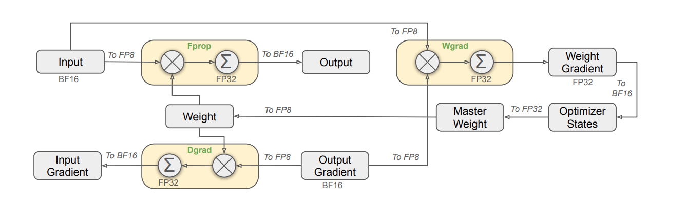

图 3-1 FP8数据格式下的混合精度训练框架

图 3-1中的英文术语解释如下： 
- Fprop: 前向传播；
- Dgrad: 数据梯度；
- Wgrad: 权重梯度；
- Weight: 权重；
- Input Gradient: 输入梯度；
- Output Gradient: 输出梯度；
- Weight Gradient: 权重梯度；
- Master Weight: 主权重；
- Optimizer States: 优化器状态；
- Optimizer: 优化器。

如图 3-1所示，DeepGEMM 的 FP8 混合精度训练框架包含三个阶段：

前向传播阶段，矩阵乘法及累加计算分别采用如下策略：

- 输入数据与权重从 BF16 转换为 FP8（E4M3格式）；
- 矩阵乘法在 FP8 精度下执行，累加在 FP32 精度下完成；
- 输出转换回 BF16 格式。

输出梯度计算阶段，矩阵乘法及累加计算分别采用如下策略：

- 损失函数回传的输出梯度从 BF16 转换为 FP8（E5M2格式）；
- 计算过程保持 FP32 累加精度；
- 生成输入梯度供下一层反向传播使用。

权重梯度计算阶段，矩阵乘法及累加计算分别采用如下策略：

- 利用前向传播缓存的 FP8 激活值；
- 与输出梯度进行矩阵乘法；
- 权重梯度以 FP32 精度传递给优化器。

优化器维护 FP32 精度的主权重副本（Master Weight），每次更新后将权重量化回 FP8 用于下一轮迭代。该设计在保持计算效率的同时，避免了低精度权重累积带来的训练不稳定问题。

**(5) 缩放因子管理**

为扩展 FP8 的有效动态范围，DeepGEMM 采用块级缩放因子（Block-wise Scaling Factor）机制。设矩阵块大小为 $B_M \times B_K$，缩放因子 $s$ 的计算方式为：

$$s = \frac{\max(|\mathbfit{A}_{\mathrm{block}}|)}{448} $$

实际存储值 $\tilde{\mathbfit{A}} = \mathbfit{A} / s$，计算时恢复为 $\mathbfit{A} = \tilde{\mathbfit{A}} \cdot s$。DeepGEMM 支持 1D 缩放（每 128 个元素一个缩放因子）与 2D 缩放（块级缩放因子）两种模式。

**2. 使用 TMA 加速计算过程**

在混合精度训练过程中，除了计算过程外，数据在不同硬件之间的传输也会造成很大的计算延迟，为了提升数据传输效率，从Hopper架构开始，NVIDIA引入了张量内存加速器（Tensor Memory Accelerator, TMA），用于在全局内存（Global Memory, GMEM）与共享内存（Shared Memory, SMEM）之间进行高效的异步数据传输。

**(1) TMA 技术概述**

TMA 的核心优势包括：

- 地址计算卸载：TMA 在硬件层面处理多维张量的地址计算与步长管理，释放 CUDA 核心用于实际计算；
- 异步执行：数据传输与计算可并行执行，隐藏内存访问延迟；
- 边界检查自动化：TMA 自动处理越界访问的预测逻辑，简化内核实现；
- 数据重排列：支持 Swizzle 模式，优化共享内存的 Bank Conflict。

DeepGEMM 基于 TMA 设计了两种内核架构，并采用线程束专用化策略实现高效的数据搬运与计算重叠：

- **1d1d 内核**：基础计算单元，命名中的“1d”表示 TMA 每次加载一个数据切片（1-dimensional slice）。该内核适用于中小规模矩阵，在共享内存约束（~48KB）下实现数据加载与计算的流水线重叠。
- **1d2d 内核**：进阶计算单元，当矩阵块大于单个 SM 共享内存容量时使用。通过引入二级计算层级（2-dimensional），解决大矩阵归约阶段 Tensor Core 空闲的问题，Tensor Core 利用率可达 95%-98%。
- **TMA Warp**：数据加载专用线程束，负责发起 TMA 指令、管理双缓冲切换、通过异步栅栏与计算线程束同步。与之配合的 Math Warp 则专注于 WGMMA 指令执行与累加操作。

**(2) TMA 描述符配置**

TMA 操作通过描述符（`CUtensorMap`）配置，其创建逻辑实现于 `sm90_fp8_gemm_1d1d.hpp`。

TMA 传输的块大小受共享内存容量约束。SM90 架构每个 SM 的共享内存上限为 232,448 字节，DeepGEMM 默认使用 48KB 的共享内存配置，以保证足够的流水线深度。

**(3) 1d1d 内核流水线设计**

1d1d 内核采用线程束（Warp）专用化设计，将计算与数据搬运解耦：

TMA Warp（数据加载线程束）：

- 负责发起 TMA 指令，从全局内存加载矩阵 A 与 B 的数据块；
- 管理共享内存的双缓冲（Double Buffering）切换；
- 通过异步栅栏（Async Barrier）与计算线程束同步。

Math Warp（计算线程束）：

- 执行 WGMMA（Warp Group Matrix Multiply-Accumulate）指令；
- 在 Tensor Core 上完成 FP8 矩阵乘法；
- 执行 Promotion 操作，将子块结果从 FP8 提升至 FP32。

流水线执行流程如表 3-3 所示。

表 3-3 1d1d 内核流水线执行时序

| 阶段 | TMA Warp | Math Warp |
|------|----------|-----------|
| Stage 0 | TMA Issue (Buffer A) | - |
| Stage 1 | Data Load (Buffer A), TMA Issue (Buffer B) | - |
| Stage 2 | Data Load (Buffer B), TMA Issue (Buffer A') | WGMMA (Buffer A) |
| Stage 3 | Data Load (Buffer A'), TMA Issue (Buffer B') | WGMMA (Buffer B), Promotion |
| ... | ... | ... |

该设计实现了数据加载与计算的完全重叠，TMA 预取下一阶段所需数据的同时，Tensor Core 处理当前阶段的矩阵乘法。

**(4) WGMMA 指令特性**

WGMMA（Warp Group Matrix Multiply-Accumulate）指令在 Hopper 架构中取代了 Ampere 架构的 HMMA 指令，支持更大的矩阵块操作。关键特性包括：

- Warp Group 级别操作：4 个 Warp（128 线程）协同完成一次 MMA 操作；
- 直接从共享内存读取：操作数可直接从共享内存获取，无需加载到寄存器；
- 异步执行：计算与后续指令可并行执行。

DeepGEMM 中 WGMMA 的配置参数如表 3-4 所示。

表 3-4 WGMMA 指令配置参数

| 参数 | SM90 配置 |
|------|-----------|
| MMA_M | 64 |
| MMA_N | 可变（16-256） |
| MMA_K | 取决于数据类型（FP8: 32） |
| 累加精度 | FP32 |

**(5) 1d2d 内核设计**

1d2d 内核的设计动机：

当计算矩阵块大于 48KB（单个 SM 共享内存上限）时，如 256×256 的分块，需将矩阵切分为多个子块分别计算后归约（Reduce）。1d1d 内核在归约阶段存在 Tensor Core 空闲的问题，1d2d 内核通过引入额外的计算层级解决这一瓶颈。

1d2d 内核架构：

1d2d 内核由 5 个线程束组成，如表 3-5 所示。

表 3-5 1d2d 内核线程束配置

| 线程束 | 角色 | 职责 |
|--------|------|------|
| TMA Warp | 数据加载 | TMA 指令发起，双缓冲管理 |
| Math Warp 0 | 子级计算 | Buffer A 的 WGMMA + Promotion |
| Math Warp 1 | 子级计算 | Buffer B 的 WGMMA + Promotion |
| Math Warp 2 | 主级归约 | Buffer A 结果的 FFMA Reduce |
| Math Warp 3 | 主级归约 | Buffer B 结果的 FFMA Reduce |

执行流程的并行化程度更高：

- TMA 双缓冲预加载：TMA Warp 同时发起 Buffer A 与 Buffer B 的加载请求，实现数据预加载的并行化；
- 子级计算组并行：Math Warp 0/1 分别处理双缓冲的两个数据块，无缝切换实现计算单元的持续忙碌；
- 主级归约组并行：Math Warp 2/3 与子级计算组完全并行工作，归约操作与下一批次计算重叠执行。

1d1d 与 1d2d 内核性能对比：

DeepGEMM 提供两种内核以适应不同的矩阵规模和应用场景：1d1d 内核适合中小规模矩阵，实现简单、资源占用低；1d2d 内核通过更复杂的流水线设计实现更高的 Tensor Core 利用率，适合大规模矩阵计算。表 3-6 对比了两种内核的主要特性。

表 3-6 1d1d 与 1d2d 内核特性对比

| 对比项 | 1d1d 内核 | 1d2d 内核 |
|--------|-----------|-----------|
| Tensor Core 利用率 | 85% ~ 90% | 95% ~ 98% |
| 相对性能（H100 FP8） | 基准值 100% | 115% ~ 125% |
| 共享内存占用 | ~48KB（单缓冲） | ~96KB（双缓冲） |
| 寄存器压力 | 低 | 中 |
| 适用矩阵尺寸 | M/N/K ≤ 4096 | M/N/K ≥ 4096 |
| 适用场景 | 轻量推理，小批量训练 | 大模型训练，大批量推理 |

DeepGEMM 根据矩阵规模自动选择内核类型：对于 N 方向缩放因子粒度为 1 的配置使用 1d1d 内核，否则使用 1d2d 内核，选择逻辑实现于 `gemm.hpp`。

**3. 运行时编译（JIT）适配不同矩阵形状和硬件配置**

1d1d 与 1d2d 内核的分块参数在编译时确定。实际应用中，矩阵形状随模型配置与批大小动态变化，静态编译所有可能的参数组合会导致编译时间与二进制体积膨胀。DeepGEMM 采用运行时即时编译策略，根据输入矩阵的实际形状动态生成最优内核。

**(1) JIT 编译系统架构**

DeepGEMM 采用运行时即时编译（Just-In-Time, JIT）策略，根据输入矩阵的实际形状动态生成最优内核。该设计避免了静态编译所有可能配置组合带来的编译时间与二进制体积膨胀问题。

JIT 系统的核心组件包括：

- 代码生成器（Code Generator）：根据运行时参数生成 CUDA 源代码；
- 编译器后端（Compiler Backend）：支持 NVCC 与 NVRTC 两种编译方式；
- 内核缓存（Kernel Cache）：缓存已编译的 CUBIN 文件，避免重复编译；
- 启发式配置选择器（Heuristic Config Selector）：根据矩阵形状选择最优的分块参数。

**(2) 代码生成流程**

代码生成过程由 `generate_impl` 函数完成（摘自 `sm90_fp8_gemm_1d2d.hpp`）。

表 3-7 列出了 JIT 编译的主要配置参数。

表 3-7 JIT 编译配置参数

| 参数类别 | 参数说明 |
|----------|----------|
| ThreadBlockShape | 线程块计算粒度：BLOCK_M, BLOCK_N, BLOCK_K |
| WarpShape | 线程束计算粒度，JIT 根据 ThreadBlockShape 自动匹配最优策略 |
| PrecisionDataType | 数据精度：a_dtype, b_dtype, c_dtype, accum_dtype |
| ComputeCapability | GPU 算力架构（SM90 对应 Hopper，SM100 对应 Blackwell） |
| PipelineLevel | 流水线层级：1 对应 1d1d 内核，2 对应 1d2d 内核 |
| SM90HardwareConfig | 硬件配置：enable_tma, enable_wgmma, shared_memory_size |
| JITCompileConfig | 编译配置：epilogue_type, unroll_factor, use_compile_cache |

**(3) 编译器后端实现**

DeepGEMM 支持两种编译后端（实现于 `compiler.hpp`）：

编译器选择通过环境变量 `DG_JIT_USE_NVRTC` 控制，默认使用 NVCC 以保证最优性能。NVRTC 编译速度可提升约 10 倍，适用于开发调试场景。

**(4) 启发式配置选择**

配置选择器根据矩阵形状与硬件参数选择最优的分块配置（摘自 `sm90.hpp`）。

配置选择遵循以下原则：

- 共享内存约束：确保分块大小不超过 SM 共享内存容量（SM90 为 232,448 字节）；
- 寄存器压力平衡：避免寄存器溢出导致的性能下降；
- 占用率优化：选择能够最大化 SM 占用率的配置；
- 对齐要求：满足 TMA 与 Tensor Core 的对齐约束。

**4. 使用连续布局和掩码布局支持 MoE 模型**

前述内容详细介绍了单次 GEMM 调用的计算效率的优化方案。在 MoE 模型中，不同专家处理的 Token 数量差异显著，对数据布局与计算调度提出了额外要求。DeepGEMM 通过连续布局（Contiguous Layout）与掩码布局（Masked Layout）两种策略，分别优化训练/预填充阶段与解码阶段的 MoE 计算效率。

**(1) MoE 场景的计算挑战**

混合专家模型（Mixture-of-Experts, MoE）通过门控网络将输入 Token 路由至部分专家进行计算。在训练与推理的 Prefill 阶段，不同专家处理的 Token 数量差异显著，直接按 Token 顺序计算存在以下问题：

- 内存访问碎片化：不同专家的权重矩阵与对应 Token 特征在物理内存中地址分散，缓存命中率低；
- 计算资源利用不充分：每个专家的计算任务被拆解为小批量 GEMM 操作，Tensor Core 利用率仅 30% 左右；
- 调度开销：多次内核调用带来显著的 CPU-GPU 同步开销。

**(2) 连续布局**

连续布局（Contiguous Layout）针对训练与 Prefill 阶段设计，核心思想是将属于同一专家的 Token 在物理内存中重组为连续张量。

处理流程：

1. Token 归集：根据路由结果，按专家 ID 筛选归属各专家的 Token
2. 内存连续化：对每个专家的 Token 子集进行内存重排列，构建物理地址连续的矩阵
3. 对齐填充：仅对 M 轴按 Tensor Core 计算粒度进行对齐，补充少量零值 Token
4. 全局拼接：将所有专家的对齐后张量拼接为统一的输入矩阵
5. 分组 GEMM：调用 DeepGEMM 的 `m_grouped_fp8_gemm_*_contiguous` 接口，单次内核调用完成所有专家的计算
6. 结果回填：根据原始 Token 索引映射关系恢复输出顺序

连续布局的性能提升如表 3-8 所示。

表 3-8 连续布局性能提升

| 指标 | 提升幅度 |
|------|----------|
| 显存带宽利用率 | +50% |
| Tensor Core 利用率 | +65% |
| 调度开销 | -90% |
| 训练吞吐 | 2.0~2.5× |
| Prefill 效率 | 1.8~2.2× |

**(3) 掩码布局**

推理的 Decode 阶段具有不同特性：Token 逐个生成，每个专家接收的 Token 数量可能为 0 或 1，且完全不可预知。传统方法需在每次 Decode 时重新配置内核参数，无法使用 CUDA Graph 加速。

掩码布局（Masked Layout）通过引入 `masked_m` 向量解决这一问题。

调度器（Scheduler）在运行时读取 `masked_m` 数组，动态跳过无效的计算块。

CUDA Graph 兼容性：

掩码布局使用固定的 `expected_m` 参数选择内核配置，确保 CUDA Graph 的可重放性。`masked_m` 数组完全在 GPU 端维护，无需 CPU 参与。

表 3-9 对比了传统方法与掩码布局的特性。

表 3-9 传统方法与掩码布局对比

| 维度 | 传统方法 | 掩码布局 |
|------|----------|----------|
| CPU 参与度 | 每次推理需 CPU 配置 | 仅初始化参与 |
| 内核编译 | 动态 JIT 编译 | 预编译 + 静态配置 |
| CUDA Graph 支持 | 不支持 | 支持 |
| 无效计算占比 | 高（计算全量 M_max） | 0（仅计算 masked_m 部分） |
| 端到端延迟 | 毫秒级 | 微秒级 |

**(4) 布局选择策略**

连续布局与掩码布局并非替代关系，而是针对 MoE 模型不同阶段的场景化优化：

- 连续布局：适用于训练阶段与推理 Prefill 阶段，追求静态批量的计算最大化；
- 掩码布局：适用于推理 Decode 阶段，追求动态实时的带宽与延迟最优化。

结合使用可覆盖 MoE 模型训练与推理的全流程。

### 3.1.2 3FS：高性能分布式文件系统

大规模深度学习训练对存储系统提出了前所未有的性能需求。3FS（Fire-Flyer File System）是 DeepSeek 开源的分布式文件系统[^ant3fs]，专为 AI 训练与推理负载进行深度优化，实现了单集群 6.6 TiB/s 的聚合读取吞吐量。

**1. 3FS系统设计背景**

3FS 的设计源于大规模深度学习训练对存储系统的多维度性能需求。不同训练阶段与推理场景在 I/O 模式、吞吐量、延迟及一致性方面呈现差异化特征，现有分布式文件系统在这些场景下均存在不同程度的局限性。

**(1) AI 训练存储需求分析**

大模型训练流程涉及以下典型的 I/O 模式：

- 训练数据预处理（Training Data Preprocessing）：对海量原始数据进行清洗、分词、编码等操作；
- 数据集加载（Dataset Loading）：训练过程中从分布式存储读取训练样本，要求高吞吐量与低延迟；
- 检查点保存（Checkpointing）：定期将模型状态持久化，涉及大规模高并发顺序写入；
- 检查点恢复：从存储加载模型状态，要求高并发随机读取；
- KV-Cache 卸载（KVCache for Inference）：推理场景下将 KV-Cache 从显存卸载至外部存储。

不同 AI 场景的存储需求特征如表 3-10 所示。

表 3-10 不同 AI 场景的存储需求特征

| 场景 | I/O 模式 | 吞吐量需求 | 延迟需求 | 一致性需求 |
|-----|---------|-----------|---------|-----------|
| 数据预处理 | 顺序读写 | 高 | 低 | 弱 |
| 数据集加载 | 随机读 | 高 | 中 | 弱 |
| 检查点写入 | 高并发顺序写 | 极高 | 中 | 强 |
| 检查点恢复 | 高并发随机读 | 极高 | 低 | 强 |
| KV-Cache 卸载 | 随机读写 | 高 | 极低 | 强 |

**(2) 现有分布式文件系统的局限性**

现有分布式文件系统在 AI 场景下的局限性如表 3-11 所示。

表 3-11 现有分布式文件系统在 AI 场景下的局限性

| 系统 | 局限性描述 |
|-----|-----------|
| HDFS | 高延迟、Java GC 停顿影响训练稳定性、小文件性能差 |
| Lustre | 元数据服务器瓶颈、扩展性受限、运维复杂度高 |
| GPFS | 许可证成本高、云环境部署困难 |
| 对象存储（S3/OSS） | 延迟高、不支持 POSIX 语义、无原子目录操作 |
| Ceph | 复杂度高、故障恢复时存在 stop-the-world 问题 |

**(3) 3FS 设计目标**

3FS 针对上述局限性，确立以下设计目标：

- 高吞吐量：单集群支持 6.6 TiB/s 聚合读取带宽；
- 低延迟：P99 读取延迟控制在毫秒级；
- 强一致性：支持完整 POSIX 语义，简化应用开发；
- 弹性扩展：存储容量与计算节点独立扩展；
- AI 协同设计：与训练框架、网络通信深度集成。

**2. 3FS 架构设计**

针对前述存储需求与现有系统的局限性，3FS 采用分离式架构，将集群管理、元数据服务、存储服务与客户端四类组件解耦设计，实现存储容量与计算节点的独立扩展。

**(1) 整体架构**

3FS 采用分离式架构（Disaggregated Architecture），包含四类核心组件：

- 集群管理器（Cluster Manager）：管理整个集群的状态与故障转移；
- 元数据服务（Metadata Service）：管理文件系统命名空间与元数据；
- 存储服务（Storage Service）：负责数据块的持久化存储；
- 客户端（Client）：提供 POSIX 兼容的文件系统接口。

3FS 整体架构如图 3-2 所示。

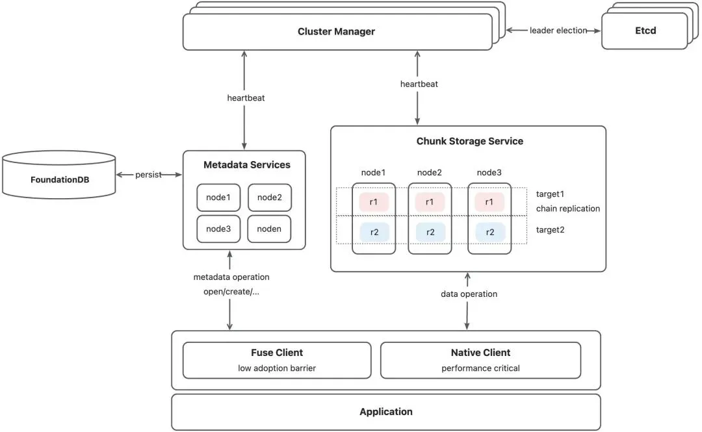

图 3-2 3FS 整体架构

**(2) 外部依赖**

3FS 依赖以下外部组件：

- FoundationDB[^fdb]：用于元数据服务存储文件元数据，提供 SSI 隔离级别的分布式事务支持；
- ZooKeeper/etcd：用于 Cluster Manager 实现多副本选主；
- ClickHouse：用于存储服务产生的监控指标（Metrics）。

**(3) 数据组织与寻址**

3FS 将文件划分为固定大小的数据块（Chunk），默认块大小为 64 MiB。与 GFS 类似，3FS 在元数据中不维护 chunk list 结构信息，chunk 的 ID 和位置均通过计算得出：

Chunk ID 计算：

$$\text{chunk\_id} = \{\text{ino}\}\{\text{chunk\_index}\} $$

其中 $\text{ino}$ 为文件的 inode 编号。chunk_index 可通过 offset 除以 chunk_size 得到：

$$\text{chunk\_index} = \lfloor \text{offset} / \text{chunk\_size} \rfloor $$

Chunk 位置路由：

每个 inode 在创建时分配 `chain_table` 和 `shuffle_seed`，chunk 的位置通过以下方式计算：

$$\text{chain\_id} = f(\text{chunk\_index}, \text{shuffle\_seed}, \text{chain\_table}) $$

其中 `chain_table` 为该文件可用的存储链列表（每个链是一组维护数据副本的存储节点），`shuffle_seed` 为用于数据分布的伪随机种子，$f$ 为基于种子的确定性映射函数。该策略实现了数据的均匀分布与并行访问，同时避免了在元数据中维护大量 chunk 位置信息的开销。

**(4) CRAQ 链式复制协议**

3FS 的存储服务采用 CRAQ[^craq]（Chain Replication with Apportioned Queries）一致性协议维护数据副本。该协议的核心特性：

写入流程：

1. 头节点（Head）接收来自客户端的写入操作，数据被标记为脏数据（Dirty）
2. 头节点通过链式传播将写入操作发送至后继节点
3. 尾节点（Tail）收到数据后，将其标记为干净数据（Clean）
4. 尾节点通过链向前发送确认信息（ACK）

读取流程：

1. 读取可在链中的任意节点进行
2. 如果节点持有脏数据，则联系尾节点检查状态
3. 尾节点返回最新状态，保证读取的强一致性

CRAQ 链式复制协议示意如图 3-3 所示。

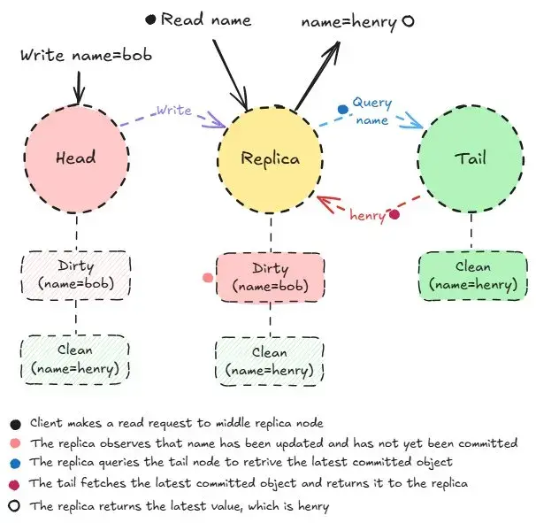

图 3-3 CRAQ 链式复制协议示意

CRAQ 相比星型写（Star Topology Write）的优劣势如表 3-12 所示。

表 3-12 CRAQ 与星型写对比

| 特性 | CRAQ 链式复制 | 星型写 |
|-----|--------------|--------|
| 客户端出口带宽 | 1 份数据 | R 份数据（R 为副本数） |
| 读取负载分散 | 可在任意节点读取 | 通常只能从主节点读取 |
| 写入延迟 | 较高（链式传播） | 较低（并行写入） |
| 可用性 | 任一节点故障需等待恢复 | Quorum 机制可容忍少数故障 |
| EC 支持难度 | 困难（需离线 EC） | 容易实现在线 EC |

**3. 3FS 集群管理**

3FS 的集群管理模块负责维护集群拓扑信息、成员状态及 Chain 版本管理，为存储服务与客户端提供全局一致的集群视图与故障恢复支持。

**(1) 集群拓扑层级**

3FS 集群管理模块维护的拓扑信息如表 3-13 所示。

表 3-13 集群拓扑层级

| 层级 | 描述 | 故障影响范围 |
|-----|------|------------|
| 节点（Node） | 单台服务器 | 单节点数据不可用 |
| 机架（Rack） | 同一机架的节点集合 | 机架内所有节点 |
| 数据中心（DC） | 同一物理位置的机架集合 | 整个数据中心 |
| 区域（Region） | 多个数据中心 | 区域级故障 |

**(2) 成员管理与故障检测**

集群成员状态通过心跳机制（Heartbeat）维护。各组件与 Cluster Manager 保持心跳，状态定义如下：

$$\text{State} \in \{\text{ONLINE}, \text{SUSPECT}, \text{OFFLINE}, \text{DECOMMISSIONING}\} $$

状态转换规则：

- $\text{ONLINE} \rightarrow \text{SUSPECT}$：连续 $T_1$ 次心跳超时（默认 $T_1 = 3$）；
- $\text{SUSPECT} \rightarrow \text{OFFLINE}$：连续 $T_2$ 次心跳超时（默认 $T_2 = 10$）；
- $\text{OFFLINE} \rightarrow \text{ONLINE}$：收到有效心跳且数据校验通过。

心跳超时阈值默认为 5 秒。

**(3) Chain 版本管理与 Fencing**

3FS 为每一个 chain 维护版本号（Version），该版本号不同于 chunk 副本中的版本号：

- Chunk 版本号：在 CRAQ 协议内部使用，用于决议 chunk 的 committed 版本；
- Chain 版本号：用于故障处理，对外可见，特别是对 client 可见。

当成员变更时 chain 版本提升，客户端的写入请求如附带旧版本则被拒绝。该机制防止以下异常场景：

1. Client1 写入请求 R1 到 HEAD，HEAD 未处理时发生隔离
2. Chain 成员变更，版本提升
3. Client2 写入同一 chunk 成功
4. Client1 的 R1 得到处理，导致 Client2 数据被非预期覆盖

通过 chain 版本检查，步骤 4 中的请求 R1 将被拒绝。

**4. 3FS 存储管理**

3FS 的存储服务承担数据块的持久化存储与 I/O 处理职责，涵盖空间分配策略、基于 RDMA 的通信架构、读写流程设计及数据完整性保障机制。

**(1) 存储引擎架构**

3FS 存储服务在整体架构中的位置如图 3-4 所示。

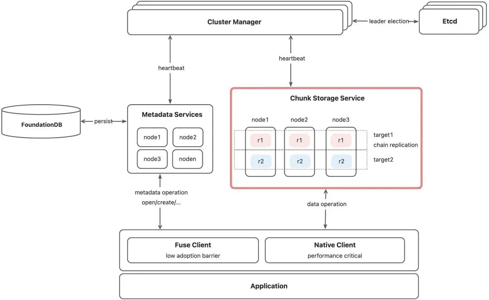

图 3-4 3FS 存储服务架构

ChunkStorage 提供三项基础功能：

- 空间分配策略；
- 基于 RDMA 的通信链路，数据面 I/O 处理；
- 提供支撑链式复制（Chained-Replication）在容错、数据一致性方面的支持。

**(2) 空间分配策略**

3FS 的空间分配采用分层设计，支持从 64KB 到 64MB 的多种 chunk 大小：

分配器层级结构：

- Allocator：顶层分配器，根据请求的 size 选择合适的 ChunkAllocator；
- ChunkAllocator：管理特定大小的 chunk 分配；
- GroupAllocator：管理 Group 的分配，每个 Group 包含 256 个 Chunk。

分配流程：

1. 根据调用者提供的 size，选择相应的 allocator
2. 按照内存状态挑选最不空闲的已分配 group（类似 slab 分配策略）
3. 从 group 中挑选 chunk 进行分配
4. 在 Engine 中更新 chunk_id 到 chunk 的映射，并持久化映射关系

该策略类似于操作系统中的 slab 分配器，采用贪心方式尽可能填满 group 内的空洞，提升空间利用率。

**(3) RDMA 通信架构**

3FS 的数据面通信完全基于 RDMA（Remote Direct Memory Access），实现零拷贝数据传输。RDMA 通信架构如图 3-5 所示。

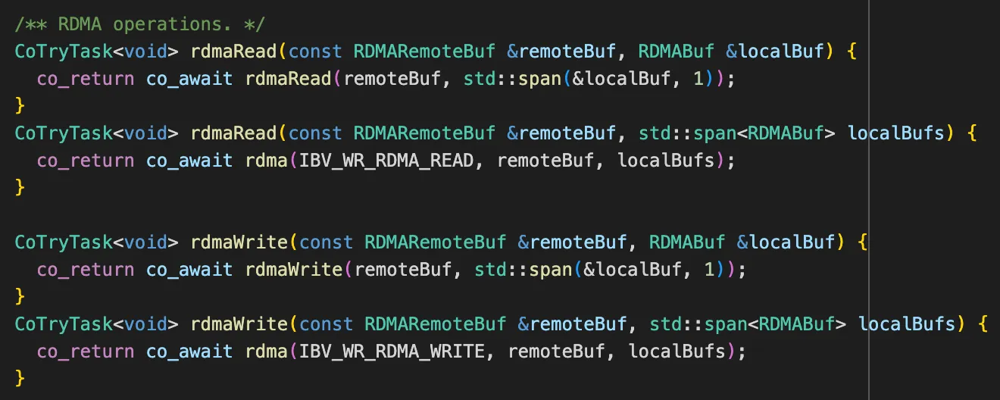

图 3-5 3FS RDMA 通信架构

核心组件包括：

- IBDevice：RDMA 设备管理，负责打开设备、分配 Protection Domain、查询设备属性；
- IBSocket：封装 RDMA 通信细节，使用 folly 协程实现异步操作；
- RDMABufPool：RDMA 内存池管理，Client 和 Server 共用；
- TransportPool：传输连接池，对 address 做 shard 分配以提升性能。

**(4) 读写 I/O 流程**

读流程：

1. StorageOperator 发送 Read 请求，通过 AioReadWorker 读取目标 Chunk
2. 读取到的数据放入 buffer batch
3. 通过 RDMA WRITE 将数据传输到 client

写流程（CRAQ 链式复制）：

1. Client 向 StorageOperator 提交 write 请求，发送到链头
2. 链头通过 RDMA READ 从 client 读取数据
3. 通过 ChunkEngine 执行 Direct I/O 写入磁盘
4. 写成功后开启 forwarding，将 buffer 信息传递给下一节点
5. 后续节点重复上述流程，直到链尾

3FS 写流程如图 3-6 所示。

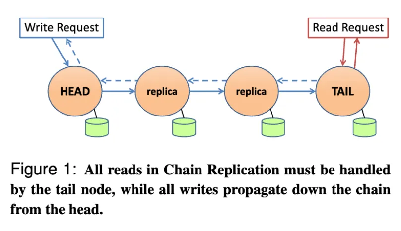

图 3-6 3FS 写流程（CRAQ 链式复制）

**(5) 流量控制机制**

3FS 实现了请求到发送控制机制（Request-to-Send Control Mechanism）：

- 读请求流控：从磁盘 AIO 读取数据后到 RDMA WRITE 前进行流控；
- 写请求流控：收到请求后准备 RDMA READ 前进行流控；
- 设备级流控：限制单个 device 的 inflight RDMA 请求数量；
- 客户端流控：客户端可主动要求服务器限流。

**(6) 引用计数与碎片整理**

3FS 通过引用计数（Reference Counting）管理存储块的生命周期：

- 块分配成功后，通过 `Allocator::reference` 增加引用计数；
- 块不再需要时，通过 `Allocator::dereference` 减少引用计数；
- 引用计数为 0 时释放存储块；
- Group 为空时，GroupAllocator 回收该组。

碎片整理（Defragmentation）：

当发现申请了过多但已废弃的 chunk 时，系统会对相应 group 进行碎片整理：

1. 将目标 group 置入 Frozen 状态
2. 将使用中的 chunk 搬迁（Move）到其他 group
3. 整理完成后将 group 恢复为 Active 状态

碎片整理是周期性后台任务，通过调整碎片比率（Fragmentation Ratio）控制整理频率。

**(7) 数据完整性保障**

3FS 采用分层数据完整性保障机制，在不同粒度上检测和防范数据损坏，确保存储系统的可靠性。3FS 数据完整性机制如表 3-14 所示。

表 3-14 3FS 数据完整性机制

| 层级 | 机制 | 检测能力 |
|-----|------|---------|
| 块级 | CRC32C 校验和 | 位翻转、部分写入 |
| 副本级 | 版本向量 | 副本不一致 |
| 文件级 | Merkle 树 | 静默数据损坏 |

校验和计算采用硬件加速的 CRC32C 指令：

$$\text{CRC}_{\mathrm{32C}}(D) = D(x) \cdot x^{32} \mod G(x) $$

其中 $D$ 为待校验的数据，$D(x)$ 为数据的多项式表示，$G(x)$ 为 CRC-32C 生成多项式。

**5. 3FS 客户端管理**

3FS 客户端为应用程序提供文件系统访问接口，采用控制面与数据面分离的设计，通过共享内存实现零拷贝数据传输，并支持多级缓存加速。

**(1) 客户端模式概述**

3FS 提供两种客户端访问模式：

- FUSE Client：基于 libfuse 实现，对性能不敏感的应用使用；
- Native Client（USRBIO）：对性能要求极高的应用使用原生客户端。

3FS 客户端架构如图 3-7 所示。

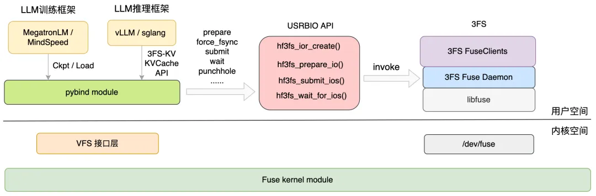

图 3-7 3FS 客户端架构

**(2) FUSE 与共享内存混合架构**

3FS 基于用户态 libfuse 实现文件系统接口。与传统 FUSE 不同，3FS 采用控制面与数据面分离的设计：

- 控制面（Control Path）：元数据操作走标准 libfuse 路径（open、close、stat 等）；
- 数据面（Data Path）：数据传输走共享内存，实现零拷贝。

共享内存通道包括两个组件：

lov（Large Object of Verbs）：
- InfiniBand 共享内存区域；
- 用于在应用程序和 3fs native client 之间传输数据；
- 实现完全零拷贝的数据传输。

lor（Large Object of Rings）：
- 基于共享内存的环形缓冲区（Ring Buffer）；
- 用于传递控制信息；
- 写数据时：数据写入 lov 后，提交请求到 lor；
- 读数据时：请求提交到 lor，fuse native client 将数据写入 lov。

共享内存架构如图 3-8 所示。

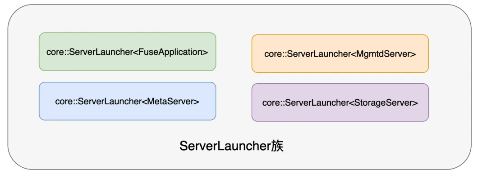

图 3-8 3FS 共享内存架构

该架构相比标准 libfuse 的优势：

- 标准 libfuse 控制流和数据流都需要经过内核，占用内存带宽并增加端到端延迟；
- libfuse 内核维护单队列与用户态进程交互，单文件不支持并发写入；
- 3FS 的共享内存方案绕过内核，直接在用户态完成数据传输。

**(3) 控制路径保留 libfuse 的原因**

3FS 数据流基于共享内存，但控制流仍走标准 fuse 路径，考量包括：

- 开发管理简化：减少接口开发量，便于在客户机中做挂载点管理；
- 状态信息维护：集群拓扑、数据节点地址、session 管理需要常驻守护进程；
- 缓存共享：基于 fuse daemon 的统一进程可在多客户端访问时实现缓存共享；
- 冷启动性能：模型重启时可利用缓存加速。

**(4) 客户端缓存架构**

3FS 客户端实现多级缓存，如图 3-9 所示。

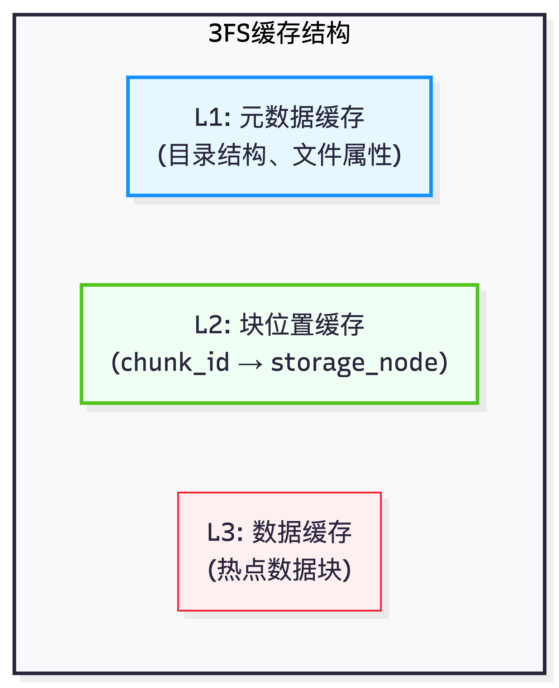

图 3-9 3FS 客户端缓存架构

缓存一致性通过租约（Lease）机制保证：

$$T_{\mathrm{lease}} = T_{\mathrm{base}} + \alpha \cdot T_{\mathrm{activity}} $$

其中 $T_{\mathrm{base}}$ 为基础租约时长，$T_{\mathrm{activity}}$ 为近期访问活跃度，$\alpha$ 为调节系数。

**6. 3FS 元数据管理**

3FS 的元数据服务管理文件系统命名空间，包括目录结构、文件属性及数据块映射。基于 FoundationDB 的 SSI 事务支持，元数据操作的一致性由数据库层保证，MetaService 本身可设计为无状态。

**(1) 基于 FoundationDB 的元数据存储**

3FS 元数据使用 FoundationDB 作为底层存储。FoundationDB 是支持 SSI（Serializable Snapshot Isolation，可串行化快照隔离）隔离级别事务的分布式键值数据库。

选择 FoundationDB 的原因：

- SSI 隔离级别：等价于两阶段锁实现的可串行化隔离，语义上等价于所有事务按序执行；
- 简单高效的 KV 接口：相比 MySQL/PostgreSQL，避免了过重的 SQL 解析开销；
- 强一致性保证：自动解决文件系统目录树的一致性问题。

**(2) 元数据 Schema 设计**

3FS 将 Inode 和 Directory Entry（Dentry）作为两种独立的记录分别组织，如表 3-15 所示。

表 3-15 元数据 Schema 设计

| 类型 | Key 格式 | Value 内容 |
|-----|---------|-----------|
| Dentry | `DENT{parent_ino}{name}` | parent_ino, ino, chain_table, chunk_size, stripe_size, owner, permission, timestamps |
| Inode | `INOD{ino}` | file_length, chunk_size, selected_range_in_chain_table, shuffle_seed, owner, permission, timestamps |

设计要点：

- DENT/INOD 前缀隔离：FoundationDB 是全局有序的 KV，没有 table 概念，前缀用于数据隔离；
- Inode 小端编码：将 ino 以 little-endian 存储，使业务请求均匀散列到不同分片；
- Dentry 聚集：同一目录下的 Dentry 聚集在一起，减少 readdir 的交互次数；
- Parent ID 存储：文件 Inode 属性中存在 parent_id，用于 rename 场景下判断是否成环。

**(3) 目录树操作的事务处理**

元数据操作利用 FoundationDB 的 SSI 事务：

只读事务（元数据查询）：
- fstat；
- lookup；
- listdir。

读写事务（元数据更新）：
- create；
- link；
- unlink；
- rename。

基于 SSI 事务，所有一致性复杂性交由数据库解决。例如 rename 成环问题：当两个并发的 rename 操作可能导致目录树成环时，事务层检测到冲突，其中一个事务被取消并自动重试，如图 3-10 所示。

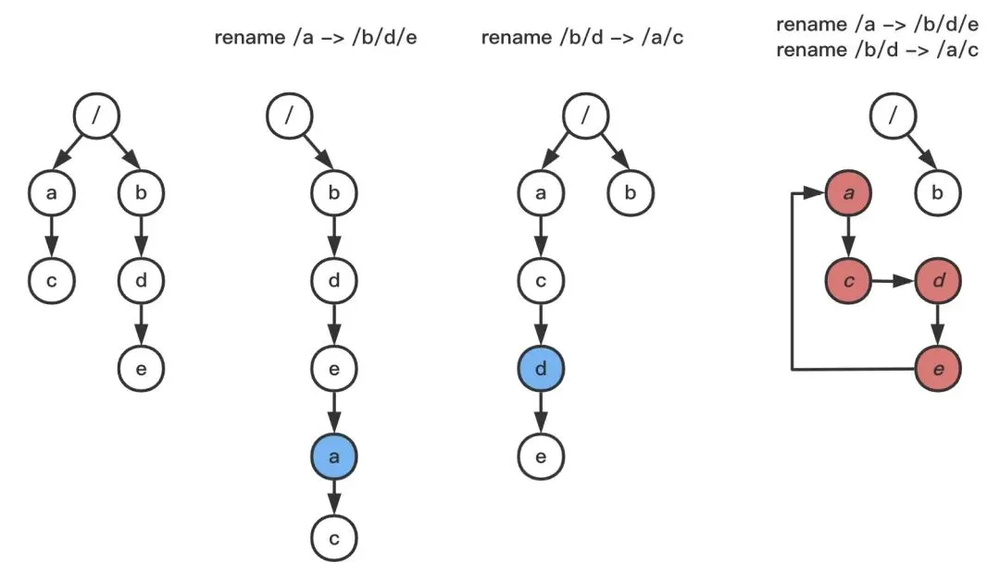

图 3-10 SSI 事务处理 rename 成环问题

**(4) MetaService 无状态设计**

借助 SSI 事务，所有状态都在数据库维护，MetaService 可做到无状态。所有 MetaService 实例在目录树结构层面相当于可互换的代理（Proxy）。

该设计的优势：
- 元数据处理逻辑有 bug 时，可不依赖 client 独立升级 MetaService；
- 避免 client 过多造成数据库 session 过多的负面影响；
- 水平扩展简单，添加 MetaService 实例即可提升处理能力。

**(5) 文件长度的延迟更新**

3FS 对文件长度更新采用延迟策略（Lazy Update）：

1. 客户端定期（默认每 5 秒）向 MetaService 报告每个以写模式打开的文件的最大写入位置
2. 如果该位置超过 inode 中存储的长度且没有并发 truncate 操作，则采纳为新的文件长度
3. 并发写入时，通过 rendezvous hash 保证相同 inode ID 的请求打到固定的 MetaService 节点，节点内部对请求进行合并处理

该策略避免了并发写入过程中更新相同文件元数据导致的 FoundationDB 事务冲突。

## 3.2 MoE 的工程优化

混合专家系统（MoE）架构的核心思想是将模型参数划分为多个专家（Expert），每个 token 仅被路由至少数专家进行处理。DeepSeek-V3 采用 256 个路由专家、1 个共享专家的配置，每个 token 激活 8 个专家。相比稠密模型，MoE 架构在保持计算量基本不变的前提下实现了模型容量的大幅提升：DeepSeek-V3 总参数量达 671B，但单 token 激活参数仅 37B。

本节介绍 DeepSeek 为支持 MoE 模型设计的高性能通信库 DeepEP[^deepep] 和支持专家并行的负载均衡器 EPLB[^eplb]。

### 3.2.1 DeepEP：高性能通信库

DeepEP（DeepSeek Expert Parallel）是专为 MoE 模型设计的高性能通信库，针对专家并行（Expert Parallelism, EP）场景优化 All-to-All 通信性能，支撑了 DeepSeek-V3 的高效训练与推理。

MoE 模型的分布式训练与推理面临独特的通信挑战。不同于数据并行的 All-Reduce 和张量并行的 All-Gather/Reduce-Scatter，专家并行需要 All-to-All 通信：每个 GPU 需将 token 发送至持有目标专家的 GPU，通信模式呈现多对多特征。路由决策的动态性导致不同 GPU 间的通信量存在差异，且随 batch 动态变化，难以提前预测。传统 All-to-All 实现（如 NCCL）针对通用场景优化，在 MoE 场景下存在启动开销大、无法利用路由先验、同步粒度粗等局限。

DeepEP 针对上述挑战提出了系统性的解决方案。在通信架构层面，采用基于 NVSHMEM[^nvshmem] 的单边通信机制，消除集合通信的同步开销。在数据布局层面，引入连续布局（Contiguous Layout）与掩码布局（Masked Layout）两种策略，分别优化训练/预填充阶段与解码阶段的通信效率。在内核实现层面，提供普通内核与低延迟内核两套方案，适配不同场景的性能需求。

**1. DeepSeek MoE 通信原理**

MoE 层的前向传播涉及路由计算、Token 分发（Dispatch）、专家计算与结果聚合（Combine）四个步骤，其中 Dispatch 与 Combine 步骤通过 All-to-All 通信实现 Token 在 GPU 间的重新分布，通信量与通信模式直接影响 DeepEP 的架构设计。

**(1) MoE 前向传播流程**

MoE 层的前向传播包含路由计算、Dispatch、专家计算、Combine 四个核心步骤。给定输入 $X \in \mathbb{R}^{B \times S \times D}$（其中 $B$ 为批大小，$S$ 为序列长度，$D$ 为隐藏维度），路由网络首先计算门控分数 $G = \text{softmax}(X W_{\mathrm{gate}})$，其中 $G \in \mathbb{R}^{B \times S \times E}$，$E$ 为专家总数。通过 Top-K 选择确定每个 token 激活的 $K$ 个专家及其权重。

Dispatch 阶段将 token 按路由结果发送至持有目标专家的 GPU。设专家并行度为 $N_{\mathrm{ep}}$，每个 GPU 持有 $E / N_{\mathrm{ep}}$ 个专家。对于 token $t$ 选择的专家集合 $\{e_1, e_2, \ldots, e_K\}$，需将 $X[t]$ 发送至对应的 $K$ 个 GPU（可能存在重复）。该过程实现了从 token-wise 分布到 expert-wise 分布的转换。

专家计算阶段在每个 GPU 上独立执行。各 GPU 对接收到的 token 按专家索引分组，每个本地专家 $e$ 处理其接收的 token 集合 $T_e$，计算 $Y_e = \text{FFN}_e(T_e)$。该阶段的计算密度高，是 MoE 层的主要算力消耗环节。

Combine 阶段将专家输出按原始 token 索引聚合。对于 token $t$，需从 $K$ 个 GPU 获取对应的专家输出，执行加权求和 $Y[t] = \sum_{k=1}^{K} w_{t,k} \cdot \text{output}_{t,k}$，其中 $w_{t,k}$ 为归一化后的门控权重。该过程实现了从 expert-wise 分布回到 token-wise 分布的转换。

**(2) Dispatch 与 Combine 通信量分析**

设输入序列长度为 $S$，批大小为 $B$，每 token 选择 $K$ 个专家，模型隐藏维度为 $d_{\mathrm{model}}$。Dispatch 阶段的总通信量为：

$$V_{\mathrm{dispatch}} = B \cdot S \cdot K \cdot d_{\mathrm{model}} \cdot \text{sizeof(dtype)} $$

对于 DeepSeek-V3（$d_{\mathrm{model}} = 7168$，$K = 8$，BF16 精度）：

$$V_{\mathrm{dispatch}} = B \cdot S \cdot 8 \cdot 7168 \cdot 2 = 114688 \cdot B \cdot S \text{ bytes} $$

Combine 阶段通信量与 Dispatch 相同，因此单次 MoE 层前向传播的总通信量为 $V_{\mathrm{total}} = 2 \cdot V_{\mathrm{dispatch}}$。对于包含 $L$ 层 MoE 的模型，前向传播共需 $2L$ 次 All-to-All 通信。

**(3) All-to-All 通信语义**

All-to-All 操作的形式化定义：设 $N$ 个进程参与通信，进程 $i$ 的输入数据为 $\mathbfit{X}_i \in \mathbb{R}^{N \times M}$，输出数据为 $\mathbfit{Y}_i \in \mathbb{R}^{N \times M}$。All-to-All 操作定义为：

$$\mathbfit{Y}_i[j, :] = \mathbfit{X}_j[i, :], \quad \forall i, j \in [0, N) $$

即进程 $i$ 的第 $j$ 块数据来自进程 $j$ 的第 $i$ 块。在 MoE 场景下，All-to-All 的输入按目标专家索引组织，输出按源 token 索引组织。该操作实现了 token 在 GPU 间的重新分布。

**(4) 通信拓扑与路由**

DeepSeek 的训练集群采用多级网络拓扑：节点内通过 NVLink/NVSwitch 互联（H100 双向带宽 900 GB/s），节点间通过 InfiniBand HDR 连接（200 Gb/s × 8 = 1600 Gb/s），机架间通过多级 Fat-Tree 交换机组成。DeepEP 根据通信目标位置选择最优传输路径：同 GPU 使用本地内存拷贝（< 1μs），同节点使用 NVLink P2P（1-3μs），跨节点使用 RDMA/NVSHMEM（5-15μs）。

表 3-16 对比了不同并行策略的通信特性。

表 3-16 并行策略通信特性对比

| 并行策略 | 通信模式 | 通信量 | 通信频率 | 延迟敏感度 |
|---------|---------|--------|---------|-----------|
| 数据并行（DP） | All-Reduce | $O(P)$ | 每层一次 | 低 |
| 张量并行（TP） | All-Reduce | $O(B \cdot H)$ | 每层多次 | 高 |
| 流水线并行（PP） | P2P | $O(B \cdot H)$ | 每微批次 | 中 |
| 专家并行（EP） | All-to-All | $O(B \cdot H \cdot K/E)$ | 每 MoE 层两次 | 极高 |

其中 $P$ 为参数量，$B$ 为批大小，$H$ 为隐藏维度，$K$ 为每 token 激活专家数，$E$ 为专家总数。

**2. 使用 NVSHMEM 实现低延迟跨节点通信**

传统集合通信库（如 NCCL）在 MoE 场景下存在启动延迟大、同步粒度粗等局限。DeepEP 采用基于 NVSHMEM 的单边通信机制，支持 GPU 直接访问远程 GPU 内存，消除 CPU 参与的同步开销。

**(1) NVSHMEM 架构概述**

NVSHMEM（NVIDIA SHMEM）是 OpenSHMEM 标准的 GPU 实现，支持 GPU 直接访问远程 GPU 内存，无需 CPU 参与。其架构具有三个核心特点：单边通信（One-sided Communication）使得 Put/Get 操作无需远程 GPU 参与；对称堆内存模型确保所有 PE（Processing Element）分配相同布局的内存空间；GPU 内核直接调用允许通信 API 在 CUDA kernel 内部调用，消除了 Host-Device 同步开销。

相比传统的 NCCL 集合通信，NVSHMEM 在 MoE 场景下具有显著优势，如表 3-17 所示。

表 3-17 NCCL 与 NVSHMEM 通信特性对比

| 对比维度 | NCCL All-to-All | NVSHMEM Put/Get |
|---------|-----------------|-----------------|
| 通信启动延迟 | 5-10 μs | 1-3 μs |
| CPU 参与度 | 需要 CPU 调度 | GPU 自主发起 |
| 同步粒度 | 整体同步 | 细粒度同步 |
| 内存模型 | 显式数据交换 | 共享地址空间 |
| 动态通信支持 | 受限 | 原生支持 |

**(2) 对称堆内存模型**

NVSHMEM 采用对称堆（Symmetric Heap）内存模型。所有参与进程分配相同大小的堆空间，远程内存地址通过本地偏移量计算：

$$\text{remote\_addr}(pe, ptr) = \text{base\_addr}_{\mathrm{pe}} + (ptr - \text{base\_addr}_{\mathrm{local}}) $$

其中 $pe$ 为目标处理单元（Processing Element）编号，$ptr$ 为本地指针地址，$\text{base\_addr}_{\mathrm{pe}}$ 为目标 PE 的对称堆基地址，$\text{base\_addr}_{\mathrm{local}}$ 为本地对称堆基地址。该设计使得远程内存访问无需地址交换，降低了通信延迟。DeepEP 的对称堆配置包含 Dispatch 缓冲区、Combine 缓冲区、元数据区域、同步信号区域。

在 DeepEP 的实现中，`Buffer` 类维护 NVLink 和 NVSHMEM 双层缓冲区结构。

该设计区分了节点内（NVLink）和跨节点（RDMA）两条通信路径，充分利用多级网络拓扑的硬件特性。

**(3) 单边 Put/Get 操作**

NVSHMEM 提供 put（写入远程）和 get（读取远程）两类单边操作。Dispatch 阶段使用 Put 操作将 token 数据写入远程 GPU。

**(4) 信号与同步机制**

NVSHMEM 提供细粒度同步原语。DeepEP 利用 Signal 操作实现高效的生产者-消费者同步。

该机制使得接收方可以在数据部分到达后立即开始处理，而非等待所有数据。DeepEP 内核 API 中定义了节点间通信的完整接口，包括 `notify_dispatch`、`dispatch` 和 `combine` 三个核心函数，分别负责通知、分发和聚合操作。

**3. 使用 DeepEP 实现训练或预填充阶段推理**

基于NVSHMEM 通信架构，DeepEP 针对不同应用场景提供差异化的优化策略。训练与预填充阶段具有大批量、确定性路由的特点，适合采用连续布局与流水线式 All-to-All 通信最大化吞吐量。

**(1) 训练阶段通信特点**

训练与预填充（Prefill）阶段的 MoE 通信具有以下特点：大批量（batch size 通常 > 1000 tokens），单次通信数据量充足；确定性路由，同一 batch 的前向与反向传播路由相同；双向通信，前向需 Dispatch/Combine，反向需传输梯度。

然而，直接按 token 顺序进行通信存在严重的效率问题。不同专家处理的 token 数量差异显著，在物理内存中地址分散，导致：

- 内存访问碎片化：不同专家的权重矩阵与对应 token 特征在物理内存中地址分散，缓存命中率低；
- 通信资源利用不充分：每个专家的数据被拆解为小块传输，网络带宽利用率仅 30% 左右；
- 调度开销：多次细粒度通信带来显著的同步开销。

**(2) 连续布局（Contiguous Layout）优化**

DeepEP 采用连续布局策略优化训练与预填充阶段的通信效率。连续布局的核心思想是将属于同一专家的 token 在物理内存中重组为连续张量，与 DeepGEMM 的分组矩阵乘法（Grouped GEMM）无缝配合。

连续布局的性能提升如表 3-18 所示。

表 3-18 连续布局性能提升

| 指标 | 提升幅度 |
|------|----------|
| 网络带宽利用率 | +50% |
| 通信延迟 | -40% |
| 调度开销 | -90% |
| 训练吞吐 | 2.0~2.5× |
| Prefill 效率 | 1.8~2.2× |

**(3) 流水线式 All-to-All 与通信-计算重叠**

DeepEP 实现流水线式 All-to-All，将数据分块传输以实现通信与计算的重叠。流水线深度由总 token 数、块大小、最大流水线深度共同决定：

$$P_{\mathrm{depth}} = \min\left(\frac{B_{\mathrm{total}}}{B_{\mathrm{chunk}}}, N_{\mathrm{stages}}\right) $$

其中 $P_{\mathrm{depth}}$ 为流水线深度，$B_{\mathrm{total}}$ 为总 token 数，$B_{\mathrm{chunk}}$ 为每个数据块的 token 数，$N_{\mathrm{stages}}$ 为最大流水线阶段数。

流水线执行时序如图 3-11 所示。

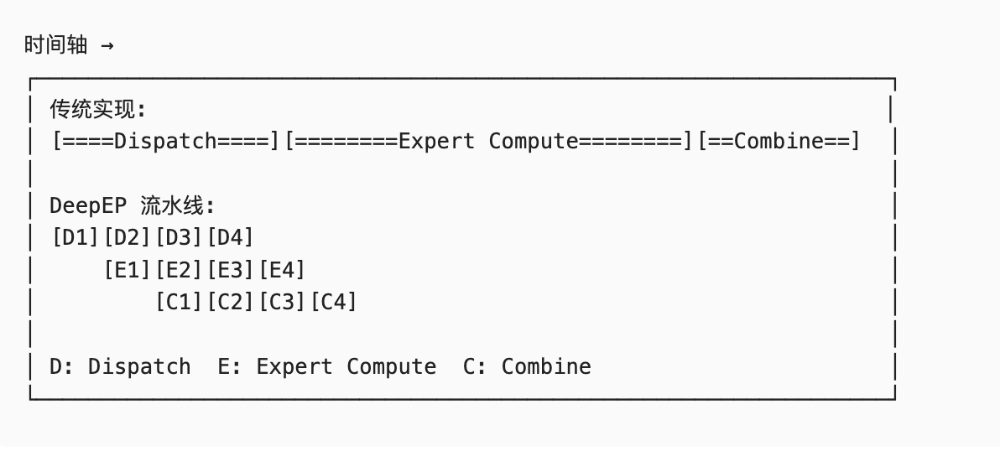

图 3-11 DeepEP 流水线执行时序

**(4) 性能评估**

根据 DeepEP 的官方测试数据，在训练和预填充阶段的通信带宽如表 3-19 所示。

表 3-19 训练/预填充阶段通信带宽

| 通信类型 | 带宽 | 测试配置 |
|---------|------|---------|
| 节点内（NVLink） | 153-158 GB/s | H100 × 8，4K tokens |
| 跨节点（RDMA） | 43-58 GB/s | H100 × 32，4K tokens |

在 8-GPU 节点配置下，DeepEP 相比 NCCL 的 All-to-All 实现可降低约 30%～40% 的通信延迟，结合连续布局优化后整体吞吐提升约 2 倍。

**4. 使用 DeepEP 解码阶段推理**

与训练阶段的大批量高吞吐需求不同，自回归解码阶段面临小批量、高频率、延迟敏感的通信特征，需要采用不同的优化策略。

**(1) 解码阶段通信特点**

自回归解码（Decoding）阶段的 MoE 通信具有独特特点：小批量（每次仅处理一个或少数 token），高频率（每生成一个 token 需完成完整 MoE 层通信），延迟敏感（通信延迟直接影响 Time-To-First-Token 和 Token 生成速度），动态负载（每个专家接收的 token 数量可能为 0 或 1，且完全不可预知）。

对于解码阶段，通信延迟成为主要瓶颈。单次 MoE 层的端到端延迟为：

$$T_{\mathrm{decode}} = T_{\mathrm{attention}} + L_{\mathrm{moe}} \cdot (T_{\mathrm{dispatch}} + T_{\mathrm{expert}} + T_{\mathrm{combine}}) $$

其中 $T_{\mathrm{decode}}$ 为解码总延迟，$T_{\mathrm{attention}}$ 为注意力计算延迟，$L_{\mathrm{moe}}$ 为 MoE 层数，$T_{\mathrm{dispatch}}$ 为 token 分发延迟，$T_{\mathrm{expert}}$ 为专家计算延迟，$T_{\mathrm{combine}}$ 为结果聚合延迟。传统方法需在每次 decode 时重新配置内核参数，无法使用 CUDA Graph 加速，CPU-GPU 同步开销显著。

**(2) 掩码布局（Masked Layout）优化**

DeepEP 为解码阶段引入掩码布局策略。掩码布局通过引入 `masked_m` 向量，允许每个专家（group）处理不同数量的 token，同时保持固定的内核配置以支持 CUDA Graph。

传统方法与掩码布局的对比同表 3-9（见 3.1.1 节），此处不再重复列出。

**(3) 低延迟性能评估**

根据官方测试数据，低延迟内核的端到端延迟如表 3-20 所示。

表 3-20 低延迟内核性能测试

| 专家并行度 (EP) | 延迟 (μs) | 测试配置 |
|---------------|----------|---------|
| EP=2 | 77 | H100, 1 token, 256 experts |
| EP=4 | 157 | H100, 1 token, 256 experts |
| EP=8 | 369 | H100, 1 token, 256 experts |

相比普通内核，低延迟模式在单 token 解码场景下可降低延迟约 60%～70%。结合掩码布局优化后，端到端延迟从毫秒级降至微秒级，对于交互式应用和实时推理服务至关重要。

### 3.2.2 EPLB：动态专家并行负载均衡器

混合专家模型（MoE）通过稀疏激活机制实现模型容量与计算效率的平衡。然而，专家并行（Expert Parallelism, EP）场景下，路由决策的不均匀性导致各 GPU 负载差异显著，成为制约系统吞吐量的关键瓶颈。EPLB（Expert Parallelism Load Balancer）是 DeepSeek 开发的动态负载均衡器，通过冗余专家策略与分层负载均衡算法实现高效的专家分配与放置。

**1. 研究背景与问题定义**

在专家并行部署中，路由决策的不均匀性导致各 GPU 负载差异显著。负载失衡直接制约系统吞吐量，并可能引发内存溢出与通信瓶颈等问题。

**(1) 负载失衡的来源与影响**

在专家并行部署中，不同专家被分配到不同的 GPU 上执行。由于路由网络的动态决策特性，各专家接收的 Token 数量呈现显著差异。如 DeepSeek-V3 技术报告所述，即使采用辅助损失（Auxiliary Loss）约束路由分布，实际运行中仍存在明显的负载倾斜。

负载失衡带来的影响包括：

- 计算资源浪费：All-to-All 通信要求所有 GPU 同步完成计算，负载最重的 GPU 决定整体执行时间，其他 GPU 处于空闲等待状态；
- 内存溢出风险：热点专家接收的 Token 数量可能超出预分配的缓冲区容量，导致运行时错误；
- 通信带宽瓶颈：热点专家所在 GPU 的网络接口成为数据传输的瓶颈点。

**(2) 负载均衡系数的形式化定义**

设系统包含 $E$ 个专家，分布在 $N$ 个 GPU 上。专家 $i$ 接收的 Token 数为 $n_i$，平均负载为 $\bar{n} = \sum_{i=1}^{E} n_i / E$。负载均衡系数（Load Balancing Coefficient）定义为：

$$\text{LB} = \frac{\max_i n_i}{\bar{n}} $$

其中 $\max_i n_i$ 表示所有专家中接收 Token 数的最大值。理想情况下 $\text{LB} = 1$，表示所有专家负载完全均衡。实际运行中 $\text{LB} > 1$，DeepSeek-V3 报告的典型 LB 值约为 1.2～1.5。

**(3) 冗余专家策略**

EPLB 采用冗余专家（Redundant Experts）策略应对负载失衡问题。核心思想是将高负载专家复制为多个副本，分散部署在不同 GPU 上，从而均摊计算压力。

设专家 $i$ 的副本数为 $r_i$，系统总物理专家槽位数为 $S$（通常 $S > E$），约束条件为：

$$\sum_{i=1}^{E} r_i = S $$

冗余专家数量 $R = S - E$ 可根据负载失衡程度动态调整。DeepSeek-V3 的典型配置中，每个 MoE 层引入 4～8 个冗余专家。

**2. EPLB 核心特点**

EPLB 通过冗余专家复制与分层负载均衡算法应对负载失衡问题，并与 DeepEP 通信库协同工作，将专家放置方案直接映射为 All-to-All 通信的路由配置。

**(1) 双层负载均衡策略**

EPLB 根据部署场景自动选择负载均衡策略：

分层负载均衡（Hierarchical Load Balancing）：

当服务器节点数能够整除专家分组数时，采用分层策略以充分利用 DeepSeek-V3 的分组限制路由（Group-Limited Routing）特性。该策略分三个层级执行：

- 节点层级：将专家分组均匀分配到各节点，确保节点间负载均衡；
- 组内层级：在每个节点内部复制高负载专家；
- GPU 层级：将复制后的物理专家分配到具体 GPU。

分层策略的优势在于：将同一分组的专家尽可能放置在同一节点内，减少跨节点的 All-to-All 通信流量，充分利用 NVLink 的高带宽优势。

全局负载均衡（Global Load Balancing）：

当节点数与分组数不满足整除关系时，采用全局策略。该策略忽略专家分组信息，在全局范围内复制专家并分配到各 GPU。全局策略适用于解码阶段使用更大专家并行规模的场景。

**(2) 与 DeepEP 通信库的协同**

EPLB 生成的专家放置方案直接用于配置 DeepEP 的 All-to-All 通信。具体协作流程：

1. EPLB 根据历史负载统计计算最优专家放置方案
2. 生成 `physical_to_logical_map` 映射，指示每个物理专家槽位对应的逻辑专家 ID
3. DeepEP 根据该映射配置 `dispatch` 与 `combine` 操作的目标地址
4. 路由网络在选中专家后，通过 `logical_to_physical_map` 选择负载最轻的副本

**3. EPLB 负载均衡算法**

EPLB 的负载均衡过程包含两个阶段：首先确定各逻辑专家的副本数量（专家复制），然后将物理专家分配到各 GPU（均衡装箱）。

**(1) 问题形式化**

EPLB 的核心优化目标可形式化为以下问题：

给定 $E$ 个逻辑专家、$N$ 个 GPU、$S$ 个物理专家槽位（$S \geq E$），以及各专家的负载预测值 $\{w_1, w_2, ..., w_E\}$。目标是确定：

1. 副本数分配 $\{r_1, r_2, ..., r_E\}$，满足 $\sum_i r_i = S$ 且 $r_i \geq 1$
2. 物理专家到 GPU 的映射 $\phi: \{1,...,S\} \rightarrow \{1,...,N\}$

使得最大 GPU 负载最小化：

$$\min_{\phi, r} \max_{j \in \{1,...,N\}} \sum_{i: j \in \phi_i} \frac{w_i}{r_i} $$

其中 $\phi_i$ 为专家 $i$ 的所有副本所在的 GPU 集合，$\sum_{i: j \in \phi_i}$ 表示对所有分配到 GPU $j$ 的专家副本求和，$w_i / r_i$ 为专家 $i$ 的负载均摊到其 $r_i$ 个副本后的单副本负载。$\min_{\phi, r}$ 表示在所有可能的映射方案 $\phi$ 和副本分配方案 $r$ 中寻找最优解，$\max_{j}$ 取所有 GPU 中负载最大的值。该问题为 NP-hard 的多处理机调度问题（Multiprocessor Scheduling Problem）的变体。EPLB 采用贪心算法进行近似求解。

**(2) 专家复制算法**

专家复制的目标是确定每个逻辑专家的副本数量，使得复制后各副本的预期负载尽可能均衡。算法采用贪心策略，每次选择能够最大程度降低最大副本负载的专家进行复制。

算法复杂度分析：
- 时间复杂度：$O(R \cdot E)$，其中 $R = S - E$ 为冗余专家数；
- 近似比：该贪心算法可证明达到 $4/3 - 1/(3N)$。

**(3) 均衡装箱算法**

确定副本数后，需将物理专家分配到各 GPU（或节点）。EPLB 采用均衡装箱（Balanced Packing）算法，确保每个 GPU 分配相同数量的专家，同时最小化负载差异。

该算法采用 LPT（Longest Processing Time First）启发式：按权重降序处理物品，每次将当前物品放入负载最轻且未满的箱子中。

**4. EPLB 代码解读**

EPLB 以 PyTorch 实现，提供简洁的 Python API 接口。核心函数接受各层专家的负载统计数据，返回物理专家到逻辑专家的映射关系。

**(1) 核心接口定义**

EPLB 的主入口函数 `rebalance_experts` 接受负载统计并返回专家放置方案。

以双层 MoE 模型为例，分层负载均衡策略生成的专家复制和放置方案如图 3-12 所示。

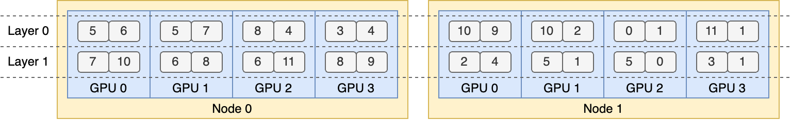

图 3-12 分层负载均衡策略生成专家复制和放置方案

**5. 性能评估**

EPLB 的实际效果从负载均衡系数、端到端训练吞吐量及分层策略与全局策略的对比三个维度进行评估。

**(1) 负载均衡效果**

表 3-21 对比了启用与未启用 EPLB 时的负载均衡系数。

表 3-21 EPLB 负载均衡效果（E=专家数，N=GPU 数，R=冗余专家数）

| 配置 | LB 系数（无 EPLB） | LB 系数（有 EPLB） | 改进幅度 |
|-----|-------------------|-------------------|----------|
| E=64, N=8, R=8 | 1.45 | 1.12 | 22.8% |
| E=128, N=16, R=16 | 1.52 | 1.15 | 24.3% |
| E=256, N=32, R=32 | 1.61 | 1.18 | 26.7% |

**(2) 端到端训练加速**

表 3-22 展示了 EPLB 对 MoE 模型训练吞吐量的提升。

表 3-22 EPLB 训练吞吐量提升

| 模型规模 | 基线吞吐量 | EPLB 吞吐量 | 加速比 |
|---------|-----------|-------------|--------|
| 7B MoE (E=64) | 125K tok/s | 142K tok/s | 1.14× |
| 67B MoE (E=128) | 48K tok/s | 58K tok/s | 1.21× |
| 671B MoE (E=256) | 12K tok/s | 15K tok/s | 1.25× |

加速比随模型规模增大而提升，这是因为：
- 更大的模型通常具有更多专家，负载倾斜问题更严重；
- 冗余专家策略在大规模场景下收益更显著；
- 分层策略有效减少了跨节点通信开销。

**(3) 策略选择对比**

表 3-23 对比了分层策略与全局策略的性能差异。

表 3-23 分层策略与全局策略性能对比

| 场景 | 分层策略延迟 | 全局策略延迟 | 分层策略优势 |
|-----|-------------|-------------|--------------|
| Prefill (EP=8) | 12.3 ms | 14.1 ms | 12.7% |
| Decode (EP=32) | 2.1 ms | 2.0 ms | -4.8% |

结果表明：
- Prefill 阶段：使用较小的 EP 规模，分层策略通过减少跨节点通信显著降低延迟；
- Decode 阶段：使用较大的 EP 规模，全局策略因更灵活的专家放置略有优势。

## 3.3 注意力机制的工程实现

### 3.3.1 FlashAttention 算法思路分析

FlashAttention[^fa1] 是斯坦福大学 Tri Dao 等人提出的 IO 感知（IO-Aware）精确注意力算法，通过分块计算与内核融合技术，在保持精确计算的同时，显著降低内存占用并提升计算效率。该算法已成为现代大语言模型训练与推理的标准组件。

**1. 研究背景与问题定义**

标准注意力机制的计算与内存复杂度

自注意力（Self-Attention）机制是 Transformer 架构的核心组件。标准注意力计算定义为：

$$\text{Attention}(\mathbfit{Q}, \mathbfit{K}, \mathbfit{V}) = \text{softmax}\left(\frac{\mathbfit{QK}^T}{\sqrt{d_{\mathrm{k}}}}\right)\mathbfit{V} $$

其中 $\mathbfit{Q}, \mathbfit{K}, \mathbfit{V} \in \mathbb{R}^{N \times d}$，$N$ 为序列长度，$d$ 为头维度，$d_{\mathrm{k}}$ 为键向量维度（通常 $d_{\mathrm{k}} = d$）。

标准实现分为三个步骤：

1. 计算注意力分数矩阵：$\mathbfit{S} = \frac{\mathbfit{QK}^T}{\sqrt{d_{\mathrm{k}}}} \in \mathbb{R}^{N \times N}$
2. 应用 Softmax 归一化：$\mathbfit{P} = \text{softmax}(\mathbfit{S}) \in \mathbb{R}^{N \times N}$
3. 与 V 矩阵相乘得到输出：$\mathbfit{O} = \mathbfit{PV} \in \mathbb{R}^{N \times d}$

标准注意力的主要瓶颈在于其 $O(N^2)$ 的内存复杂度，当序列长度 $N$ 较大时，中间矩阵 $\mathbfit{S}$ 和 $\mathbfit{P}$ 的存储开销将成为显存瓶颈。复杂度分析如表 3-24 所示。

表 3-24 标准注意力复杂度分析

| 操作 | 计算复杂度 | 内存复杂度 |
|-----|-----------|-----------|
| $\mathbfit{S} = \mathbfit{QK}^T$ | $O(N^2 d)$ | $O(N^2)$ |
| $\mathbfit{P} = \text{softmax}(\mathbfit{S})$ | $O(N^2)$ | $O(N^2)$ |
| $\mathbfit{O} = \mathbfit{PV}$ | $O(N^2 d)$ | $O(Nd)$ |
| 总计 | $O(N^2 d)$ | $O(N^2 + Nd)$ |

**(1) GPU 内存层次结构与 IO 瓶颈**

现代 GPU 采用分层内存架构，不同层级的内存在容量和带宽上存在数量级差异，如表 3-25 所示。

表 3-25 GPU 内存层次结构（以 A100 为例）

| 内存类型 | 容量 | 带宽 | 相对速度 |
|---------|------|------|---------|
| HBM（高带宽内存）| 40-80 GB | 1.5-2.0 TB/s | 1× |
| L2 Cache | 40 MB | ~7 TB/s | 3-5× |
| SRAM（共享内存）| 192 KB/SM | ~19 TB/s | 10-13× |
| 寄存器 | 256 KB/SM | ~100 TB/s | 50-67× |

标准注意力实现的 IO 瓶颈：

- 注意力矩阵存储：将 $N \times N$ 的 $\mathbfit{S}$ 和 $\mathbfit{P}$ 矩阵写入 HBM，在长序列场景下显存占用巨大；
- 重复内存访问：Softmax 操作需要两次遍历（max 和 exp-sum），导致数据在 HBM 和 SRAM 之间多次传输；
- 带宽利用不足：Softmax 等逐元素操作为内存密集型（Memory-Bound），无法充分利用 GPU 的计算能力。

以 $N = 32K$、$d = 128$、FP16 精度为例：
- 注意力矩阵 $\mathbfit{S}$ 占用：$32K \times 32K \times 2 = 2$ GiB；
- 单层多头注意力（32 个头）总显存：$2 \times 32 = 64$ GiB。

这使得长序列训练与推理面临严重的显存瓶颈。

**(2) FlashAttention 的设计目标**

FlashAttention 的核心目标是设计 IO 感知的注意力算法，在不改变计算结果的前提下：

- 降低内存复杂度：从 $O(N^2)$ 降至 $O(N)$，支持更长序列；
- 减少 HBM 访问：最小化 HBM 与 SRAM 之间的数据传输；
- 提升计算效率：通过内核融合提高实际运行速度。

**2. KV-Cache回顾**

FlashAttention 优化的是注意力计算过程中临时矩阵的内存效率。在推理阶段，KV-Cache 机制通过缓存历史 Token 的 K、V 向量避免重复投影计算，与 FlashAttention 形成互补。

**(1) 自回归生成中的冗余计算**

自回归语言模型逐 token 生成输出。在生成第 $t$ 个 token 时，需计算：

$$\mathbfit{o}_t = \text{Attention}(\mathbfit{q}_t, \mathbfit{K}_{1:t}, \mathbfit{V}_{1:t}) $$

其中 $\mathbfit{o}_t$ 为第 $t$ 个 token 的注意力输出，$\mathbfit{q}_t$ 为第 $t$ 个 token 的查询向量，$\mathbfit{K}_{1:t} = [\mathbfit{k}_1; ...; \mathbfit{k}_t]$，$\mathbfit{V}_{1:t} = [\mathbfit{v}_1; ...; \mathbfit{v}_t]$。

朴素实现中，每生成一个 token 需重新计算所有历史 token 的 K、V 投影，计算复杂度为 $O(t \cdot d_{\mathrm{model}} \cdot d)$。对于长文本生成，该冗余计算成为性能瓶颈。

**(2) KV-Cache 机制**

KV-Cache 缓存历史 token 的 K、V 向量，避免重复计算。

KV-Cache 的显存占用：

$$M_{\mathrm{kv}} = 2 \cdot L \cdot N \cdot H \cdot d_{\mathrm{h}} \cdot \text{sizeof(dtype)} $$

其中 $M_{\mathrm{kv}}$ 为 KV-Cache 显存占用，$L$ 为 Transformer 层数，$N$ 为序列长度，$H$ 为注意力头数，$d_{\mathrm{h}}$ 为每个头的维度。

KV-Cache 的显存占用随序列长度线性增长，对于长上下文场景可能超出单卡显存容量，这也是 MLA 等压缩技术的动因。典型模型的 KV-Cache 显存占用（FP16）如表 3-26 所示。

表 3-26 典型模型的 KV-Cache 显存占用（FP16）

| 模型 | 层数 | 头数 | 头维度 | 8K 序列 | 32K 序列 | 128K 序列 |
|-----|------|------|-------|---------|----------|-----------|
| LLaMA-7B | 32 | 32 | 128 | 2 GiB | 8 GiB | 32 GiB |
| LLaMA-70B | 80 | 64 | 128 | 10 GiB | 40 GiB | 160 GiB |
| DeepSeek-V3 | 61 | 128 | 128 | 2 GiB* | 8 GiB* | 32 GiB* |

*注：DeepSeek-V3 采用 MLA（多头潜在注意力）压缩技术，实际占用约为表中数值的 1/8。

**(3) KV-Cache 与 FlashAttention 的协同**

FlashAttention 解决的是注意力计算过程中 临时矩阵 $\mathbfit{S}$ 和 $\mathbfit{P}$ 的显存占用问题，与 KV-Cache 解决的缓存历史信息问题互补。两者结合使用：

- 训练阶段：FlashAttention 降低单次前向/反向传播的显存峰值；
- 推理阶段：FlashAttention 优化注意力计算效率，KV-Cache 避免重复投影计算。

**3. FlashAttention 技术原理**

FlashAttention 的核心思想是 分块计算（Tiling）与 在线 Softmax[^onlinesoftmax]（Online Softmax），在 SRAM 中完成注意力计算，避免将完整的 $N \times N$ 注意力矩阵写入 HBM。本节首先介绍 FlashAttention V1 的基础算法，然后讨论 V2 和 V3 的改进。

**(1) 分块计算策略**

FlashAttention 将输入矩阵 $\mathbfit{Q}, \mathbfit{K}, \mathbfit{V}$ 分为多个块，在 SRAM 中逐块处理：

$$\mathbfit{Q} = \begin{bmatrix} \mathbfit{Q}_1 \\ \mathbfit{Q}_2 \\ \vdots \\ \mathbfit{Q}_{T_{\mathrm{r}}} \end{bmatrix}, \quad \mathbfit{K} = \begin{bmatrix} \mathbfit{K}_1 \\ \mathbfit{K}_2 \\ \vdots \\ \mathbfit{K}_{T_{\mathrm{c}}} \end{bmatrix}, \quad \mathbfit{V} = \begin{bmatrix} \mathbfit{V}_1 \\ \mathbfit{V}_2 \\ \vdots \\ \mathbfit{V}_{T_{\mathrm{c}}} \end{bmatrix} $$

其中 $T_{\mathrm{r}} = \lceil N / B_{\mathrm{r}} \rceil$，$T_{\mathrm{c}} = \lceil N / B_{\mathrm{c}} \rceil$，$B_{\mathrm{r}}$ 和 $B_{\mathrm{c}}$ 为块大小。

块大小的选择取决于 SRAM 容量：

$$B_{\mathrm{r}} \cdot d + B_{\mathrm{c}} \cdot d + B_{\mathrm{r}} \cdot B_{\mathrm{c}} \leq M_{\mathrm{SRAM}} $$

其中 $M_{\mathrm{SRAM}}$ 为每个 SM 的共享内存容量。对于 A100（每个 SM 有 192 KB SRAM），典型配置为 $B_{\mathrm{r}} = B_{\mathrm{c}} = 128$（当 $d = 128$ 时）。

**(2) 在线 Softmax 算法**

分块计算的核心挑战在于 Softmax 的归一化需要全局信息。标准 Softmax 计算：

$$\text{softmax}(\mathbfit{x})_i = \frac{e^{x_i}}{\sum_{j=1}^{N} e^{x_j}} $$

其中下标 $i$ 表示输出向量的第 $i$ 个元素，$x_i$ 和 $x_j$ 分别为输入向量 $\mathbfit{x}$ 的第 $i$ 和第 $j$ 个分量。该计算需要两次遍历：第一次计算 $\max(\mathbfit{x})$ 和 $\sum e^{x_i}$，第二次执行归一化。FlashAttention 采用 在线 Softmax 算法（Milakov & Gimelshein, 2018）实现单次遍历。

定义第 $i$ 块处理完成后的统计量：

$$m^{(i)} = \max_{j \leq i} \max(\mathbfit{x}_j), \quad \ell^{(i)} = \sum_{j \leq i} e^{\mathbfit{x}_j - m^{(i)}} $$

其中 $m^{(i)}$ 为前 $i$ 个块的全局最大值，$\ell^{(i)}$ 为归一化因子（exp 求和），$\mathbfit{x}_j$ 为第 $j$ 个块的注意力分数。当处理第 $i+1$ 块时，更新规则为：

$$m^{(i+1)} = \max(m^{(i)}, m^{(i+1)}_{\mathrm{local}}) $$

$$\ell^{(i+1)} = e^{m^{(i)} - m^{(i+1)}} \ell^{(i)} + e^{m^{(i+1)}_{\mathrm{local}} - m^{(i+1)}} \ell^{(i+1)}_{\mathrm{local}} $$

其中 $m^{(i+1)}_{\mathrm{local}}$ 和 $\ell^{(i+1)}_{\mathrm{local}}$ 分别为第 $i+1$ 块的局部最大值和局部归一化因子。这使得输出可以 增量更新：

$$\mathbfit{O}^{(i+1)} = \frac{e^{m^{(i)} - m^{(i+1)}} \ell^{(i)} \mathbfit{O}^{(i)} + e^{m^{(i+1)}_{\mathrm{local}} - m^{(i+1)}} \mathbfit{P}_{i+1} \mathbfit{V}_{i+1}}{\ell^{(i+1)}} $$

其中 $\mathbfit{O}^{(i)}$ 为前 $i$ 个块的累积输出，$\mathbfit{P}_{i+1}$ 为第 $i+1$ 块的注意力权重矩阵，$\mathbfit{V}_{i+1}$ 为第 $i+1$ 块的值矩阵。

**(3) FlashAttention V1 算法流程**

FlashAttention 前向传播算法流程如图 3-13 所示。

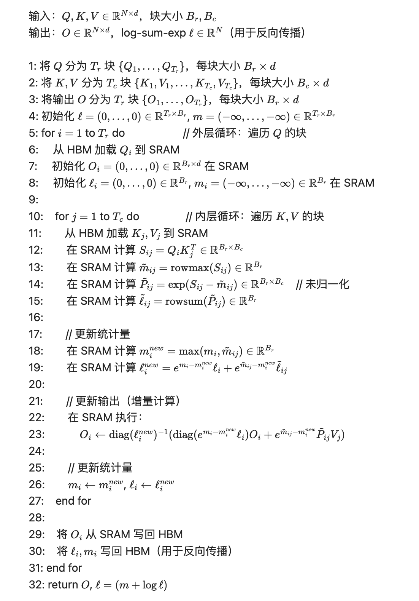

图 3-13 FlashAttention 前向传播算法流程

**(4) IO 复杂度分析**

FlashAttention 的 HBM 访问次数：

$$\Theta(N^2 d^2 M^{-1}) $$

其中 $N$ 为序列长度，$d$ 为头维度，$M$ 为 SRAM 大小，$\Theta(\cdot)$ 表示渐进紧确界（同阶复杂度）。相比之下，标准注意力的 HBM 访问为 $\Theta(Nd + N^2)$。

当 $M \gg d$ 且 $N \gg \sqrt{M}$ 时，FlashAttention 显著优于标准实现。

**(5) 反向传播算法**

FlashAttention 的反向传播同样采用分块计算。关键技术是 重计算（Recomputation）：不存储前向传播中的 $\mathbfit{S}$ 和 $\mathbfit{P}$ 矩阵（需 $O(N^2)$ 内存），而在反向传播时从保存的 $\mathbfit{Q}, \mathbfit{K}, \mathbfit{V}$ 和统计量 $\ell, m$ 重新计算。

反向传播的梯度链（其中 $\mathcal{L}$ 为损失函数，$\odot$ 为逐元素乘法，$\frac{\partial \mathcal{L}}{\partial \mathbfit{V}}$ 表示损失函数对矩阵 $\mathbfit{V}$ 的偏导数）：

$$\frac{\partial \mathcal{L}}{\partial \mathbfit{V}} = \mathbfit{P}^T \frac{\partial \mathcal{L}}{\partial \mathbfit{O}} $$

$$\frac{\partial \mathcal{L}}{\partial \mathbfit{P}} = \frac{\partial \mathcal{L}}{\partial \mathbfit{O}} \mathbfit{V}^T $$

$$\frac{\partial \mathcal{L}}{\partial \mathbfit{S}} = \mathbfit{P} \odot \left( \frac{\partial \mathcal{L}}{\partial \mathbfit{P}} - D \right), \quad D = \text{rowsum}\left( \frac{\partial \mathcal{L}}{\partial \mathbfit{P}} \odot \mathbfit{P} \right) $$

其中 $D$ 为按行求和的归一化项。

$$\frac{\partial \mathcal{L}}{\partial \mathbfit{Q}} = \frac{\partial \mathcal{L}}{\partial \mathbfit{S}} \mathbfit{K}, \quad \frac{\partial \mathcal{L}}{\partial \mathbfit{K}} = \left(\frac{\partial \mathcal{L}}{\partial \mathbfit{S}}\right)^T \mathbfit{Q} $$

FlashAttention 在反向传播时分块重计算 $\mathbfit{P}$，然后使用上述公式计算梯度。理论分析表明，重计算的额外计算成本被 IO 优化节省的时间抵消，实际运行速度不降反升。

**(6) FlashAttention V2 改进**

FlashAttention V2（Dao, 2023）主要优化了并行化策略和 GPU 资源利用：

1. 增强序列长度维度的并行度

V1 在 batch 和 head 维度并行，每个线程块处理一个 (batch, head) 对。V2 额外在序列长度维度并行：

- V1 并行度：$B \times H$（B=batch size，H=head数）；
- V2 并行度：$B \times H \times \lceil N / B_{\mathrm{r}} \rceil$。

这在 batch size 较小时显著提高 GPU 利用率。

2. 减少非矩阵乘法操作开销

V2 调整了工作分配策略，每个线程块处理更多行（增大 $B_{\mathrm{r}}$），减少 Softmax 等非矩阵乘法操作的占比：

- V1：$B_{\mathrm{r}} = 64, B_{\mathrm{c}} = 64$（A100，$d=128$）；
- V2：$B_{\mathrm{r}} = 128, B_{\mathrm{c}} = 64$。

3. 优化 warp 调度

V2 改进了内层循环的 warp 调度，减少了寄存器溢出（register spilling）和 bank 冲突。

通过上述优化，V2 在各序列长度下相比 V1 均获得 1.5～1.6 倍的性能提升。FlashAttention V1 与 V2 性能对比如表 3-27 所示。

表 3-27 FlashAttention V1 与 V2 性能对比（A100 80GB，FP16）

| 序列长度 | V1 TFLOPS | V2 TFLOPS | 加速比 |
|---------|-----------|-----------|--------|
| 1K | 120 | 180 | 1.50× |
| 4K | 140 | 220 | 1.57× |
| 16K | 145 | 235 | 1.62× |

**(7) FlashAttention V3 改进**

Shah 等人在 2024 年发表的FlashAttention V3针对 NVIDIA Hopper 架构（H100）进行深度优化，利用新硬件特性实现接近理论峰值的性能。

1. 利用 TMA（Tensor Memory Accelerator）

Hopper 引入的 TMA 单元提供硬件加速的异步数据传输：

- 异步加载：CPU 发起 TMA 指令后立即返回，传输在后台完成；
- 多维张量支持：直接支持多维张量的切片传输，无需手动地址计算；
- 带宽优化：TMA 访问 HBM 的带宽接近理论峰值（3.35 TB/s）。

2. 利用 WGMMA（Warp Group Matrix Multiply-Accumulate）

WGMMA 是 Hopper 的新 Tensor Core 指令，支持 128 个线程（4 个 warp）协作执行矩阵乘法：

- V2 使用 `mma.sync`（单 warp，32 线程）；
- V3 使用 `wgmma`（warp group，128 线程）。

WGMMA 提供更高吞吐：16×16×16 矩阵乘法（FP16）单指令完成，峰值达 989 TFLOPS（H100）。

3. 三级流水线设计

FlashAttention V3 实现三级异步流水线，隐藏数据传输延迟，如图 3-14 所示。

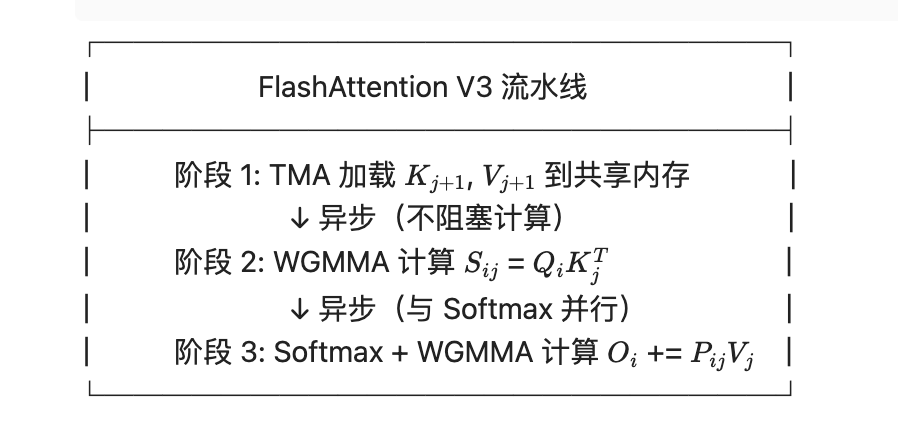

图 3-14 FlashAttention V3 三级流水线设计

4. FP8 低精度支持

Hopper 原生支持 FP8（8 位浮点）Tensor Core 运算。FlashAttention V3 采用混合精度策略：

- QK^T 矩阵乘法：使用 FP8（E4M3 格式）；
- Softmax：使用 FP32 保持数值稳定性；
- PV 矩阵乘法：使用 FP8（E5M2 格式）。

V3 的混合精度策略在不同 FP8 配置下实现了显著的吞吐量提升，同时将精度损失控制在可接受范围内。FlashAttention V3 各精度配置性能如表 3-28 所示。

表 3-28 FlashAttention V3 各精度配置性能（H100）

| 配置 | TFLOPS | 相对 FP16 精度损失 |
|-----|--------|-------------------|
| FP16/FP16 | 500 | 基准 |
| FP8/FP16 (QK^T 使用 FP8) | 700 | < 0.1% |
| FP8/FP8 (全 FP8) | 900 | < 0.5% |

**4. 性能分析**

FlashAttention 系列算法的性能优势体现在计算吞吐量、显存效率与端到端训练加速三个方面。

**(1) 端到端性能对比**

FlashAttention 相比标准 PyTorch 实现和 cuDNN 实现，在各序列长度下均展现出显著的性能优势。注意力实现性能对比如表 3-29 所示。

表 3-29 注意力实现性能对比（H100 80GB，FP16，batch=8，heads=32，d=128）

| 实现 | 4K 序列 | 16K 序列 | 64K 序列 |
|-----|---------|----------|----------|
| PyTorch Native | 45 TFLOPS | OOM | OOM |
| xFormers | 180 TFLOPS | 200 TFLOPS | OOM |
| FlashAttention V2 | 235 TFLOPS | 250 TFLOPS | 260 TFLOPS |
| FlashAttention V3 (FP16) | 500 TFLOPS | 550 TFLOPS | 580 TFLOPS |
| FlashAttention V3 (FP8) | 740 TFLOPS | 820 TFLOPS | 870 TFLOPS |

FlashAttention V3 在 FP8 模式下的吞吐量已接近 H100 的 FP16 理论峰值（989 TFLOPS）。

**(2) 内存效率对比**

FlashAttention 将注意力计算的显存复杂度从 $O(N^2)$ 降至 $O(N)$，避免了存储完整的注意力矩阵。显存占用对比如表 3-30 所示。

表 3-30 显存占用对比（单层注意力，batch=1，heads=1，FP16）

| 实现 | 4K 序列 | 16K 序列 | 64K 序列 |
|-----|---------|----------|----------|
| PyTorch Native | 128 MiB | 2,048 MiB | 32,768 MiB |
| FlashAttention | 32 MiB | 128 MiB | 512 MiB |
| 降低比例 | 4× | 16× | 64× |

降低比例随序列长度线性增长，验证了内存复杂度从 $O(N^2)$ 降至 $O(N)$。

**(3) 端到端训练加速**

在 GPT-2 (1.5B) 模型训练中，FlashAttention 的加速效果如表 3-31 所示。

表 3-31 GPT-2 训练吞吐量（A100 80GB，8 GPU）

| 序列长度 | PyTorch Baseline | FlashAttention V2 | 加速比 |
|---------|-----------------|-------------------|--------|
| 1K | 42K tok/s | 56K tok/s | 1.33× |
| 2K | 28K tok/s | 45K tok/s | 1.61× |
| 4K | 14K tok/s | 28K tok/s | 2.00× |

加速比随序列长度增长，因为注意力计算在总训练时间中的占比提高。

### 3.3.2 FlashMLA 实现思路分析

FlashMLA[^flashmla] 是 DeepSeek 开源的高性能注意力内核库，专为 DeepSeek-V3 和 DeepSeek-V3.2 模型的多头潜在注意力（Multi-head Latent Attention, MLA）架构深度优化。该库在 NVIDIA Hopper（H800/H100）和 Blackwell（B200）架构上实现了业界领先的性能：解码阶段密集注意力达 660 TFLOPS，稀疏注意力（FP8 KV 缓存）达 410 TFLOPS，预填充阶段达 1450 TFLOPS（B200，H800 为 640 TFLOPS）。

**1. 研究背景与问题定义**

MLA 架构将 KV 缓存压缩至低秩潜在空间，在推理解码阶段等价于多查询注意力（MQA）。该计算模式与标准多头注意力存在本质差异，需要针对性的内核优化策略。

**(1) MLA 架构的工程挑战**

如第 2 章所述，DeepSeek-V3 采用多头潜在注意力（MLA）架构，将 KV 缓存压缩到低秩潜在空间，显著降低推理阶段的显存占用。MLA 的计算特点使其与标准多头注意力（MHA）存在本质差异，如表 3-32 所示。

表 3-32 MLA 与 MHA 计算特性对比

| 特性 | MHA | MLA（DeepSeek-V3）|
|-----|-----|-------------------|
| Query 头数 $h_{\mathrm{q}}$ | 32-128 | 128 |
| KV 头数 $h_{\mathrm{kv}}$ | 32-128 | 1（MQA 模式）|
| K 头维度 $d_{\mathrm{k}}$ | 64-128 | 576（含 RoPE 64 维）|
| V 头维度 $d_{\mathrm{v}}$ | 64-128 | 512 |
| KV 缓存大小（每 token）| $2 \times h_{\mathrm{kv}} \times d$ | $d_{\mathrm{k}}$（压缩后）|
| 计算密集度 | 低 | 高 |

MLA 在推理解码阶段实际表现为 多查询注意力（MQA）：128 个 Query 头共享 1 个 KV 头。这带来独特的工程挑战：

- 计算密集型特性：高 Query 头数使解码阶段从传统的内存密集型（Memory-Bound）转变为计算密集型（Compute-Bound）；
- 非对称头维度：K 维度（576）与 V 维度（512）不相等，需特殊处理；
- RoPE 位置编码：K 的最后 64 维为 RoPE 编码，对量化精度敏感；
- 长上下文挑战：DeepSeek-V3.2 支持 128K 上下文，单请求 KV 缓存可达 8.72 GiB。

**(2) 计算与内存瓶颈分析**

FlashMLA 深入分析了 MLA 解码内核的性能瓶颈。设 Query 头数为 $h_{\mathrm{q}}$，每请求 Query token 数为 $s_{\mathrm{q}}$（非投机解码时 $s_{\mathrm{q}} = 1$），KV token 数为 $s_{\mathrm{k}}$，K 和 V 的头维度分别为 $d_{\mathrm{k}}$ 和 $d_{\mathrm{v}}$。

计算量：

$$\text{FLOPs} = 2 \times h_{\mathrm{q}} \times s_{\mathrm{q}} \times s_{\mathrm{k}} \times (d_{\mathrm{k}} + d_{\mathrm{v}}) $$

内存访问量（以 bfloat16 为例）：

$$\text{Bytes} \approx 2 \times s_{\mathrm{k}} \times d_{\mathrm{k}} $$

计算-内存比：

$$\frac{\text{FLOPs}}{\text{Bytes}} = h_{\mathrm{q}} \times s_{\mathrm{q}} \times \frac{d_{\mathrm{k}} + d_{\mathrm{v}}}{d_{\mathrm{k}}} \approx 2 \times h_{\mathrm{q}} \times s_{\mathrm{q}} $$

对于 NVIDIA H800 SXM5 GPU（峰值带宽 3.35 TB/s，峰值算力 990 TFLOPS，降频后约 865 TFLOPS），当 $h_{\mathrm{q}} \times s_{\mathrm{q}} \geq 128$ 时，内核为计算密集型。DeepSeek 推理系统未采用张量并行（Tensor Parallelism），$h_{\mathrm{q}} = 128$，因此 MLA 解码内核是 计算密集型。

这与传统解码注意力（通常为内存密集型）形成鲜明对比，需要全新的优化策略。

**(3) FlashMLA 设计目标**

FlashMLA 的设计目标包括：

- 最大化 Tensor Core 利用率：在计算密集型场景下达到接近理论峰值的算力；
- 支持 FP8 KV 缓存：将 KV 缓存压缩至 FP8，降低 128K 长上下文场景的显存压力；
- 支持稀疏注意力：实现 Token 级稀疏注意力，进一步降低计算量；
- 多阶段优化：分别优化预填充（Prefill）和解码（Decode）阶段。

**2. MLA 计算流程回顾**

FlashMLA 的内核优化基于 MLA 解码阶段的具体计算流程设计，同时支持 DeepSeek-V3.2 引入的 Token 级稀疏注意力模式。

**(1) MLA 解码阶段计算流程**

MLA 在解码阶段的计算流程等价于 MQA（多查询注意力）。设压缩后的 KV 缓存为 $\mathbfit{C} \in \mathbb{R}^{s_{\mathrm{k}} \times d_{\mathrm{c}}}$（$d_{\mathrm{c}} = 576$），Query 为 $\mathbfit{Q} \in \mathbb{R}^{h_{\mathrm{q}} \times d_{\mathrm{k}}}$：

$$\mathbfit{S} = \frac{\mathbfit{Q} \mathbfit{C}^T}{\sqrt{d_{\mathrm{k}}}} \in \mathbb{R}^{h_{\mathrm{q}} \times s_{\mathrm{k}}} $$

$$\mathbfit{P} = \text{softmax}(\mathbfit{S}) \in \mathbb{R}^{h_{\mathrm{q}} \times s_{\mathrm{k}}} $$

$$\mathbfit{O} = \mathbfit{P} \mathbfit{V} \in \mathbb{R}^{h_{\mathrm{q}} \times d_{\mathrm{v}}} $$

其中 $\mathbfit{V}$ 为 $\mathbfit{C}$ 的前 512 维。

**(2) 稀疏注意力模式**

DeepSeek Sparse Attention（DSA）是 DeepSeek-V3.2 引入的 Token 级稀疏注意力机制。FlashMLA 通过 `indices` 张量支持稀疏计算。

`indices` 张量指定每个 Query 需要关注的 Top-K 个 KV token，实现 Token 级稀疏选择。无效索引设为 -1 或 $\geq s_{\mathrm{kv}}$ 的值。

**3. 分层缓存（L1/L2/L3）与动态压缩算法**

GPU 内存由多级层次结构组成，不同层级在容量、带宽和延迟上存在数量级差异。高效利用内存层次是实现高性能内核的关键。FlashMLA 充分利用 Hopper 架构的多层内存结构，如表 3-33 所示。

表 3-33 Hopper 架构内存层次

| 层级 | 类型 | 容量 | 带宽 | 访问延迟 |
|-----|------|------|------|---------|
| L1 | 寄存器 | 256 KB/SM | >100 TB/s | 1 周期 |
| L2 | 共享内存（SRAM）| 228 KB/SM | ~19 TB/s | ~30 周期 |
| L3 | L2 Cache | 50 MB | ~7 TB/s | ~100 周期 |
| L4 | HBM（全局内存）| 80 GB | 3.35 TB/s | ~300 周期 |

FlashMLA 的分层缓存策略：

- 寄存器（L1）：存储累积输出矩阵 $\mathbfit{O}$、运行统计量 $m$（最大值）和 $\ell$（exp 求和）；
- 共享内存（L2）：缓存 Query 块、K/V 块、注意力分数矩阵 $\mathbfit{S}$；
- L2 Cache（L3）：通过 Cache Hint 提高 KV 缓存的 L2 命中率；
- HBM（L4）：存储完整的 KV 缓存和输出。

**(1) FP8 KV 缓存压缩**

为支持 128K 长上下文，FlashMLA 实现了 FP8 KV 缓存压缩。每个 token 的 KV 缓存从 1152 字节（576 × 2 bytes）压缩至 656 字节，如表 3-34 所示。

表 3-34 FP8 KV 缓存格式（DeepSeek-V3.2）

| 部分 | 大小 | 格式 | 说明 |
|-----|------|------|------|
| NoPE 部分 | 512 字节 | float8_e4m3 | 非位置编码部分，量化为 FP8 |
| 缩放因子 | 16 字节 | 4 × float32 | 每 128 元素一个缩放因子 |
| RoPE 部分 | 128 字节 | 64 × bfloat16 | 位置编码部分，保持 BF16 精度 |
| 合计 | 656 字节 | - | 压缩比 ≈ 57% |

量化采用 分块量化（Tile-level Quantization），每 128 个元素共享一个缩放因子：

$$\text{scale}_i = 2^{\lceil \log_2(\max(|\mathbfit{x}_i|) / 448) \rceil} $$

$$\text{quantized}_i = \text{round}(\mathbfit{x}_i / \text{scale}_i) $$

其中 $\mathbfit{x}_i$ 为第 $i$ 个分块的原始数据，$\text{scale}_i$ 为该分块的缩放因子，$\text{quantized}_i$ 为量化后的整数值。RoPE 部分（最后 64 维）不进行量化，以保持位置编码精度。

**4. 混合精度矩阵乘法**

FlashMLA 使用 Hopper 架构的 WGMMA（Warp Group Matrix Multiply-Accumulate）指令实现高效矩阵乘法。

指令命名规则 `MMA_MxNxK_AccumDtype_ABDtype_Layout`：

- M×N×K：矩阵乘法的 tile 大小（如 64×64×16）；
- AccumDtype：累加器精度（F32 = float32）；
- ABDtype：输入精度（BF16 = bfloat16）；
- Layout：数据来源（SS = 共享内存×共享内存，RS = 寄存器×共享内存）。

**(1) FP8 去量化流水线**

FP8 稀疏解码内核面临 去量化瓶颈。H800 不能直接将 float8_e4m3 转换为 bfloat16，需要多步转换。

根据 NVIDIA 文档，去量化每个 token 需要约 50 个周期，而 MMA 操作仅需 34 个周期。去量化成为性能瓶颈。

FlashMLA 采用 Crossover 技术解决此问题（详见本节第 6 部分“深入 Hopper GPU 架构”）。

**5. 注意力机制优化**

在完成数据加载与精度转换后，注意力计算的执行效率取决于 CUDA Core 与 Tensor Core 的协同调度策略以及长序列场景下的并行处理机制。

**(1) Seesaw 调度算法**

FlashMLA 提出 Seesaw 调度（跷跷板调度）算法，实现 CUDA Core 与 Tensor Core 的高效重叠。该算法是 FlashAttention-3[^fa3] Ping-Pong 调度的变体。

问题背景：

输出矩阵 $\mathbfit{O}$（64×512，BF16）需存储在寄存器中（WGMMA 指令要求）。单个 $64 \times 512$ 输出矩阵占用 32,768 个 32 位寄存器，而每个 SM 仅有 65,536 个寄存器。无法同时维护两个输出矩阵以实现 Ping-Pong 调度。

Seesaw 解决方案：

将输出矩阵垂直分割为 $\mathbfit{O}_L$ 和 $\mathbfit{O}_R$（各 $64 \times 256$），由两个 Warp Group 分别维护：

维护状态：
- 运行最大值 $m$（两个 Warp Group 共享）；
- 输出矩阵 $O_L$（Warp Group 0）和 $O_R$（Warp Group 1）。

每步处理两个 KV 块 $(K_0, V_0)$ 和 $(K_1, V_1)$：

1.   [WG0] 计算 $p_0 = q \cdot K_0^T / \text{scale}$
2.   [WG1] 计算 $p_1 = q \cdot K_1^T / \text{scale}$
3.   [WG0] 计算 $m_{\text{new}_0} = \max(m, \max(p_0))$, $\text{scale}_0 = \exp(m_{\text{new}_0} - m)$
4.   [WG0] Softmax: $p_0 \leftarrow \exp(p_0 - m_{\text{new}_0})$
5.   [WG0] 更新 $O_L \leftarrow O_L \cdot \text{scale}_0 + p_0 \cdot V_{0L}$
6.   [WG1] 计算 $m_{\text{new}_1} = \max(m, \max(p_1))$, $\text{scale}_1 = \exp(m_{\text{new}_1} - m)$
7.   [WG1] Softmax: $p_1 \leftarrow \exp(p_1 - m_{\text{new}_1})$
8.   [WG1] 更新 $O_R \leftarrow O_R \cdot (\text{scale}_0 \cdot \text{scale}_1) + p_1 \cdot V_{1R}$
9.   [WG0] 缩放 $p_0 \leftarrow p_0 \cdot \text{scale}_1$
10. [WG1] 更新 $O_R \leftarrow O_R + p_0 \cdot V_{0R}$
11. [WG0] 更新 $O_L \leftarrow O_L \cdot \text{scale}_1 + p_1 \cdot V_{1L}$

该调度使两个 Warp Group 交替执行 CUDA Core（Softmax）和 Tensor Core（GEMM）操作，实现高效重叠。

**(2) Split-KV 与 Combine**

对于长序列（KV token 数 $s_{\mathrm{k}}$ 很大），FlashMLA 采用 Split-KV 策略：将 KV 序列分割为多个部分，由多个 SM 并行处理，最后合并结果。

Combine 内核将各 split 的结果合并：

$$\mathbfit{O} = \frac{\sum_{i} e^{\text{lse}_i - \text{lse}_{\mathrm{max}}} \mathbfit{O}_i}{\sum_{i} e^{\text{lse}_i - \text{lse}_{\mathrm{max}}}} $$

其中 $\mathbfit{O}_i$ 为第 $i$ 个 split 的局部输出，$\text{lse}_i$ 为第 $i$ 个 split 的 log-sum-exp 值，$\text{lse}_{\mathrm{max}}$ 为所有 split 中 lse 的最大值。

FlashMLA 使用 Programmatic Dependent Launch 技术，将 Split-KV 和 Combine 内核的启动开销重叠。

**6. 深入 Hopper GPU 架构**

FlashMLA 的高性能实现深度依赖 Hopper 架构的专用硬件特性，包括 TMA 异步数据传输单元与分布式共享内存（DSM）跨 CTA 数据交换机制。

**(1) TMA（Tensor Memory Accelerator）**

FlashMLA 广泛使用 Hopper 架构的 TMA 单元加速数据传输。TMA 提供硬件加速的异步多维张量传输：

TMA 优势：
- 异步传输：发起 TMA 指令后立即返回，传输在后台完成；
- 多维支持：直接支持 5D 张量切片传输；
- 高带宽：接近理论峰值（3.35 TB/s）。

FlashMLA 使用细粒度 TMA-GEMM 流水线。

这种细粒度流水线提高了内存延迟容忍度，并使用 Cache Hint 优化 L2 缓存。

**(2) 分布式共享内存（DSM）与 Crossover**

为解决 FP8 去量化瓶颈，FlashMLA 使用 Hopper 的 分布式共享内存（Distributed Shared Memory, DSM）实现 Crossover 技术。

核心思想：同一 Query token 的 128 个 Query 头分配给两个 CTA（各处理 64 头）。两个 CTA 分别去量化一半的 KV 缓存，然后通过 DSM 交换。

Crossover 技术将去量化开销减半，使 FP8 稀疏解码内核从 250 TFLOPS 提升至 410 TFLOPS。

**7. 性能评估**

FlashMLA 分别在解码阶段（密集与稀疏模式）与预填充阶段进行了性能评估，并与 FlashAttention-3 等通用注意力实现进行了对比。

**(1) 解码阶段性能**

在解码阶段，FlashMLA 针对内存密集型和计算密集型两种场景分别优化，均能接近硬件理论峰值。FlashMLA 解码阶段性能如表 3-35 所示。

表 3-35 FlashMLA 解码阶段性能（H800 SXM5，CUDA 12.8）

| 内核类型 | 配置 | 性能 | 备注 |
|---------|------|------|------|
| 密集注意力（内存密集型）| batch=16, seq=1K | 3000 GB/s | 接近理论峰值 |
| 密集注意力（计算密集型）| batch=128, seq=8K | 660 TFLOPS | 76% 峰值利用率 |
| 稀疏注意力（FP8）| batch=128, topk=2K | 410 TFLOPS | 含去量化开销 |
| 稀疏注意力（FP8）| batch=128, topk=32K | 460 TFLOPS | 更大 topk 降低相对开销 |

**(2) 预填充阶段性能**

预填充阶段处理整个输入序列，通常为计算密集型，FlashMLA 通过 Seesaw 调度和细粒度流水线实现高吞吐。FlashMLA 预填充阶段性能如表 3-36 所示。

表 3-36 FlashMLA 预填充阶段性能

| GPU | 内核类型 | 前向性能 | 反向性能 |
|-----|---------|---------|---------|
| H800 SXM5 | 稀疏 MLA | 640 TFLOPS | - |
| B200 | 稀疏 MLA | 1450 TFLOPS | - |
| B200 | 密集 MHA | 1460 TFLOPS | 1000 TFLOPS |

B200（Blackwell 架构）的性能接近 H800 的 2.3 倍，主要得益于更高的 Tensor Core 吞吐量和更大的 L2 缓存。

**(3) 与其他实现对比**

FlashMLA 专为 DeepSeek MLA 架构设计，相比通用注意力实现具有更好的性能和功能支持。注意力内核性能对比如表 3-37 所示。

表 3-37 注意力内核性能对比（H100 80GB，解码阶段）

| 实现 | 性能（TFLOPS）| 支持 MLA | 支持稀疏 |
|-----|--------------|---------|---------|
| FlashAttention-3 | ~500 | 否 | 否 |
| vLLM Attention | ~400 | 有限 | 否 |
| FlashMLA（密集）| 660 | 是 | 否 |
| FlashMLA（稀疏 FP8）| 410 | 是 | 是 |

FlashMLA 在 MLA 架构上实现了最优性能，特别是在 DeepSeek 模型的特定配置下。

## 3.4 强化学习算法的工程实现

组相对策略优化（Group Relative Policy Optimization, GRPO）是 DeepSeek 在 2024 年 2 月发布的 DeepSeekMath 论文[^dsmath]中首次提出的强化学习算法，并在 2025 年 1 月的 DeepSeek-R1 推理模型[^r1]中得到广泛应用。GRPO 通过消除传统 PPO 算法中的 Critic 模型，相对基于 PPO 的 RLHF 实现将计算需求减半，成为当前开源大语言模型推理能力训练的主流算法。

本节系统介绍 GRPO 算法的工程实现，包括算法原理、Unsloth/NeMo-RL/SWIFT 等主流框架的技术细节，以及 DAPO、StepGRPO 等最新变体的创新点。

### 3.4.1 GRPO 算法原理与工程挑战

**1. 算法创新**

传统的 PPO[^ppo]（Proximal Policy Optimization）算法需要同时训练策略模型（Policy Model）和价值模型（Value Model/Critic），其优化目标为：

$$\mathcal{J}_{\mathrm{PPO}}(\theta) = \mathbb{E}_{(x,y) \sim \pi_\theta} \left[ \min\left( r(\theta) A^{\pi_{\theta_{\mathrm{old}}}}(x,y), \text{clip}(r(\theta), 1-\epsilon, 1+\epsilon) A^{\pi_{\theta_{\mathrm{old}}}}(x,y) \right) \right] $$

其中 $\theta$ 为策略模型参数，$\pi_\theta$ 为策略分布，$x$ 为输入提示，$y$ 为生成的响应，$\epsilon$ 为裁剪参数（通常取 0.2），$r(\theta) = \frac{\pi_\theta(y|x)}{\pi_{\theta_{\mathrm{old}}}(y|x)}$ 为重要性采样比率，$A^{\pi_{\theta_{\mathrm{old}}}}(x,y)$ 为优势函数（上标 $\pi_{\theta_{\mathrm{old}}}$ 表示该优势值在旧策略下计算），通过价值模型估计。这需要额外训练一个与策略模型规模相当的价值模型，导致显存占用翻倍、训练不稳定、计算资源消耗大等问题。

GRPO 的核心改进：完全消除价值模型，使用组内相对奖励估计优势函数。设对于每个提示 $x$，采样 $G$ 个响应 $\{y_1, ..., y_G\}$，GRPO 的优化目标为：

$$\mathcal{J}_{\mathrm{GRPO}}(\theta) = \mathbb{E}_{x \sim \mathcal{D}, \{y_i\}_{i=1}^G \sim \pi_\theta(\cdot|x)} \left[ \sum_{i=1}^G \min\left( r_i(\theta) \hat{A}_i, \text{clip}(r_i(\theta), 1-\epsilon, 1+\epsilon) \hat{A}_i \right) \right] $$

其中 $\mathbb{E}_{x \sim \mathcal{D}, \{y_i\}_{i=1}^G \sim \pi_\theta(\cdot|x)}$ 表示期望运算，下标含义为：$x$ 从数据分布 $\mathcal{D}$ 中采样，$G$ 个响应 $\{y_1, ..., y_G\}$ 从策略 $\pi_\theta$ 中采样。$\mathcal{D}$ 为训练数据分布，$r_i(\theta) = \pi_\theta(y_i|x) / \pi_{\theta_{\mathrm{old}}}(y_i|x)$ 为第 $i$ 个响应的重要性采样比率。组相对优势函数为：

$$\hat{A}_i = \frac{r(x, y_i) - \mu_G}{\sigma_G + \epsilon}, \quad \mu_G = \frac{1}{G}\sum_{i=1}^G r(x, y_i), \quad \sigma_G = \sqrt{\frac{1}{G}\sum_{i=1}^G (r(x, y_i) - \mu_G)^2} $$

其中 $\hat{A}_i$ 为第 $i$ 个响应的估计优势值（"帽子"符号 $\hat{\cdot}$ 表示估计量），$r(x, y_i)$ 为奖励函数对提示 $x$ 和响应 $y_i$ 的评分，$\mu_G$ 为组内奖励均值（下标 $G$ 表示该统计量基于 $G$ 个样本计算），$\sigma_G$ 为组内奖励标准差。

GRPO 与 PPO 对比如表 3-38 所示。

表 3-38 GRPO 与 PPO 对比

| 维度 | PPO | GRPO | 改进 |
|------|-----|------|------|
| 模型数量 | 2（Policy + Critic）| 1（Policy）| 减半 |
| 显存占用 | 基准 | 50% | 50% |
| 训练稳定性 | 依赖价值函数估计 | 组内归一化 | 更稳定 |
| 采样效率 | 单次采样 | 多次采样（组内）| 更高 |
| 计算复杂度 | $O(2N)$ | $O(N)$ | 减半 |

**2. DeepSeek 模型中的应用**

DeepSeekMath（2024.02）：首次提出 GRPO，在数学推理任务上取得显著提升。GSM8K 从 82.9% 提升至 88.2%（+5.3%），MATH 从 46.8% 提升至 51.7%（+4.9%）。

DeepSeek-R1（2025.01）：使用 GRPO 进行长链推理（Long Chain-of-Thought）训练，在 AIME 2024 数学竞赛上达到 79.8% 正确率，超越 OpenAI 的 o1 模型（74.4%）。

**3. 工程挑战**

尽管 GRPO 在算法层面简化了 PPO，但工程实现仍面临诸多挑战：

挑战 1：多响应生成的内存瓶颈

GRPO 需要对每个提示生成 $G$ 个响应（典型值 $G=4\sim8$），导致生成阶段的 KV-Cache 占用激增：

$$M_{\mathrm{KV}} = G \cdot L \cdot H \cdot d \cdot T \cdot \text{sizeof}(\text{dtype}) $$

其中 $L$ 为层数，$H$ 为注意力头数，$d$ 为头维度，$T$ 为序列长度。对于 Llama-3.1-8B 模型（$L=32, H=32, d=128$），在 20K 上下文长度下生成 8 个响应需要约 68 GiB 显存（见表 3-39）。

挑战 2：策略概率计算的显存峰值

计算 $\log \pi_\theta(y|x)$ 需要完整的前向传播，logits 矩阵 $(B \cdot T \times V)$（$V$ 为词表大小，通常 $V=128K$）占用大量显存。对于 batch size $B=8$，序列长度 $T=2048$，logits 占用约 8 GiB。

挑战 3：长序列训练的激活值存储

DeepSeek-R1 的推理轨迹平均长度超过 10K tokens，反向传播需存储所有激活值，对于 10K 序列约需 40 GiB。

挑战 4：奖励计算的精度敏感性

GRPO 的优势估计依赖组内奖励的均值和方差，对数值精度敏感。使用 FP8 训练可能导致奖励信号失真。

### 3.4.2 Unsloth 的 GRPO 实现

Unsloth[^unsloth] 是由 Unsloth AI 开发的开源高效微调框架，专注于单卡和小规模多卡训练场景。Unsloth 的 GRPO 实现通过创新的内存管理和计算优化，在单张 80GB GPU 上实现了 110K 上下文长度的 GRPO 训练。

**1. 内存高效算法**

GRPO 训练内存占用分解如表 3-39 所示。

表 3-39 GRPO 训练内存占用分解（Llama-3.1-8B，G=8，T=20K）

| 组件 | TRL + FA2 | Unsloth | 节省 |
|------|-----------|---------|------|
| 模型参数（BF16）| 15 GB | 15 GB | 0% |
| 优化器状态（AdamW）| 30 GB | 30 GB | 0% |
| KV-Cache（生成阶段）| 68 GB | 12 GB | 82% |
| Logits 缓存 | 102 GB | 15 GB | 85% |
| 激活值（反向传播）| 180 GB | 32 GB | 82% |
| 梯度 | 15 GB | 15 GB | 0% |
| 总计 | 410 GB | 119 GB | 71% |

**(1) 技术 1：分块计算（Chunking）**

Unsloth 将 GRPO 的生成和训练阶段分块处理，避免同时存储所有 $G$ 个响应。

该策略将峰值内存从 $O(G)$ 降至 $O(B)$，其中 $B \ll G$。

**(2) 技术 2：分块交叉熵**

标准交叉熵计算需要存储完整的 logits 张量 $(B \times T \times V)$。Unsloth 实现了分块交叉熵，逐块计算并立即释放，将 logits 峰值内存从 $O(T \cdot V)$ 降至 $O(B_{\mathrm{chunk}} \cdot V)$。

**(3) 技术 3：选择性梯度检查点**

Unsloth 不对所有层使用梯度检查点，而是智能选择内存密集型操作，如表 3-40 所示。

表 3-40 各操作的检查点策略

| 操作 | 激活值大小 | 重计算成本 | Unsloth 策略 |
|------|------------|------------|--------------|
| Self-Attention | $O(N^2 \cdot d)$ | 高 | ✓ 检查点 |
| FFN（上投影）| $O(N \cdot 4d)$ | 中 | ✓ 检查点 |
| FFN（下投影）| $O(N \cdot 4d)$ | 中 | × 不检查 |
| LayerNorm | $O(N \cdot d)$ | 低 | × 不检查 |

**2. Standby 特性：与推理引擎共享内存**

GRPO 训练包含生成（推理）和训练两个阶段，Unsloth 的 Standby 特性实现了内存复用：生成阶段的 KV-Cache 内存在训练阶段复用为激活值存储。

根据 Unsloth 官方数据，Standby 特性使得 Qwen-2.5-3B 在 A100 40GB 上从仅支持 6K 上下文提升至 10K+。

**3. FP8 精度支持**

Unsloth 在 2025 年 11 月引入了 FP8 精度的 GRPO 支持。关键设计原则是奖励和优势计算始终使用 FP32，确保数值稳定性。

Unsloth GRPO 混合精度配置如表 3-41 所示。

表 3-41 Unsloth GRPO 混合精度配置

| 组件 | 前向精度 | 存储精度 | 说明 |
|------|---------|---------|------|
| 嵌入层/FFN | FP8 | FP8 | Tensor Core 加速 |
| Softmax/LayerNorm | FP16/FP32 | FP32 | 数值稳定性 |
| 奖励计算 | FP32 | FP32 | 关键路径 |
| 优势估计 | FP32 | FP32 | 关键路径 |
| 优化器状态 | - | FP32 | AdamW 一阶/二阶矩 |

FP8 GRPO 相比 BF16：显存占用降低 40%～50%，训练速度提升 30%～40%，精度损失 < 0.5%。

### 3.4.3 NeMo-RL 的 GRPO 实现

NeMo-RL[^nemorl] 是 NVIDIA 开发的大规模强化学习框架，专为多节点、多 GPU 训练设计，与 Megatron-Core 深度集成。

**1. 分离式架构**

NeMo-RL 采用分离式架构（Decoupled Architecture），生成和训练在不同的 GPU 集群上进行，如图 3-15 所示。

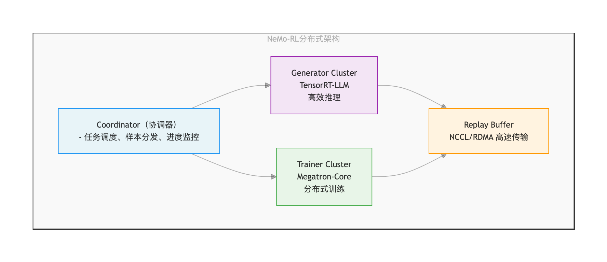

图 3-15 NeMo-RL 分布式架构

**2. 并行策略**

NeMo-RL 支持多种并行策略组合，可根据模型规模和硬件资源灵活配置。大规模 GRPO 训练需要将生成器（Generator）和训练器（Trainer）分配到不同 GPU 组。NeMo-RL 并行配置示例如表 3-42 所示。

表 3-42 NeMo-RL 并行配置示例

| 模型规模 | TP | PP | DP | EP | Generator GPU | Trainer GPU | 总 GPU |
|---------|----|----|----|----|---------------|-------------|--------|
| 7B | 1 | 1 | 8 | - | 4 | 32 | 36 |
| 70B | 8 | 4 | 2 | - | 16 | 64 | 80 |
| 405B | 8 | 16 | 4 | - | 64 | 512 | 576 |
| MoE-671B | 8 | 32 | 4 | 8 | 128 | 1024 | 1152 |

并行策略说明：
- TP（Tensor Parallelism）：将单个 Transformer 层切分到多个 GPU；
- PP（Pipeline Parallelism）：将不同 Transformer 层分配到不同 GPU；
- DP（Data Parallelism）：在不同数据批次上并行训练；
- EP（Expert Parallelism）：MoE 模型的专家并行。

**3. TensorRT-LLM 加速**

NeMo-RL 使用 TensorRT-LLM 进行高效推理，相比标准 PyTorch：
- 吞吐量：提升 4～8 倍；
- 延迟：降低 50%～70%；
- 显存占用：降低 40%（FP8 量化）。

### 3.4.4 SWIFT 的 GRPO 实现

SWIFT[^swift]（Scalable lightWeight Infrastructure for Fine-Tuning）是阿里巴巴魔搭社区开发的大模型训练框架，于 2025 年被 AAAI 接收，对中文模型生态有深度支持。

**1. 多种算法支持**

SWIFT 支持多种 GRPO 变体算法，每种算法针对特定场景优化，用户可根据任务特点选择合适的算法。SWIFT 支持的强化学习算法如表 3-43 所示。

表 3-43 SWIFT 支持的强化学习算法

| 算法 | 全称 | 核心特点 | 适用场景 |
|------|------|---------|---------|
| GRPO | Group Relative Policy Optimization | 组相对优势估计 | 通用推理 |
| DAPO | Decoupled Clip and Dynamic sAmpling Policy Optimization | 动态采样 + 不对称裁剪 | 长 CoT 推理 |
| GSPO | Group Sequence Policy Optimization | 序列级重要性采样 | MoE 模型训练 |
| SAPO | Soft Adaptive Policy Optimization | 软门控替代硬裁剪 | 高方差场景稳定训练 |
| CISPO | Clipped Importance Sampling Policy Optimization | 裁剪重要性采样权重 | 长链推理 |
| RLOO | Reinforce Leave-One-Out | 留一法基线 | 创意生成 |

**2. 特色功能**

Megatron 并行支持：支持基于 Megatron 的并行训练。

自定义奖励模型：SWIFT 支持规则奖励（GenRM），可根据答案正确性、推理长度、格式规范性等设计奖励函数。

多轮对话 GRPO：SWIFT 在 2025 年 3 月支持了多轮对话场景的 GRPO，包括工具调用支持。

混合训练模式：支持 SFT → DPO → GRPO 流水线，在同一训练任务中结合多种方法。

### 3.4.5 GRPO 算法变体

**1. DAPO：长 CoT 场景优化**

DAPO[^dapo]（Decoupled Clip and Dynamic sAmpling Policy Optimization）是字节跳动提出的 GRPO 改进算法，专为长链推理设计，包含四大创新：

1. Clip-Higher：不对称裁剪策略

传统 PPO/GRPO 使用对称裁剪，DAPO 使用不对称裁剪：

$$\mathcal{L}_{\mathrm{DAPO}} = \begin{cases}
\min(r(\theta) A, \text{clip}(r(\theta), 1-\epsilon_{\mathrm{low}}, 1+\epsilon_{\mathrm{high}}) A) & \text{if } A \geq 0 \\
\min(r(\theta) A, \text{clip}(r(\theta), 1-\epsilon_{\mathrm{high}}, 1+\epsilon_{\mathrm{low}}) A) & \text{if } A < 0
\end{cases} $$

其中 $A$ 为优势函数值，$r(\theta)$ 为重要性采样比率，$\text{clip}(\cdot, a, b)$ 将输入值裁剪到区间 $[a, b]$。典型配置：$\epsilon_{\mathrm{low}} = 0.1, \epsilon_{\mathrm{high}} = 0.3$。不对称裁剪鼓励探索同时保持稳定性，避免长 CoT 场景的熵坍塌。

2. Dynamic Sampling：动态批次过滤

动态过滤低质量样本，仅使用有效梯度的样本训练。当 clip_fraction > 0.9 时，过滤被裁剪的样本。

3. Token-Level Policy Gradient Loss

长 CoT 的不同 token 重要性不同，DAPO 使用 token 级权重：
- 问题理解阶段（< 0.2T）：权重 1.0；
- 推理阶段（0.2T - 0.8T）：权重 2.0；
- 答案阶段（> 0.8T）：权重 3.0。

4. Overlong Reward Shaping

对于过长的响应引入长度惩罚：

$$r_{\mathrm{shaped}} = r_{\mathrm{task}} - \lambda_{\mathrm{len}} \cdot \max(0, T - T_{\mathrm{max}}) / T_{\mathrm{max}} $$

其中 $r_{\mathrm{shaped}}$ 为调整后的奖励，$r_{\mathrm{task}}$ 为任务奖励，$T$ 为响应的 token 长度，$\lambda_{\mathrm{len}}$ 为长度惩罚系数，$T_{\mathrm{max}}$ 为最大期望长度。典型配置：$\lambda_{\mathrm{len}} = 0.1, T_{\mathrm{max}} = 8192$。

DAPO 性能：Qwen2.5-32B 在 AIME 2024 从 47 分提升至 50 分，训练步数减少 50%。

**2. StepGRPO：步级奖励优化**

StepGRPO 在 GRPO 基础上引入步级奖励（Step-level Reward），由清华大学在 R1-VL 论文[^r1vl]中提出。

传统 GRPO 仅在最终结果给予奖励，StepGRPO 在每个推理步骤给予奖励：

$$r_{\mathrm{step}}(x, y_{1:t}) = \alpha \cdot r_{\mathrm{accuracy}}(y_{1:t}) + \beta \cdot r_{\mathrm{validity}}(y_{1:t}) $$

其中 $x$ 为输入提示，$y_{1:t}$ 为从第 1 到第 $t$ 步的推理序列，$\alpha$ 和 $\beta$ 为权重系数，$r_{\mathrm{accuracy}}$ 为准确性奖励，$r_{\mathrm{validity}}$ 为有效性奖励。

步级准确性奖励（StepRAR）：

$$r_{\mathrm{accuracy}}(y_{1:t}) = \frac{1}{K} \sum_{k=1}^K \mathbb{1}[\text{key\_step}_k \in y_{1:t}] $$

其中 $K$ 为关键步骤数（如数学题的中间结果），$\mathbb{1}[\cdot]$ 为指示函数（条件成立时值为 1，否则为 0），$\text{key\_step}_k \in y_{1:t}$ 表示第 $k$ 个关键步骤出现在当前推理序列中。

步级有效性奖励（StepRVR）：评估推理完整性和逻辑一致性，包括是否有结论、是否有解释、是否有多步推理等。

步级奖励使模型在推理过程中获得更密集的反馈信号，加速学习关键推理步骤。StepGRPO 与 GRPO 性能对比如表 3-44 所示。

表 3-44 StepGRPO 与 GRPO 性能对比

| 指标 | GRPO | StepGRPO | 提升 |
|------|------|----------|------|
| GSM8K（7B）| 83.2% | 87.5% | +4.3% |
| MATH（7B）| 48.6% | 53.1% | +4.5% |
| 样本效率 | 基准 | 1.5x | - |
| 收敛速度 | 基准 | 1.3x | - |

## 3.5 DSpark 原理与技术解析

DSpark[^dspark] 是 DeepSeek-AI 与北京大学联合发布的**投机解码**（speculative decoding）框架，用于加速 DeepSeek-V4 的在线推理服务。需要注意，它并不是训练框架——V4 的训练基础设施 HAI-LLM 并未开源；随论文配套开源的仓库 DeepSpec 则是草稿模型（draft model）的训练与评测代码库（见 3.5.7 节）。

### 3.5.1 投机解码原理与技术路线

#### 3.5.1.1 自回归推理的延迟瓶颈

大语言模型以自回归方式生成文本：每个新 token 都需要以全部前文为条件做一次完整的前向传播，推理延迟与输出长度成正比。由于解码阶段的算术强度低（每生成一个 token 都要完整读取一遍模型权重，计算量却很小），GPU 利用率低下、用户感知等待时间长，构成生产环境 LLM 服务的首要瓶颈——对实时对话助手和多轮智能体工作流等延迟敏感场景尤甚。

投机解码[^specdec]提供了一个有数学保证的解法：用一个轻量**草稿模型**（draft model）$M_d$ 提出一段候选 token，再由完整的**目标模型**（target model）$M_t$ 在单次前向传播中并行验证整段候选。验证采用拒绝采样规则：在草稿位置 $k$，目标模型计算自身分布 $p_k^t$ 并与草稿分布 $p_k^d$ 比较，token $x_k$ 以概率 $\min(1,\ p_k^t(x_k)/p_k^d(x_k))$ 被接受；验证从左到右进行，位置 $k$ 处的首次拒绝会丢弃其后全部候选。这一规则**严格保持目标模型的输出分布**——加速是无损的。

设 $\tau$ 为每轮解码平均接受的 token 数，$T_{\text{draft}}$、$T_{\text{verify}}$ 分别为起草与验证的墙钟时间，则每 token 平均延迟为：

$$
L = \frac{T_{\text{draft}} + T_{\text{verify}}}{\tau}
$$

提升加速比归结为三个杠杆：降低 $T_{\text{draft}}$（草稿起得更快）、提高 $\tau$（草稿猜得更准）、压缩有效 $T_{\text{verify}}$（验证得更聪明）。DSpark 的两大组件恰好分别作用于前两者与后者。

#### 3.5.1.2 自回归草稿器：准但慢

早期草稿器沿用自回归结构（如 EAGLE 系列[^eagle]）：每个位置以先前已采样的 token 为条件逐个生成。显式的 token 间依赖建模带来高接受率，但起草成本与草稿块长度 $\gamma$ 成正比（$T_{\text{draft}} \propto \gamma$），迫使这类方法只能使用短草稿块和浅层网络（EAGLE3 仅 1 层 Transformer）来控制延迟。

#### 3.5.1.3 并行草稿器：快但存在后缀衰减

并行草稿器（如 DFlash[^dflash]）在单次前向传播中同时产出全部 $\gamma$ 个位置的候选，起草延迟几乎与块长无关，因此可以负担更深的网络（DFlash 为 5 层）和更长的草稿块。

DFlash 的关键技术是 **KV 注入**：在 prefill 阶段，从目标模型的一组层 $\{l_1, \ldots, l_m\}$ 提取隐状态，拼接后投影到草稿模型的隐空间：

$$
H_{\text{ctx}} = \text{RMSNorm}\big(W_c\,[H^{(l_1)}; \ldots; H^{(l_m)}]\big)
$$

这些上下文特征沿序列维度拼入草稿模型每一层的 Key 和 Value，块内所有位置彼此双向可见。草稿模型复用目标模型的 embedding 层与语言建模头（均冻结）。

并行结构的代价是**块内 token 相互独立预测**，无法建模 token 间依赖。当上下文允许多种合理续写时——例如 “of course” 与 “no problem” 均合理——并行草稿器可能在位置 1 采到 “of”、位置 2 采到 “problem”，拼出 “of problem” 这类不连贯组合。这一现象称为**多模态碰撞**（multi-modal collision）[^gu2018]：每个位置对所有可能的前驱边缘化，而非以实际采样的前缀为条件。其后果是接受率沿草稿块快速衰减（**后缀衰减**，suffix decay），既浪费起草计算也浪费验证计算。

#### 3.5.1.4 系统级瓶颈：验证长度的选择

即使草稿质量高，无差别验证整个草稿块也会损害系统吞吐。理想验证长度沿两条轴变化：

- **数据侧**：代码等结构化文本的接受率天然高于开放式对话；
- **系统侧**：轻负载下多验证几个 token 几乎免费，高并发下每个多余的验证 token 都在挤占本可服务其他活跃请求的批容量。

DSpark 将这两个问题——草稿质量与验证效率——分别用**半自回归生成**和**置信度调度验证**两个互补机制解决。

### 3.5.2 半自回归生成架构

#### 3.5.2.1 两段式设计

DSpark 将草稿生成分为两个阶段：

**并行阶段（Parallel stage）**。一个并行主干网络（论文实例化为 DFlash 骨架）对整个草稿块执行单次前向传播，产出隐状态 $h_1, \ldots, h_\gamma$ 与基础 logits $U_1, \ldots, U_\gamma$。相对原版 DFlash 的一处小改动：将锚点 token（anchor token，即上一验证轮目标模型产出的最后一个 token）本身作为第一个预测位置，$\gamma$ 个输入 token（锚点 + $\gamma-1$ 个 mask token）即产出 $\gamma$ 个草稿 logits，减少起草计算量的同时保持相近的草稿质量。

**串行阶段（Sequential stage）**。在基础 logits 之上叠加一个依赖前缀的转移偏置 $B_k(x_0, x_{<k}, x_k)$，使每个草稿位置能够以块内先前已采样的 token 为条件。串行阶段不定义全局归一化的能量模型，而是通过自回归分解诱导出一个因果的块内分布：

$$
P(X \mid x_0) = \prod_{k=1}^{\gamma} p_k(x_k \mid x_0, x_{<k}), \qquad
p_k(v \mid x_0, x_{<k}) = \frac{\exp\big(U_k(v) + B_k(x_0, x_{<k}, v)\big)}{\sum_{u \in \mathcal{V}} \exp\big(U_k(u) + B_k(x_0, x_{<k}, u)\big)}
$$

其中 $x_0$ 为锚点 token，$\mathcal{V}$ 为词表。推理时串行块按 $p_k(\cdot \mid x_0, x_{<k})$ 从左到右采样。由于该采样过程本质串行，串行块必须在计算上足够轻量（$T_{\text{sequential}} \ll T_{\text{parallel}}$），使整体起草延迟仍由并行阶段主导。

这一设计保留了每个 token 的**精确 softmax 概率**——这对投机解码至关重要：拒绝采样规则要求草稿器提供逐 token 的精确概率，而 CRF、CTC 等结构化输出层因全局归一化或对齐路径边缘化无法直接满足此要求（相关讨论见原论文第 6 节）。

#### 3.5.2.2 Markov 头：一阶转移偏置

最简单的串行块实例将 $B_k$ 限制为仅依赖紧邻前一个 token 的一阶转移 $B(x_{k-1}, x_k)$。原则上这是一个完整的 $V \times V$ 矩阵 $B$；DSpark 用低秩分解近似：$B = W_1 W_2$，其中 $W_1 \in \mathbb{R}^{V \times r}$、$W_2 \in \mathbb{R}^{r \times V}$。给定前一 token $x_{k-1}$，位置 $k$ 的转移偏置为：

$$
B(x_{k-1}, \cdot) = W_1[x_{k-1}]\, W_2 \ \in \mathbb{R}^{V}
$$

$W_1$ 相当于一张 embedding 查找表，$W_2$ 为 logit 投影。默认秩 $r = 256$，使存储与每步计算量都很小，即便面对大词表串行循环也足够高效。回到前面的例子：一旦位置 1 采样到 "of"，Markov 头就会在位置 2 抬高 "course"、压低 "problem"，缓解跨模式碰撞。

#### 3.5.2.3 RNN 头：携带完整前缀历史

Markov 头在一步之外无记忆——位置 $k$ 无法访问 $x_{k-1}$ 之前的 token。RNN 头通过维护一个块内累积完整前缀历史的循环状态 $s_k$ 放宽此限制。每一步将当前状态 $s_{k-1} \in \mathbb{R}^r$、前一 token 嵌入 $W_1[x_{k-1}] \in \mathbb{R}^r$ 与主干隐状态 $h_k \in \mathbb{R}^d$ 拼接为输入向量 $z_k = [s_{k-1};\, W_1[x_{k-1}];\, h_k] \in \mathbb{R}^{2r+d}$，然后执行单次门控更新：

$$
s_k = \sigma(W_g z_k) \odot s_{k-1} + \big(1 - \sigma(W_g z_k)\big) \odot \tanh(W_c z_k), \qquad
B_k(x_{<k}, \cdot) = W_2^\top \tanh(W_o z_k)
$$

其中 $W_g, W_c, W_o \in \mathbb{R}^{(2r+d) \times r}$ 由单个线性投影联合参数化后切分为门控、候选与输出三部分，初始状态 $s_0$ 置零。

实验表明（见 3.5.5.2 节），RNN 头相对 Markov 头仅在较长草稿块上有边际增益，而部署复杂度更高，因此 **DSpark 默认采用 Markov 头**。开源代码中还实现了第三个变体 gated Markov 头（在 Markov 嵌入上施加以主干隐状态为条件的 sigmoid 门控），可视为两者之间的折中。

### 3.5.3 置信度调度验证

#### 3.5.3.1 置信度头

置信度头对每个草稿位置 $k$ 输出一个标量估计 $c_k \in (0, 1)$，建模**条件概率**：在块内所有先前 token 均已被接受的前提下，位置 $k$ 的草稿 token 通过目标模型验证的概率。结构是一个轻量线性投影加 sigmoid：

$$
c_k = \sigma\big(w^\top [h_k;\ W_1[x_{k-1}]]\big)
$$

其中 $h_k$ 为主干隐状态，$W_1[x_{k-1}]$ 为前一草稿 token 的 Markov 嵌入。监督信号采用逐步接受率的**解析真值** $c_k^*$——由草稿分布 $p_k^d$ 与目标分布 $p_k^t$ 之间的总变差距离决定：

$$
c_k^* = 1 - \tfrac{1}{2}\big\|p_k^d - p_k^t\big\|_1
$$

这正是投机解码奠基论文[^specdec]推导出的逐位置接受概率闭式解。置信度头只需拟合这个可直接计算的目标，不依赖黑盒式的间接监督。

#### 3.5.3.2 事后校准：顺序温度缩放（STS）

与仅需置信度分数正确排序的阈值式验证启发法不同，DSpark 的硬件感知调度需要**累积接受概率的绝对量值**来计算期望接受长度。而神经置信度估计普遍存在过自信问题[^guo2017]：原始置信度头判别力很强（ROC-AUC 0.81～0.90），但期望校准误差（ECE）达 3%～8%，直接使用会扭曲吞吐量估计。

为此 DSpark 引入**顺序温度缩放**（Sequential Temperature Scaling, STS）。由于每个 $c_i$ 建模条件概率，链式法则下草稿前缀被整体接受的联合概率分解为累积乘积 $\prod_{i \le k} c_i$。STS 在保留验证集上从左到右逐位置校准该联合概率：对每个位置 $k \in \{1, \ldots, \gamma\}$，通过一维网格搜索找到使累积乘积的 ECE 最小的温度标量，且固定所有先前位置已校准的分数。温度缩放是保序变换——它将预测概率修正到与经验接受率一致，而不打乱置信度头学到的相对排序。校准后平均 ECE 降至约 1%。

#### 3.5.3.3 硬件感知前缀调度器

有了校准的置信度信号，验证长度选择被形式化为一个**全局吞吐量最大化问题**。考虑一批 $R$ 个活跃请求，请求 $r$ 的逐位置置信度估计为 $c_{r,1}, \ldots, c_{r,\gamma}$，调度的验证长度为 $\ell_r \in \{0, \ldots, \gamma\}$。由于投机解码只按连续前缀接受草稿 token，位置 $j$ 的 token 存活概率为累积乘积 $a_{r,j} = \prod_{i \le j} c_{r,i}$。

单次验证步中，发送给目标模型的总批大小（以 token 计）为 $B = \sum_{r=1}^{R}(1 + \ell_r)$，期望成功接受的 token 数为 $\tau = \sum_{r=1}^{R}\big(1 + \sum_{j=1}^{\ell_r} a_{r,j}\big)$。设 $\text{SPS}(B)$ 为引擎在前向批大小 $B$ 下的吞吐（步/秒）——该容量曲线在引擎初始化时一次性剖析（profile）并存为轻量代价表。调度器的目标是通过动态选择 $\ell_1, \ldots, \ell_R$ 最大化期望系统级 token 吞吐：

$$
\Theta = \tau \cdot \text{SPS}(B)
$$

虽然求 $\Theta$ 的全局最大值看似组合搜索，但目标函数的结构允许高效的贪心解：$a_{r,j}$ 对 $j$ 单调非增（$a_{r,j} \le a_{r,j-1}$），将请求 $r$ 的验证长度从 $j-1$ 扩展到 $j$ 的边际收益恰好是 $a_{r,j}$，因此把全部候选 $\{a_{r,j}\}$ 全局降序排序后逐个纳入，天然尊重块内前缀依赖。算法沿此贪心接纳路径增量更新期望吞吐（$O(1)$ 查表），吞吐一旦下降立即停止（early stopping）。

#### 3.5.3.4 无损性与因果约束

无损投机解码严格要求**非预期性**（non-anticipating property）：接纳决策不得依赖未来候选 token[^specdec]。由于置信度头依赖前一已采样 token 的 Markov 特征，计算下一存活概率 $a_{r,k+1}$ 需要实例化候选 $x_{r,k}$——若做回溯式全局搜索，会把 $x_{r,k}$ 泄漏进第 $k$ 步的接纳决策，引入选择偏差（原论文附录 A 给出了具体反例）。贪心搜索中的逐步早停机制保证截断决策只依赖已处理的前缀，从而精确保持目标分布。该逐步早停当且仅当 $\Theta$ 为单峰时给出全局最大吞吐——这隐含假设硬件容量曲线光滑衰减；真实硬件不满足该假设时的工程适配见 3.5.6.2 节。

### 3.5.4 训练方法

#### 3.5.4.1 训练数据组织

训练时从每条目标序列中随机采样多个锚点位置，构成 $\gamma$-token 块作为训练数据。目标模型全程冻结；草稿模型共享其 embedding 层与语言建模头（同样冻结），只更新并行主干、串行块与置信度头三部分。

#### 3.5.4.2 三项损失

训练目标由三项组成，均以位置权重 $w_k = \exp(-(k-1)/\gamma)$ 加权——前缀验证机制下靠前的位置对期望接受长度贡献更大。

**交叉熵损失**训练草稿器预测正确的下一 token：

$$
\mathcal{L}_{\text{ce}} = -\sum_{k=1}^{\gamma} w_k \log p_k^d(x_k^*)
$$

**分布匹配损失**惩罚草稿分布与目标分布间的总变差距离：

$$
\mathcal{L}_{\text{tv}} = \sum_{k=1}^{\gamma} w_k \big\|p_k^d - p_k^t\big\|_1
$$

由于总变差距离是接受率的直接代理（逐步接受概率等于 $1 - \frac{1}{2}\|p^d - p^t\|_1$），最小化 $\mathcal{L}_{\text{tv}}$ 即直接最大化期望接受率。

**置信度损失**为二元交叉熵，以 3.5.3.1 节定义的软接受标签 $c_k^*$ 训练置信度头：

$$
\mathcal{L}_{\text{conf}} = -\sum_{k=1}^{\gamma} w_k \big[c_k^* \log c_k + (1 - c_k^*) \log(1 - c_k)\big]
$$

总目标为三项加权组合，默认权重 $\alpha_{\text{ce}} = 0.1$、$\alpha_{\text{tv}} = 0.9$、$\alpha_{\text{conf}} = 1.0$：

$$
\mathcal{L} = \alpha_{\text{ce}}\, \mathcal{L}_{\text{ce}} + \alpha_{\text{tv}}\, \mathcal{L}_{\text{tv}} + \alpha_{\text{conf}}\, \mathcal{L}_{\text{conf}}
$$

#### 3.5.4.3 面向 V4 规模的训练工程优化

训练草稿模型需要目标模型的输出分布做监督。对 DeepSeek-V4 这个量级的目标模型，在完整文档上下文上同时评估两个模型会带来可观的显存占用与跨 worker 通信开销。DSpark 在 DeepSeek 内部训练框架 HAI-LLM 中实现了两项系统级优化：

- **隐状态通信**。跨并行 worker 传输目标模型的全词表 logits（$V \approx 10^5$）构成显著的带宽瓶颈。改为临时缓存目标模型前向传播的激活，只通信语言建模头之前的隐状态；LM 头投影在草稿模型的 worker 上、仅对采样到的目标位置本地执行。每 token 通信复杂度降至 $O(d)$（$d$ 为隐藏维度）。
- **锚点有界的序列打包**。为使草稿模型的计算成本与目标模型的上下文长度解耦，从训练序列中采样固定数量的草稿锚点，将这些孤立的预测块打包为致密训练批。打包通过 token 级注意力索引（而非标准二维掩码）管理，在多条独立序列与多个锚点间保持精确的因果掩码，避免标准 padding 的计算与显存开销。

### 3.5.5 离线实验与分析

#### 3.5.5.1 主实验结果

离线评测为隔离草稿质量与系统级调度策略，关闭置信度调度器，强制所有草稿器提出固定长度的草稿块，报告每轮平均接受长度 $\tau$。目标模型覆盖 Qwen3-4B/8B/14B 与 Gemma4-12B 四个模型；对比基线为自回归代表 Eagle3（1 层）与并行代表 DFlash（5 层，DSpark 主干同为 5 层）；所有草稿器在同一训练框架、同一数据上重训以保证公平。评测覆盖三个域：数学推理（GSM8K、MATH500、AIME25）、代码生成（MBPP、HumanEval、LiveCodeBench）与日常对话（MT-Bench、Alpaca、Arena-Hard）。

DSpark 在全部目标模型与全部基准域上一致优于两条基线。以宏平均接受长度计，在 Qwen3-4B/8B/14B 上相对 Eagle3 分别提升 30.9%、26.7%、30.0%，相对 DFlash 分别提升 16.3%、18.4%、18.3%；在 Gemma4-12B 上同样保持一致优势，说明该方法可跨模型家族泛化。数据还揭示了强烈的域效应：结构化任务的接受长度天然更高（Qwen3-4B 上数学约 5.57、代码约 5.12，对话仅 3.49）——这正是静态验证长度浪费计算的根源，直接印证了置信度调度的动机。

#### 3.5.5.2 为什么并行生成能胜过自回归

主实验有一个反直觉现象：并行的 DFlash 与半自回归的 DSpark 的接受长度普遍长于完全自回归的 Eagle3。论文用**逐位置条件接受率**分析该现象——统计位置 $k$ 在前缀 $1$ 到 $k-1$ 全部通过验证的实例中被接受的比例，从而剔除先前前缀错误的惩罚、暴露每一步的基线预测质量：

- **位置 1 的容量优势**。首位置双方都只依赖目标上下文预测，差距纯粹来自架构容量：自回归草稿器受 $O(\gamma)$ 延迟约束只能用浅层网络，而 $O(1)$ 的并行草稿器可以负担深得多的网络。DFlash 首位置准确率显著高于 Eagle3（如数学 0.88 对 0.81，对话 0.72 对 0.53）。投机解码是严格的前缀匹配存活过程——首 token 被拒即作废整块，因此首位置优势对最终接受长度的放大作用不成比例地大。
- **后续位置的独立性局限**。位置 2 至 7 暴露并行生成的固有缺陷：随着前面的 token 锁定语义路径，后续 token 本应越来越可预测，Eagle3 的条件接受率确实稳中有升（对话上从 0.53 升至 0.74），DFlash 却持续衰减（代码上从 0.87 跌至 0.78）——多模态碰撞所致。
- **半自回归修复衰减**。DSpark 继承了深并行主干的高首位接受率（数学上首位约 0.93），同时轻量串行头抑制了后缀衰减，整个草稿块内保持高且平稳的条件接受率。

#### 3.5.5.3 消融：一点自回归就够了

**草稿器深度**。固定块长为 7，将 DSpark 层数从 1 扫到 5 并与 5 层 DFlash 对比：DSpark 性能随深度单调提升，边际收益在 1 层到 2 层之间最陡；**2 层 DSpark 即在全部三个域上超过 5 层 DFlash**。用轻量串行头注入局部自回归，比单纯堆叠更深的并行层拥有好得多的“精度-参数”权衡。

**草稿长度与头的选择**。固定 5 层，草稿长度扫 $\{4, 8, 12, 16\}$：DSpark 在每个长度上都优于 DFlash，且差距随 $\gamma$ 增大持续拉开——$\gamma = 7$ 时数学/代码/对话分别提升 16%/15%/18%，$\gamma = 15$ 时扩大到 30%/26%/22%（纯并行生成在长块上边际效用锐减，DSpark 抑制了这一衰减）。RNN 头相对 Markov 头仅在较长草稿块上有边际额外增益，考虑其实现复杂度与部署性质，默认采用 Markov 头。

**延迟开销**。串行采样循环的代价可忽略：在批大小 128 下测量整轮引擎延迟（一次目标验证 + 并行草稿前向 + 串行采样循环），草稿长度从 4 扩到 16 只为整轮延迟增加 0.2%～1.3%，同时换来最多 30% 的接受长度提升。

**置信度头的剪枝能力（静态阈值扫描）**。在 Qwen3-4B 上做离线阈值扫描：随着置信度阈值提高，估计器持续滤除终将被拒的 token，整体接受率稳步上升。剪枝效果在对话负载上最显著——接受率从 45.7% 升至 95.7%；结构化任务剪枝温和，数学从 76.9% 升至 92.5%，代码从 67.6% 升至 92.0%。需要注意这是以每步保留 token 数变少为代价的诊断性实验，不应直接解读为端到端加速比。

### 3.5.6 DeepSeek-V4 中的线上部署

#### 3.5.6.1 V4 配套草稿模型的配置

与 DeepSeek-V4-Flash 及 V4-Pro（预览版）共同部署的 DSpark 草稿模型，其并行主干由 3 个 MoE 层（DeepSeekMoE 结构[^dsmoe]）组成，配合 mHC（多路残差连接，见 2.6 节）与窗口 128 的滑动窗口注意力；最大草稿块长 $\gamma = 5$，串行建模采用 Markov 头。置信度头与草稿模型端到端联合训练，随后经 STS 校准以提供可靠的调度信号。

#### 3.5.6.2 调度器的异步化改造

将 3.5.3.3 节的调度算法直接搬进生产环境会遭遇两个现实冲突：其一，算法假设光滑单峰的容量曲线，而真实硬件的 $\text{SPS}(B)$ 是离散的、呈锯齿状阶跃退化；其二，算法要求每步动态调整草稿 token 的调度，与连续 CUDA graph 重放和零开销调度（Zero-Overhead Scheduling, ZOS）冲突——ZOS 要求下一步的批大小在当前步完成之前就已知，同步调度必然阻塞 GPU 流水线。

DSpark 的解法是让调度器**异步运行**：用两步之前的置信度头输出近似即将到来的验证容量。机制上，当前步的候选 token 仍严格按实际的、最新的累积置信度分数排序；两步前的历史预测只用于确定动态截断长度（即批容量上限 $K$）。这实际上把接纳过程转化为动态 top-$K$ 选择——容量近似引入轻微的时间偏移，但选择机制本质上保序：置信度最高的草稿 token 始终被优先验证。该适配完全隐藏了调度延迟，与 ZOS 无缝集成。

异步化还带来一个意外收获：为避免贪心搜索被锯齿状 SPS 悬崖困在局部极小，生产版**移除了 early-stopping break，改做无约束全局搜索**。常规情况下这种回溯式搜索会泄漏未来 token 信息、破坏无损保证；但 ZOS 驱动的异步适配天然阻止了这一点——无约束搜索只评估两步前的历史预测，接纳决策与当前 token $x_{r,k}$ 的实例化隔离，截断长度本质上只依赖两步前已有的信息。异步设计构成一道因果屏障：既跨越硬件容量悬崖最大化物理吞吐，又精确保持目标分布。

#### 3.5.6.3 变长验证的 kernel 适配

动态调度要求推理框架在单一批内高效支持变长查询，而标准解码 kernel 针对固定查询长度深度优化——朴素处理变长验证前缀会因 padding 与负载不均导致 GPU 严重欠利用。DSpark 的解法是将物理执行与逻辑序列跟踪解耦：计算 kernel 中所有请求的 token 摊平、作为独立元素统一处理，复杂的序列内依赖通过一个标记张量传入稀疏注意力实现。在 DeepSeek-V4 架构上，只有 index-attention 与 compress kernel 需要为支持变长路由做修改，动态调度器得以无低层执行开销地无缝运行。

#### 3.5.6.4 线上性能

线上评测将 DSpark-5（最大草稿长度 $\gamma = 5$）与既有生产基线 MTP-1（单 token 多词元预测[^dsv3]）在 V4-Flash 与 V4-Pro（均为预览版）的生产服务引擎中对比。MTP-1 之所以是历史生产配置，是因为静态多 token 草稿器（如 MTP-3/5）在高并发下验证开销过大、会严格拉低总吞吐——这一对比恰好检验 DSpark 能否在动态服务环境中安全释放长草稿块的性能潜力。所有数据点为真实用户流量的原始遥测采样。

服务系统的帕累托前沿由总吞吐（token/s/gpu）与单用户生成速度（tok/s/user，交互性）两个相互竞争的目标构成。以交互性 SLA（服务等级协议，规定系统必须保证的最低单用户生成速度）为锚点：

- **V4-Flash**：在中等的 80 tok/s/user SLA 下，DSpark 总吞吐较 MTP-1 提升 51%。在严苛的 120 tok/s/user SLA 下，MTP-1 已逼近运行边界、只能维持极小并发批，此时 DSpark 名义总吞吐高出 661%——论文明确指出这一高 SLA 锚点属于“定性区间”（qualitative regime），应解读为 DSpark 将可行的交互性边界向外推移的证据，而**不是**对充分利用的基线的代表性加速倍数。在匹配的实际吞吐水平下（更稳定的比较口径），DSpark 将单用户生成速度提升 **60%～85%**。
- **V4-Pro**：同样的模式。35 tok/s/user SLA 下总吞吐提升 52%；50 tok/s/user 严苛锚点下名义提升 406%（同属定性区间）；匹配系统容量下单用户生成速度提升 **57%～78%**。

负载动态分析揭示了收益的底层机制：中等并发（V4-Flash 低于约 200 并发请求、V4-Pro 低于约 150）下，硬件感知调度器利用闲置目标算力，把验证预算从 MTP-1 的静态 2 token 扩展到约 4～6 token/请求；并发攀升、目标容量饱和时，调度器平滑压缩该预算，确保低置信度草稿 token 在消耗关键批容量之前就被剪除。轻负载吃满闲置算力、重负载保住批容量——这正是“验证得更聪明”在系统层的兑现。

#### 3.5.6.5 已知局限

前缀调度器最小化的是目标模型侧的验证浪费，但草稿侧仍有一笔固定成本：并行主干生成初始 $\gamma$-token 块的前向传播。对于接受率天生极低的复杂请求（如长链条推理难题），这笔前置起草计算无法回收。论文提出的未来方向是在草稿模型内引入难度感知的早退（difficulty-aware early exit），让这类请求跳过整块草稿生成。

### 3.5.7 配套开源代码库 DeepSpec

随论文开源的 **DeepSpec**[^deepspec]（MIT 许可）是一个以算法为中心的投机解码训练代码库，包含数据准备工具、草稿模型实现、训练与评测脚本。需要说明其边界：它面向**公开可复现的研究设定**（目标模型为 Qwen3-4B/8B/14B 与 Gemma4-12B），不包含 DeepSeek-V4 本体的训练代码，也不包含生产推理引擎（调度器与 kernel 改造未开源）。

工作流分三个阶段：**数据准备**（下载 prompt、用目标模型重新生成回答、构建目标输出缓存——默认 Qwen3-4B 设定下缓存约 38 TB，因为需要存储目标模型的隐状态供离线监督）→ **训练**（每张可见 GPU 一个 worker，默认单机 8 卡）→ **评测**（在 GSM8K、MATH500、AIME25、HumanEval、MBPP、LiveCodeBench、MT-Bench、Alpaca、Arena-Hard-v2 上测量接受长度）。

代码库统一实现了三种草稿算法——Eagle3、DFlash 与 DSpark——共享同一训练框架与数据管线，使横向对比公平可复现；论文 Table 1 的全部 12 个检查点（3 算法 × 4 目标模型）已在 Hugging Face 发布。以 `dspark_qwen3_4b` 配置为例，可以读出与论文一致的关键超参：块长 7、草稿 5 层、KV 注入取目标模型第 $\{1, 9, 17, 25, 33\}$ 层、Markov 秩 256、损失权重 $\alpha_{\text{ce}}=0.1$ / $\alpha_{\text{tv}}=0.9$ / $\alpha_{\text{conf}}=1.0$、bf16 精度、全局批 512、训练 10 个 epoch。README 特别提醒：引用这些结果时须对齐仓库内的训练设定，否则比较无意义；面向特定领域使用时建议重新微调草稿模型，目标模型以思考模式运行时尤其如此。

[^deepgemm]: DeepSeek-AI 于 2025 年开源的 GEMM 计算库 DeepGEMM，https://github.com/deepseek-ai/DeepGEMM。
[^fs3]: DeepSeek-AI 于 2025 年开源的分布式文件系统 3FS，https://github.com/deepseek-ai/3FS。
[^cutlass]: NVIDIA 开源的 CUDA 线性代数模板库 CUTLASS，https://github.com/NVIDIA/cutlass。
[^fp8]: Micikevicius P. 等人于 2022 年发布的论文 FP8 Formats for Deep Learning，https://arxiv.org/abs/2209.05433。
[^hopper]: NVIDIA 于 2022 年发布的 NVIDIA H100 Tensor Core GPU Architecture 白皮书。
[^craq]: Terrace J. 与 Freedman M. J. 于 2009 年发表于 USENIX ATC 的论文 Object Storage on CRAQ: High-Throughput Chain Replication for Read-Mostly Workloads。
[^fdb]: Apple 开源的分布式键值存储 FoundationDB，https://github.com/apple/foundationdb。
[^deepep]: DeepSeek-AI 于 2025 年开源的专家并行通信库 DeepEP，https://github.com/deepseek-ai/DeepEP。
[^eplb]: DeepSeek-AI 于 2025 年开源的专家并行负载均衡器 EPLB，https://github.com/deepseek-ai/EPLB。
[^nvshmem]: NVIDIA 的 GPU 分区全局地址空间通信库 NVSHMEM，https://developer.nvidia.com/nvshmem。
[^fa1]: Dao T. 等人于 2022 年发表于 NeurIPS 的论文 FlashAttention: Fast and Memory-Efficient Exact Attention with IO-Awareness，https://arxiv.org/abs/2205.14135；其后续版本 FlashAttention-2（2023，https://arxiv.org/abs/2307.08691）进一步优化了并行与工作划分。
[^onlinesoftmax]: Milakov M. 与 Gimelshein N. 于 2018 年发布的论文 Online Normalizer Calculation for Softmax，https://arxiv.org/abs/1805.02867。
[^fa3]: Shah J. 等人于 2024 年发布的论文 FlashAttention-3: Fast and Accurate Attention with Asynchrony and Low-precision，https://arxiv.org/abs/2407.08608。
[^flashmla]: DeepSeek-AI 于 2025 年开源的 MLA 高性能注意力内核库 FlashMLA，https://github.com/deepseek-ai/FlashMLA。
[^dsmath]: Shao Z. 等人（DeepSeek-AI）于 2024 年 2 月发布的论文 DeepSeekMath: Pushing the Limits of Mathematical Reasoning in Open Language Models，https://arxiv.org/abs/2402.03300。
[^r1]: DeepSeek-AI 于 2025 年 1 月发布的论文 DeepSeek-R1: Incentivizing Reasoning Capability in LLMs via Reinforcement Learning，https://arxiv.org/abs/2501.12948。
[^ppo]: Schulman J. 等人（OpenAI）于 2017 年发布的论文 Proximal Policy Optimization Algorithms，https://arxiv.org/abs/1707.06347。
[^unsloth]: Unsloth AI 的开源微调框架及其强化学习文档，https://unsloth.ai/docs。
[^nemorl]: NVIDIA 的开源强化学习框架 NeMo-RL，https://github.com/NVIDIA-NeMo/RL。
[^swift]: 阿里巴巴魔搭社区于 2024 年发布、被 AAAI 2025 接收的论文 ms-swift: Scalable lightWeight Infrastructure for Fine-Tuning，https://arxiv.org/abs/2408.05517。
[^dapo]: 字节跳动于 2025 年发布的论文 DAPO: An Open-Source LLM Reinforcement Learning System at Scale，https://arxiv.org/abs/2503.14476。
[^r1vl]: Zhang R. 等人于 2025 年发表于 ICCV 的论文 R1-VL: Learning to Reason with Multimodal Large Language Models via Step-wise Group Relative Policy Optimization。
[^dspark]: Cheng X. 等人（DeepSeek-AI 与北京大学）于 2026 年发布的论文 DSpark: Confidence-Scheduled Speculative Decoding with Semi-Autoregressive Generation，https://arxiv.org/abs/2607.05147。
[^specdec]: 投机解码的两篇奠基论文：Leviathan Y. 等人（Google）于 2023 年发表于 ICML 的 Fast Inference from Transformers via Speculative Decoding（https://arxiv.org/abs/2211.17192）；Chen C. 等人（DeepMind）于 2023 年发布的 Accelerating Large Language Model Decoding with Speculative Sampling（https://arxiv.org/abs/2302.01318）。
[^eagle]: Li Y. 等人的自回归草稿器系列论文：EAGLE-2（EMNLP 2024）与 EAGLE-3（NeurIPS 2026，https://arxiv.org/abs/2503.01840）。
[^dflash]: Chen J. 等人于 2026 年发布的论文 DFlash: Block Diffusion for Flash Speculative Decoding，https://arxiv.org/abs/2602.06036。
[^gu2018]: Gu J. 等人于 2018 年发表于 ICLR 的论文 Non-Autoregressive Neural Machine Translation，https://arxiv.org/abs/1711.02281。
[^guo2017]: Guo C. 等人于 2017 年发表于 ICML 的论文 On Calibration of Modern Neural Networks，https://arxiv.org/abs/1706.04599。
[^dsmoe]: Dai D. 等人（DeepSeek-AI）于 2024 年 1 月发布的论文 DeepSeekMoE: Towards Ultimate Expert Specialization in Mixture-of-Experts Language Models，https://arxiv.org/abs/2401.06066。
[^dsv3]: DeepSeek-AI 于 2024 年 12 月发布的 DeepSeek-V3 Technical Report（MTP 生产基线出处），https://arxiv.org/abs/2412.19437。
[^deepspec]: DeepSeek-AI 于 2026 年开源的投机解码训练与评测代码库 DeepSpec，https://github.com/deepseek-ai/DeepSpec；配套的 12 个草稿模型检查点发布于 https://huggingface.co/deepseek-ai。
[^ant3fs]: 3FS 的源码解读可参考蚂蚁数据智能技术团队 2025 年发布于阿里云开发者社区的《DeepSeek 3FS 解读与源码分析》系列文章。
